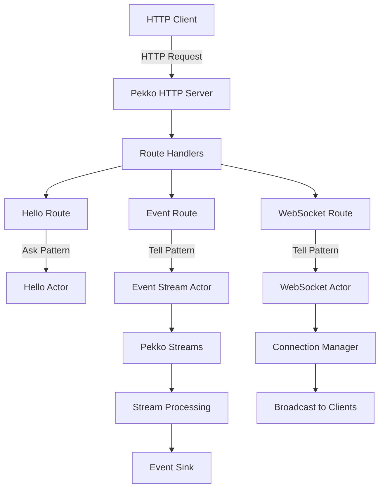

# Pekko HTTP with Actor Model - 리액티브 웹 서비스

이 프로젝트는 Spring Boot 의존성 없이 Pekko HTTP와 Actor 모델을 사용해 구축된 경량 리액티브 웹 서비스를 보여줍니다. 확장 가능하고 동시성 애플리케이션 구축을 위한 Pekko의 액터 시스템의 강력함을 보여줍니다.

## 🎯 프로젝트 개요

이것은 다음을 활용하는 Kotlin 기반 구현입니다:
- **Pekko HTTP**: 경량 HTTP 서버 및 클라이언트
- **Pekko Actors**: 동시성, 메시지 드리븐 액터
- **Pekko Streams**: 백프레셔 인식 스트림 처리
- **Spring Boot 없음**: 최소한의 오버헤드를 위한 순수 Pekko 구현

## 🏗️ 아키텍처



## 🚀 빠른 시작

### 필수 요구사항
- JDK 17+
- Gradle 8.x

### 빌드 및 실행

```bash
# 프로젝트 빌드
./gradlew build

# 테스트 실행
./gradlew test

# 서버 실행
./gradlew run

# 또는 fat JAR 빌드 후 실행
./gradlew shadowJar
java -jar build/libs/pekko-http-server.jar
```

서버는 `http://localhost:8080`에서 시작됩니다

## 📡 API 엔드포인트

### Hello 엔드포인트
- `GET /api/hello` - 기본 인사
- `GET /api/hello/{name}` - 개인화된 인사
- `POST /api/hello` - JSON 본문과 함께 인사

### 이벤트 처리
- `POST /api/events` - 단일 이벤트 전송
- `POST /api/events/batch` - 배치 이벤트 전송
- `GET /api/events/stats` - 이벤트 통계 조회
- `GET /api/events/stream` - 이벤트 통계 (간소화된 SSE)

### WebSocket
- `WS /ws` - WebSocket 연결
- `WS /ws/{userId}` - 사용자 ID와 함께 WebSocket
- `POST /api/broadcast` - 모든 WS 클라이언트에 브로드캐스트

### 문서화 및 모니터링
- `GET /swagger-ui` - 인터랙티브 Swagger UI
- `GET /swagger` - Swagger UI로 리다이렉트
- `GET /api-docs` - OpenAPI 3.0 명세 (JSON)
- `GET /swagger.json` - 대안 OpenAPI 엔드포인트
- `GET /health` - 헬스 체크 엔드포인트

### 테스트 도구
- `GET /test` - SSE와 WebSocket을 위한 인터랙티브 테스트 페이지

## 🧪 인터랙티브 테스트 페이지

### 테스트 콘솔 접근

브라우저를 열고 다음으로 이동:
```
http://localhost:8080/test
```

테스트 페이지는 다음을 제공합니다:
- **WebSocket 테스팅**: 실시간 양방향 통신
  - WebSocket 서버에 연결/연결 해제
  - 메시지 송수신
  - 연결 통계 보기
  - ping/pong 및 브로드캐스트 기능 테스트

- **SSE 테스팅**: 서버 전송 이벤트 스트리밍
  - 이벤트 스트림에 연결
  - 들어오는 이벤트 모니터링
  - 이벤트 통계 보기
  - 연결 상태 추적

- **API 테스팅**: 모든 엔드포인트에 대한 빠른 테스트 버튼
  - 테스트 이벤트 전송 (click, view, submit)
  - 배치 이벤트 전송
  - Hello API 변형 테스트
  - 시스템 헬스 체크
  - 이벤트 통계 조회

### 기능
- 타임스탬프가 있는 실시간 메시지 표시
- 연결 상태 표시기
- 메시지 카운터 및 통계
- 색상 코딩된 메시지 유형
- 모든 화면 크기에 대응하는 반응형 디자인

## 📚 Swagger UI

### Swagger UI 접근

서버가 실행되면 브라우저를 열고 다음으로 이동:
```
http://localhost:8080/swagger-ui
```

Swagger UI는 다음을 제공합니다:
- **인터랙티브 API 문서화**: 사용 가능한 모든 엔드포인트 탐색
- **Try It Out**: 브라우저에서 직접 API 호출 테스트
- **요청/응답 예제**: 샘플 페이로드와 응답 확인
- **모델 정의**: API에서 사용하는 데이터 구조 보기

### 기능
- 완전한 OpenAPI 3.0 명세
- 크로스 오리진 요청을 위한 CORS 활성화
- 모든 엔드포인트의 실시간 테스트
- 자동 요청/응답 검증
- WebSocket 엔드포인트 문서화

### Swagger UI를 통한 API 테스트

1. **Hello 엔드포인트**: 
   - "Hello" 태그 클릭
   - GET `/api/hello/{name}` 엔드포인트 시도
   - 이름을 입력하고 "Execute" 클릭

2. **이벤트 처리**:
   - "Events" 태그 클릭
   - 샘플 JSON으로 POST `/api/events` 테스트
   - GET `/api/events/stats`로 통계 보기

3. **WebSocket 테스트**:
   - WebSocket 연결은 문서화되어 있지만 테스트를 위해서는 WebSocket 클라이언트가 필요
   - 제공된 curl 예제나 브라우저 개발자 도구 사용

## 💡 핵심 개념

### 1. Actor 모델 구현

액터는 연산의 기본 단위입니다:

```kotlin
class HelloActor : AbstractBehavior<HelloCommand>(context) {
    override fun createReceive(): Receive<HelloCommand> {
        return newReceiveBuilder()
            .onMessage(GetHello::class.java, this::onGetHello)
            .build()
    }
    
    private fun onGetHello(command: GetHello): Behavior<HelloCommand> {
        val response = HelloResponse("Pekko says hello to ${command.name}!")
        command.replyTo.tell(response)
        return this
    }
}
```

### 2. 백프레셔를 통한 스트림 처리

Pekko Streams를 사용한 이벤트 처리:

```kotlin
class EventStreamActor : AbstractBehavior<EventCommand>(context) {
    private val materializer = Materializer.createMaterializer(context.system)
    
    private fun processEvent(event: UserEvent) {
        Source.single(event)
            .via(enrichmentFlow())
            .via(throttleFlow())
            .via(statsFlow())
            .to(persistenceSink())
            .run(materializer)
    }
}
```

### 3. HTTP 라우트 정의

깔끔하고 함수형 라우트 정의:

```kotlin
class HelloRoute(private val helloActor: ActorRef<HelloCommand>) {
    fun createRoute(): Route {
        return path(segment("api").slash("hello")) {
            get {
                onSuccess(askHello("World")) { response ->
                    complete(StatusCodes.OK, response, marshaller())
                }
            }
        }
    }
}
```

## 🔄 액터 통신 패턴

### Ask 패턴 (요청-응답)
액터로부터 응답이 필요할 때 사용:

```kotlin
val future = AskPattern.ask(
    helloActor,
    { replyTo -> GetHello(name, replyTo) },
    timeout,
    scheduler
)
```

### Tell 패턴 (Fire-and-Forget)
비동기 메시지 전달에 사용:

```kotlin
eventActor.tell(ProcessEvent(userEvent))
```

## 🌟 Spring Boot 대신 Pekko HTTP를 사용하는 이유?

### Pekko HTTP의 장점

1. **경량**: 
   - 최소한의 메모리 풋프린트
   - 빠른 시작 시간
   - 어노테이션 처리 오버헤드 없음

2. **진정한 리액티브**:
   - Reactive Streams 기반 구축
   - 네이티브 백프레셔 지원
   - 전체적인 논블로킹 I/O

3. **액터 모델**:
   - 자연스러운 동시성 모델
   - 위치 투명성
   - 감독을 통한 장애 허용성

4. **스트림 처리**:
   - 일급 스트림 지원
   - 조합 가능한 처리 파이프라인
   - 내장 흐름 제어

### 비교 테이블

| 특성 | Pekko HTTP | Spring Boot WebFlux |
|---------|------------|-------------------|
| 시작 시간 | ~1s | ~3-5s |
| 메모리 사용량 | ~50MB | ~150MB+ |
| 의존성 | 최소 | 광범위 |
| 학습 곡선 | 가파름 | 완만함 |
| 액터 지원 | 네이티브 | 통합을 통해 |
| 스트림 처리 | 네이티브 | Reactor를 통해 |
| 커뮤니티 | 성장 중 | 대규모 |
| 엔터프라이즈 기능 | 기본적 | 포괄적 |

### Pekko HTTP를 사용해야 하는 경우

✅ **최적인 경우:**
- 고성능, 저지연 서비스
- 스트림 처리 애플리케이션
- WebSocket 중심 애플리케이션
- 최소 풋프린트의 마이크로서비스
- 액터 기반 아키텍처

❌ **대안을 고려해야 하는 경우:**
- 광범위한 Spring 생태계가 필요한 경우
- 팀이 이미 Spring에 익숙한 경우
- 포괄적인 엔터프라이즈 기능이 필요한 경우
- 많은 통합을 포함한 빠른 프로토타이핑

## 🧪 테스트

### 단위 테스트
개별 액터 테스트:

```kotlin
@Test
fun `should respond with Pekko message`() = runTest {
    val actor = testKit.spawn(HelloActor.create())
    val probe = testKit.createTestProbe<HelloResponse>()
    
    actor.tell(GetHello("World", probe.ref))
    
    val response = probe.expectMessageClass(HelloResponse::class.java)
    response.message shouldBe "Pekko says hello to World!"
}
```

### 통합 테스트
완전한 플로우 테스트:

```kotlin
@Test
fun `test event processing pipeline`() = runTest {
    val eventActor = system.systemActorOf(EventStreamActor.create())
    eventActor.tell(ProcessEvent(testEvent))
    
    // 처리 확인
    val stats = getEventStats()
    stats.totalEvents shouldBe 1
}
```

## 📊 성능 특성

- **처리량**: 일반적인 하드웨어에서 ~10,000 req/s
- **지연 시간**: 간단한 요청에 대해 p99 < 10ms
- **동시성**: 수천 개의 동시 연결 처리
- **메모리**: ~50MB 기본 풋프린트
- **CPU**: 효율적인 비동기 I/O, 낮은 CPU 오버헤드

## 🛠️ 설정

`application.conf`를 통한 설정:

```hocon
pekko {
  actor {
    provider = local
  }
  
  http {
    server {
      idle-timeout = 60s
      request-timeout = 20s
    }
  }
  
  stream {
    materializer {
      initial-input-buffer-size = 4
      max-input-buffer-size = 16
    }
  }
}
```

## 📚 학습 자료

### 초보자를 위한 튜토리얼

1. **액터 이해하기**: 가장 간단한 액터 패턴인 `HelloActor`부터 시작
2. **스트림 처리**: 스트림 개념을 위해 `EventStreamActor` 학습
3. **HTTP 라우트**: REST API 패턴을 위해 라우트 정의 검토
4. **WebSocket**: `WebSocketActor`로 실시간 통신 학습

### 고급 주제

- **감독**: 에러 처리 및 복구 전략
- **클러스터링**: 노드 간 액터 분산
- **영속성**: 이벤트 소싱을 통한 지속적 상태
- **테스트**: 포괄적인 테스트 전략

## 🔍 문제 해결

### 일반적인 문제

1. **포트가 이미 사용 중**: `PekkoHttpServer.main()`에서 포트 변경
2. **메모리 문제**: JVM 힙 크기 조정
3. **느린 시작**: 액터 생성자의 블로킹 작업 확인

## 🤝 기여

기여를 환영합니다! 언제든지 풀 리퀘스트를 제출해 주세요.

## 📄 라이선스

이 프로젝트는 MIT 라이선스 하에 오픈 소스로 제공됩니다.

## 🙏 감사의 말

- 뛰어난 액터 프레임워크를 제공한 Apache Pekko 팀
- 현대적이고 간결한 언어를 제공한 Kotlin 팀
- 리액티브 스트림 커뮤니티

---

**참고**: 이것은 Pekko HTTP 기능을 보여주는 데모 프로젝트입니다. 프로덕션 사용을 위해서는 보안, 모니터링, 운영 요구사항과 같은 추가 고려사항을 검토하세요.