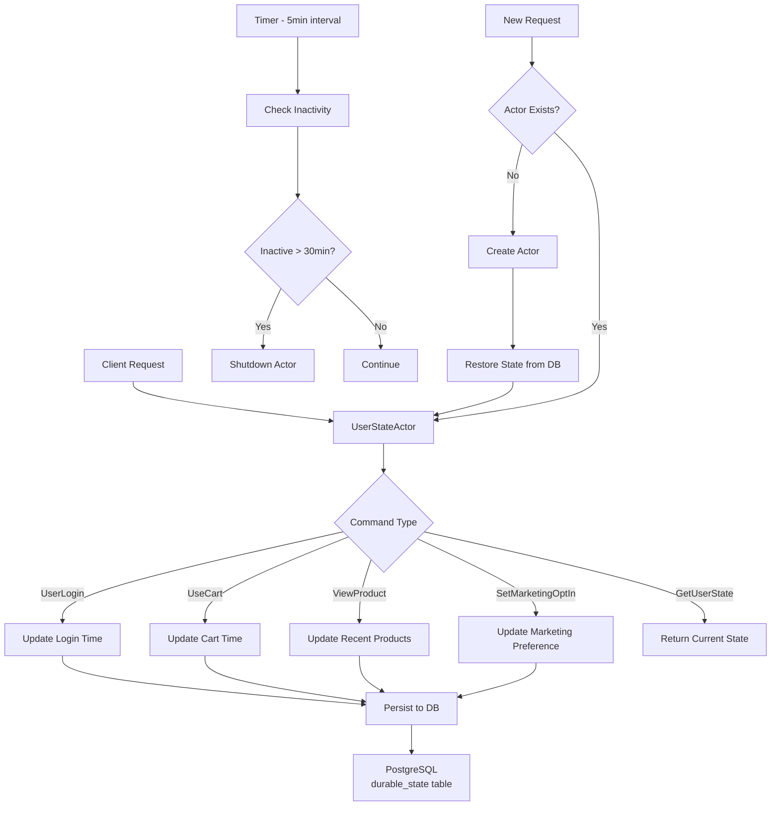

# PERSIST_DURABLE - Pekko Durable State 액터 시스템

## 개요

이 프로젝트는 Apache Pekko의 Durable State 기능을 활용하여 사용자 상태를 영속적으로 관리하는 액터 시스템을 구현합니다. 사용자의 마지막 로그인 시간, 장바구니 사용 시간, 최근 본 상품, 마케팅 수신 동의 여부 등의 상태를 관리하며, 30분 동안 비활성 상태가 지속되면 자동으로 셧다운되고 필요 시 상태를 복원하는 기능을 제공합니다.

## 주요 기능

- **영속적 상태 관리**: PostgreSQL을 통한 상태 영속성 보장
- **자동 셧다운**: 30분 비활성 시 리소스 절약을 위한 자동 종료
- **상태 복원**: 액터 재시작 시 이전 상태 자동 복원
- **고유 식별자**: mallId-userId 조합으로 고유한 사용자 식별

## 아키텍처



## 구현 세부사항

### 1. UserState 모델

```kotlin
data class UserState(
    val mallId: String,
    val userId: String,
    val lastLogin: LocalDateTime?,
    val lastCartUsedTime: LocalDateTime?,
    val recentProducts: List<String> = emptyList(),  // 최대 3개 유지
    val marketingOptIn: Boolean = false,
    val lastEventTime: LocalDateTime = LocalDateTime.now()
)
```

### 2. 명령(Command) 패턴

- `UserLogin`: 로그인 이벤트 처리
- `UseCart`: 장바구니 사용 이벤트
- `ViewProduct`: 상품 조회 이벤트
- `SetMarketingOptIn`: 마케팅 수신 동의 설정
- `GetUserState`: 현재 상태 조회
- `CheckInactivity`: 비활성 상태 체크 (내부 타이머)

### 3. 영속성 구성

Pekko R2DBC를 사용하여 PostgreSQL에 상태를 저장:

```conf
pekko.persistence {
  state {
    plugin = "pekko.persistence.r2dbc.state"
  }
  
  r2dbc {
    dialect = "postgres"
    connection-factory {
      driver = "postgres"
      host = "localhost"
      database = "persist_durable"
      user = "postgres"
      password = "postgres"
    }
  }
}
```

## 시작하기

### 1. PostgreSQL 시작

```bash
docker-compose up -d
```

### 2. 프로젝트 빌드

```bash
./gradlew build
```

### 3. 테스트 실행

```bash
./gradlew test
```

## 사용 예제

```kotlin
// 액터 생성
val mallId = "mall001"
val userId = "user001"
val actor = system.spawn(UserStateActor.create(mallId, userId))

// 로그인 이벤트
actor.tell(UserLogin(replyTo))

// 상품 조회
actor.tell(ViewProduct("product123", replyTo))

// 장바구니 사용
actor.tell(UseCart(replyTo))

// 마케팅 수신 동의
actor.tell(SetMarketingOptIn(true, replyTo))

// 상태 조회
actor.tell(GetUserState(stateReplyTo))
```

## Pekko Persist vs Kafka KTable vs Apache Flink 비교

### Pekko Persist (Durable State)

**장점:**
- ✅ 액터 모델과 완벽한 통합
- ✅ 상태와 행동의 캡슐화
- ✅ 자동 상태 복원
- ✅ 타이머 기반 자동 리소스 관리
- ✅ 강한 일관성 보장
- ✅ 복잡한 비즈니스 로직에 적합

**단점:**
- ❌ 단일 JVM 프로세스 내 제한적 확장성
- ❌ 스트림 처리에는 부적합
- ❌ 대용량 데이터 처리 시 메모리 제약

**사용 사례:**
- 사용자 세션 관리
- 게임 상태 관리
- 워크플로우 엔진
- 복잡한 상태 기계

### Kafka KTable

**장점:**
- ✅ 분산 스트림 처리에 최적화
- ✅ 높은 처리량과 확장성
- ✅ Kafka 생태계와의 완벽한 통합
- ✅ 체인지 로그 기반 상태 관리
- ✅ 자동 파티셔닝과 리밸런싱

**단점:**
- ❌ 복잡한 비즈니스 로직 구현 어려움
- ❌ 타이머 기반 작업 처리 제한적
- ❌ 개별 엔티티별 세밀한 제어 어려움
- ❌ Kafka 인프라 의존성

**사용 사례:**
- 실시간 분석 및 집계
- 이벤트 소싱
- CDC (Change Data Capture)
- 대규모 스트림 조인

### Apache Flink

**장점:**
- ✅ 진정한 스트림 처리 (이벤트 시간 기반)
- ✅ 복잡한 CEP (Complex Event Processing)
- ✅ 정확히 한 번(exactly-once) 처리 보장
- ✅ 대규모 상태 관리 (RocksDB 백엔드)
- ✅ 배치와 스트림 통합 처리

**단점:**
- ❌ 높은 운영 복잡도
- ❌ 리소스 집약적
- ❌ 러닝 커브가 가파름
- ❌ 단순한 상태 관리에는 과도함

**사용 사례:**
- 실시간 이상 탐지
- 복잡한 이벤트 패턴 매칭
- 대규모 ETL 파이프라인
- 실시간 ML 추론

## 선택 가이드

| 요구사항 | Pekko Persist | Kafka KTable | Apache Flink |
|---------|--------------|--------------|--------------|
| 개별 엔티티 상태 관리 | ⭐⭐⭐ | ⭐ | ⭐⭐ |
| 스트림 처리 | ⭐ | ⭐⭐⭐ | ⭐⭐⭐ |
| 복잡한 비즈니스 로직 | ⭐⭐⭐ | ⭐⭐ | ⭐⭐ |
| 확장성 | ⭐⭐ | ⭐⭐⭐ | ⭐⭐⭐ |
| 운영 복잡도 | 낮음 | 중간 | 높음 |
| 리소스 효율성 | ⭐⭐⭐ | ⭐⭐ | ⭐ |
| 타이머/스케줄링 | ⭐⭐⭐ | ⭐ | ⭐⭐ |

## 결론

**Pekko Persist**는 다음과 같은 경우에 최적의 선택입니다:
- 개별 엔티티(사용자, 세션, 게임 등)의 상태를 관리해야 할 때
- 복잡한 비즈니스 로직과 상태 전환이 필요할 때
- 자동 리소스 관리(타이머 기반 셧다운 등)가 필요할 때
- 중간 규모의 시스템에서 강한 일관성이 중요할 때

**Kafka KTable**은 대규모 스트림 데이터의 상태를 관리하고 실시간 집계가 필요할 때 적합하며, **Apache Flink**는 복잡한 이벤트 처리와 대규모 상태 관리가 동시에 필요한 경우에 적합합니다.

이 프로젝트에서 구현한 사용자 상태 관리 시스템은 Pekko의 강점을 잘 활용한 예시로, 개별 사용자의 상태를 효율적으로 관리하면서도 리소스를 절약하는 실용적인 솔루션을 제공합니다.

## 라이선스

MIT License

## 참고 자료

- [Apache Pekko Documentation](https://pekko.apache.org/)
- [Pekko Persistence R2DBC](https://pekko.apache.org/docs/pekko-persistence-r2dbc/current/)
- [Kafka Streams Documentation](https://kafka.apache.org/documentation/streams/)
- [Apache Flink Documentation](https://flink.apache.org/)