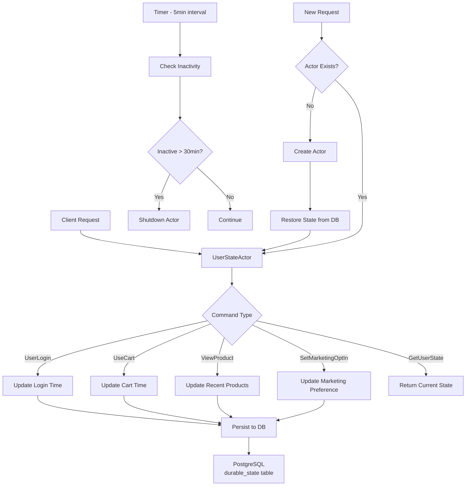

# PERSIST_DURABLE - Pekko Durable State Actor System

## Overview

This project implements an actor system that persistently manages user state using Apache Pekko's Durable State functionality. It manages states such as user's last login time, cart usage time, recently viewed products, and marketing consent preferences. The system provides automatic shutdown after 30 minutes of inactivity and state restoration capabilities when needed.

## Key Features

- **Persistent State Management**: State persistence guaranteed through PostgreSQL
- **Automatic Shutdown**: Automatic termination after 30 minutes of inactivity for resource conservation
- **State Restoration**: Automatic restoration of previous state when actor restarts
- **Unique Identification**: Unique user identification through mallId-userId combination

## Architecture



## Implementation Details

### 1. UserState Model

```kotlin
data class UserState(
    val mallId: String,
    val userId: String,
    val lastLogin: LocalDateTime?,
    val lastCartUsedTime: LocalDateTime?,
    val recentProducts: List<String> = emptyList(),  // Keep max 3 items
    val marketingOptIn: Boolean = false,
    val lastEventTime: LocalDateTime = LocalDateTime.now()
)
```

### 2. Command Pattern

- `UserLogin`: Handle login events
- `UseCart`: Cart usage events
- `ViewProduct`: Product view events
- `SetMarketingOptIn`: Set marketing consent preferences
- `GetUserState`: Query current state
- `CheckInactivity`: Check inactivity status (internal timer)

### 3. Persistence Configuration

Store state in PostgreSQL using Pekko R2DBC:

```conf
pekko.persistence {
  state {
    plugin = "pekko.persistence.r2dbc.state"
  }
  
  r2dbc {
    dialect = "postgres"
    connection-factory {
      driver = "postgres"
      host = "localhost"
      database = "persist_durable"
      user = "postgres"
      password = "postgres"
    }
  }
}
```

## Getting Started

### 1. Start PostgreSQL

```bash
docker-compose up -d
```

### 2. Build Project

```bash
./gradlew build
```

### 3. Run Tests

```bash
./gradlew test
```

## Usage Example

```kotlin
// Create actor
val mallId = "mall001"
val userId = "user001"
val actor = system.spawn(UserStateActor.create(mallId, userId))

// Login event
actor.tell(UserLogin(replyTo))

// View product
actor.tell(ViewProduct("product123", replyTo))

// Use cart
actor.tell(UseCart(replyTo))

// Set marketing consent
actor.tell(SetMarketingOptIn(true, replyTo))

// Query state
actor.tell(GetUserState(stateReplyTo))
```

## Comparison: Pekko Persist vs Kafka KTable vs Apache Flink

### Pekko Persist (Durable State)

**Advantages:**
- ✅ Perfect integration with Actor model
- ✅ Encapsulation of state and behavior
- ✅ Automatic state restoration
- ✅ Timer-based automatic resource management
- ✅ Strong consistency guarantee
- ✅ Suitable for complex business logic

**Disadvantages:**
- ❌ Limited scalability within single JVM process
- ❌ Not suitable for stream processing
- ❌ Memory constraints for high-volume data processing

**Use Cases:**
- User session management
- Game state management
- Workflow engines
- Complex state machines

### Kafka KTable

**Advantages:**
- ✅ Optimized for distributed stream processing
- ✅ High throughput and scalability
- ✅ Perfect integration with Kafka ecosystem
- ✅ Change log-based state management
- ✅ Automatic partitioning and rebalancing

**Disadvantages:**
- ❌ Difficult to implement complex business logic
- ❌ Limited timer-based task processing
- ❌ Difficult fine-grained control per individual entity
- ❌ Kafka infrastructure dependency

**Use Cases:**
- Real-time analytics and aggregation
- Event sourcing
- CDC (Change Data Capture)
- Large-scale stream joins

### Apache Flink

**Advantages:**
- ✅ True stream processing (event time-based)
- ✅ Complex CEP (Complex Event Processing)
- ✅ Exactly-once processing guarantee
- ✅ Large-scale state management (RocksDB backend)
- ✅ Unified batch and stream processing

**Disadvantages:**
- ❌ High operational complexity
- ❌ Resource intensive
- ❌ Steep learning curve
- ❌ Excessive for simple state management

**Use Cases:**
- Real-time anomaly detection
- Complex event pattern matching
- Large-scale ETL pipelines
- Real-time ML inference

## Selection Guide

| Requirements | Pekko Persist | Kafka KTable | Apache Flink |
|-------------|--------------|--------------|--------------|
| Individual Entity State Management | ⭐⭐⭐ | ⭐ | ⭐⭐ |
| Stream Processing | ⭐ | ⭐⭐⭐ | ⭐⭐⭐ |
| Complex Business Logic | ⭐⭐⭐ | ⭐⭐ | ⭐⭐ |
| Scalability | ⭐⭐ | ⭐⭐⭐ | ⭐⭐⭐ |
| Operational Complexity | Low | Medium | High |
| Resource Efficiency | ⭐⭐⭐ | ⭐⭐ | ⭐ |
| Timer/Scheduling | ⭐⭐⭐ | ⭐ | ⭐⭐ |

## Conclusion

**Pekko Persist** is the optimal choice when:
- You need to manage state of individual entities (users, sessions, games, etc.)
- Complex business logic and state transitions are required
- Automatic resource management (timer-based shutdown, etc.) is needed
- Strong consistency is important in medium-scale systems

**Kafka KTable** is suitable when you need to manage state of large-scale stream data and require real-time aggregation, while **Apache Flink** is appropriate when both complex event processing and large-scale state management are simultaneously required.

The user state management system implemented in this project is a good example that leverages Pekko's strengths, providing a practical solution that efficiently manages individual user states while conserving resources.

## License

MIT License

## References

- [Apache Pekko Documentation](https://pekko.apache.org/)
- [Pekko Persistence R2DBC](https://pekko.apache.org/docs/pekko-persistence-r2dbc/current/)
- [Kafka Streams Documentation](https://kafka.apache.org/documentation/streams/)
- [Apache Flink Documentation](https://flink.apache.org/)