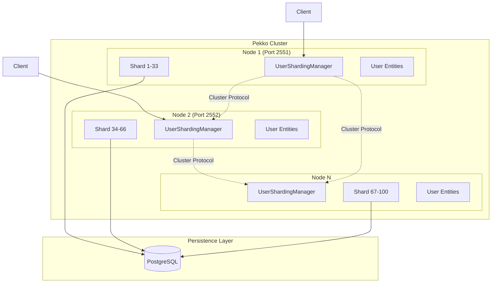
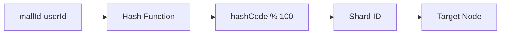

# PERSIST_DURABLE_CLUSTER

Pekko Cluster Sharding을 사용한 분산 사용자 상태 관리 시스템

## 📋 목차

- [개요](#개요)
- [아키텍처](#아키텍처)
- [핵심 개념](#핵심-개념)
- [설치 및 실행](#설치-및-실행)
- [코드 구조](#코드-구조)
- [튜토리얼](#튜토리얼)
- [기술 비교](#기술-비교)

## 개요

이 프로젝트는 Pekko Cluster Sharding과 Durable State를 활용하여 분산 환경에서 사용자 상태를 관리하는 시스템입니다. 각 사용자의 상태는 클러스터 내에서 자동으로 샤딩되며, PostgreSQL을 통해 영구 저장됩니다.

### 주요 기능
- **클러스터 샤딩**: mallId-userId 기반 해시 샤딩
- **영구 저장**: R2DBC PostgreSQL을 통한 상태 저장
- **자동 복구**: 노드 장애 시 자동 엔티티 마이그레이션
- **수평 확장**: 노드 추가를 통한 자동 리밸런싱

## 아키텍처



### 샤딩 전략



## 핵심 개념

### 1. Entity (엔티티)
- **ClusteredUserStateActor**: 개별 사용자의 상태를 관리하는 액터
- 각 엔티티는 고유한 `mallId-userId` 조합으로 식별
- DurableStateBehavior를 통해 상태 영속성 보장

### 2. Sharding (샤딩)
- 100개의 샤드로 엔티티 분산
- Hash 기반 샤딩으로 균등 분포
- 자동 리밸런싱 지원

### 3. Persistence (영속성)
- R2DBC를 통한 비동기 PostgreSQL 접근
- Durable State 패턴으로 이벤트 소싱 대신 상태 저장
- 엔티티 재시작 시 자동 상태 복구

## 설치 및 실행

### 사전 요구사항
- JDK 17+
- Docker & Docker Compose
- Gradle 8.x

### 1. PostgreSQL 실행
```bash
docker-compose up -d
```

### 2. 프로젝트 빌드
```bash
./gradlew build
```

### 3. 테스트 실행
```bash
./gradlew test
```

### 4. 클러스터 노드 실행 (별도 터미널)
```bash
# Node 1 (Seed Node)
java -Dconfig.resource=cluster1.conf -jar build/libs/persist-durable-cluster-1.0-SNAPSHOT.jar

# Node 2
java -Dconfig.resource=cluster2.conf -jar build/libs/persist-durable-cluster-1.0-SNAPSHOT.jar
```

## 코드 구조

```
src/main/kotlin/com/example/persistdurablecluster/
├── actor/
│   └── ClusteredUserStateActor.kt    # 사용자 상태 액터
├── model/
│   ├── UserCommands.kt               # 명령 정의
│   └── UserModels.kt                 # 상태 모델
└── sharding/
    ├── UserShardingManager.kt        # 샤딩 관리자
    └── UserMessageExtractor.kt       # 메시지 추출기
```

## 튜토리얼

### 초보자를 위한 단계별 가이드

#### Step 1: 기본 개념 이해

**Actor Model**
- Actor는 동시성 처리의 기본 단위
- 각 Actor는 독립적인 상태와 메시지 큐를 가짐
- 메시지 기반 통신으로 상태 변경

**Cluster Sharding**
- 여러 노드에 Actor를 자동 분산
- Entity ID 기반으로 샤드 결정
- 노드 추가/제거 시 자동 리밸런싱

#### Step 2: UserShardingManager 사용

```kotlin
// 샤딩 매니저 생성
val shardingManager = UserShardingManager(actorSystem)

// 사용자 엔티티에 명령 전송
shardingManager.sendCommand(
    mallId = "mall001",
    userId = "user001",
    command = UserLogin()
)

// 사용자 상태 조회
val stateProbe = testKit.createTestProbe<UserStateResponse>()
shardingManager.sendCommand(
    mallId = "mall001",
    userId = "user001",
    command = GetUserState(stateProbe.ref())
)
```

#### Step 3: 새로운 명령 추가하기

1. UserCommands.kt에 새 명령 정의:
```kotlin
data class UpdateProfile(
    val nickname: String,
    val replyTo: ActorRef<UserResponse>? = null
) : UserCommand()
```

2. UserModels.kt에 상태 업데이트 메서드 추가:
```kotlin
fun withNickname(nickname: String): UserState {
    return copy(nickname = nickname, lastEventTime = LocalDateTime.now())
}
```

3. ClusteredUserStateActor에 핸들러 추가:
```kotlin
.onCommand(UpdateProfile::class.java) { state, command -> 
    onUpdateProfile(state, command) 
}

private fun onUpdateProfile(state: UserState, command: UpdateProfile): Effect<UserState> {
    val newState = state.withNickname(command.nickname)
    return Effect().persist(newState).thenRun {
        command.replyTo?.tell(ActionCompleted("profile_updated"))
    }
}
```

#### Step 4: 클러스터 모니터링

```kotlin
// 클러스터 상태 확인
val status = shardingManager.getClusterStatus()
println("Cluster Members: ${status.numberOfMembers}")
println("Self Address: ${status.selfAddress}")
println("Roles: ${status.selfRoles}")
```

### 고급 사용 사례

#### 1. Passivation (비활성화)
30분 동안 사용하지 않은 엔티티는 자동으로 메모리에서 제거됩니다:

```kotlin
private val INACTIVITY_TIMEOUT = Duration.ofMinutes(30)

private fun onCheckInactivity(state: UserState): Effect<UserState> {
    val timeSinceLastEvent = Duration.between(state.lastEventTime, now)
    if (timeSinceLastEvent > INACTIVITY_TIMEOUT) {
        return Effect().none().thenStop()  // 엔티티 종료
    }
    return Effect().none()
}
```

#### 2. 분산 트랜잭션 처리
여러 엔티티 간 일관성 유지:

```kotlin
// Saga 패턴 구현 예시
class TransferSaga(
    val fromUser: EntityRef<UserCommand>,
    val toUser: EntityRef<UserCommand>,
    val amount: BigDecimal
) {
    fun execute(): CompletionStage<TransferResult> {
        return fromUser.ask(DeductBalance(amount), timeout)
            .thenCompose { result ->
                if (result.success) {
                    toUser.ask(AddBalance(amount), timeout)
                } else {
                    CompletableFuture.completedFuture(TransferFailed)
                }
            }
            .exceptionally { ex ->
                // 보상 트랜잭션
                fromUser.tell(RefundBalance(amount))
                TransferFailed
            }
    }
}
```

## 기술 비교

### Pekko Cluster Sharding vs Kafka KTable vs Apache Flink

| 특성 | Pekko Cluster Sharding | Kafka KTable | Apache Flink |
|------|------------------------|--------------|--------------|
| **아키텍처** | Actor 기반 분산 시스템 | 이벤트 스트리밍 + 상태 저장 | 스트림 처리 엔진 |
| **상태 관리** | In-memory + Durable State | Changelog + RocksDB | Managed State + Checkpoint |
| **일관성 모델** | Strong (Single Writer) | Eventual | Exactly-Once |
| **확장성** | 수평 확장 (노드 추가) | 파티션 기반 확장 | 병렬 처리 기반 |
| **지연 시간** | 매우 낮음 (μs-ms) | 중간 (ms-s) | 낮음 (ms) |
| **처리량** | 중간-높음 | 매우 높음 | 매우 높음 |
| **복잡도** | 중간 | 낮음 | 높음 |
| **장애 복구** | 자동 (클러스터 프로토콜) | 자동 (리밸런싱) | 체크포인트 기반 |

### 장단점 비교

#### Pekko Cluster Sharding
**장점:**
- ✅ 낮은 지연 시간과 높은 응답성
- ✅ Actor 모델의 직관적인 프로그래밍 모델
- ✅ 강력한 일관성 보장 (Single Writer per Entity)
- ✅ 세밀한 수준의 상태 관리
- ✅ 자동 샤드 리밸런싱

**단점:**
- ❌ 클러스터 관리 복잡도
- ❌ JVM 기반 언어에 제한
- ❌ 대용량 배치 처리에 부적합
- ❌ 운영 도구 생태계 제한적

#### Kafka KTable
**장점:**
- ✅ 매우 높은 처리량
- ✅ 이벤트 소싱과 자연스러운 통합
- ✅ 강력한 생태계와 도구
- ✅ 시계열 데이터 처리에 최적화
- ✅ 변경 이력 자동 관리

**단점:**
- ❌ 상대적으로 높은 지연 시간
- ❌ Eventual Consistency
- ❌ 복잡한 조인 연산 처리
- ❌ Kafka 인프라 의존성

#### Apache Flink
**장점:**
- ✅ 복잡한 스트림 처리 지원
- ✅ Exactly-Once 처리 보장
- ✅ 다양한 윈도우 연산
- ✅ SQL 지원
- ✅ 대규모 데이터 처리 최적화

**단점:**
- ❌ 높은 학습 곡선
- ❌ 운영 복잡도
- ❌ 리소스 사용량 높음
- ❌ 간단한 상태 관리에는 과도함

### 사용 사례별 권장사항

| 사용 사례 | 권장 기술 | 이유 |
|----------|----------|------|
| 실시간 사용자 세션 관리 | Pekko Cluster | 낮은 지연시간, 강한 일관성 |
| 이벤트 소싱 시스템 | Kafka KTable | 이벤트 로그 자동 관리 |
| 실시간 분석 대시보드 | Apache Flink | 복잡한 집계 연산 지원 |
| 마이크로서비스 상태 관리 | Pekko Cluster | Actor 격리, 장애 복구 |
| IoT 데이터 처리 | Kafka KTable | 높은 처리량, 시계열 최적화 |
| 복잡한 CEP (Complex Event Processing) | Apache Flink | 패턴 매칭, 윈도우 연산 |

## 성능 최적화

### 1. 샤드 수 조정
```hocon
pekko.cluster.sharding {
  number-of-shards = 100  # 클러스터 크기에 따라 조정
}
```

### 2. Passivation 설정
```hocon
pekko.cluster.sharding {
  passivate-idle-entity-after = 30m  # 메모리 사용량 최적화
}
```

### 3. 데이터베이스 연결 풀
```hocon
connection-factory {
  max-pool-size = 10
  initial-size = 5
  max-idle-time = 30s
}
```

## 문제 해결

### 클러스터가 형성되지 않을 때
1. 네트워크 연결 확인
2. Seed 노드가 먼저 시작되었는지 확인
3. 방화벽 설정 확인 (포트 2551, 2552)

### 엔티티를 찾을 수 없을 때
1. 샤딩 초기화 대기 (3-5초)
2. Entity ID 형식 확인 (`mallId-userId`)
3. 클러스터 상태 확인

### 성능 이슈
1. 샤드 수 증가
2. 데이터베이스 연결 풀 크기 조정
3. JVM 힙 메모리 증가

## 라이선스

이 프로젝트는 교육 목적으로 작성되었습니다.