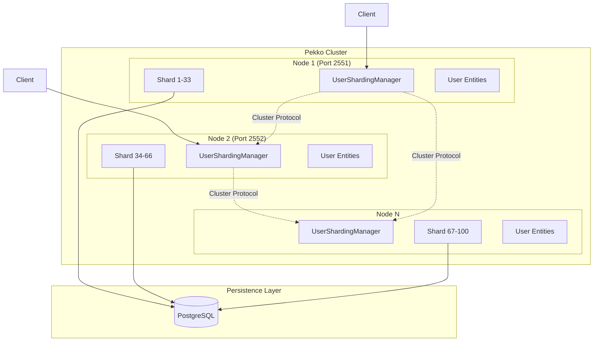
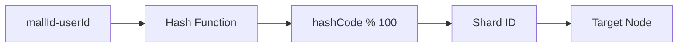

# PERSIST_DURABLE_CLUSTER

Distributed User State Management System using Pekko Cluster Sharding

## 📋 Table of Contents

- [Overview](#overview)
- [Architecture](#architecture)
- [Core Concepts](#core-concepts)
- [Installation and Execution](#installation-and-execution)
- [Code Structure](#code-structure)
- [Tutorial](#tutorial)
- [Technology Comparison](#technology-comparison)

## Overview

This project is a system that manages user state in a distributed environment using Pekko Cluster Sharding and Durable State. Each user's state is automatically sharded within the cluster and permanently stored through PostgreSQL.

### Key Features
- **Cluster Sharding**: Hash-based sharding using mallId-userId
- **Persistent Storage**: State storage through R2DBC PostgreSQL
- **Automatic Recovery**: Automatic entity migration during node failures
- **Horizontal Scaling**: Automatic rebalancing through node addition

## Architecture



### Sharding Strategy



## Core Concepts

### 1. Entity
- **ClusteredUserStateActor**: Actor that manages individual user state
- Each entity is identified by a unique `mallId-userId` combination
- State persistence guaranteed through DurableStateBehavior

### 2. Sharding
- Entity distribution across 100 shards
- Even distribution through hash-based sharding
- Automatic rebalancing support

### 3. Persistence
- Asynchronous PostgreSQL access through R2DBC
- State storage instead of event sourcing with Durable State pattern
- Automatic state recovery during entity restart

## Installation and Execution

### Prerequisites
- JDK 17+
- Docker & Docker Compose
- Gradle 8.x

### 1. Run PostgreSQL
```bash
docker-compose up -d
```

### 2. Build Project
```bash
./gradlew build
```

### 3. Run Tests
```bash
./gradlew test
```

### 4. Run Cluster Nodes (separate terminals)
```bash
# Node 1 (Seed Node)
java -Dconfig.resource=cluster1.conf -jar build/libs/persist-durable-cluster-1.0-SNAPSHOT.jar

# Node 2
java -Dconfig.resource=cluster2.conf -jar build/libs/persist-durable-cluster-1.0-SNAPSHOT.jar
```

## Code Structure

```
src/main/kotlin/com/example/persistdurablecluster/
├── actor/
│   └── ClusteredUserStateActor.kt    # User state actor
├── model/
│   ├── UserCommands.kt               # Command definitions
│   └── UserModels.kt                 # State models
└── sharding/
    ├── UserShardingManager.kt        # Sharding manager
    └── UserMessageExtractor.kt       # Message extractor
```

## Tutorial

### Step-by-Step Guide for Beginners

#### Step 1: Understanding Basic Concepts

**Actor Model**
- Actor is the basic unit of concurrency processing
- Each Actor has independent state and message queue
- State changes through message-based communication

**Cluster Sharding**
- Automatic distribution of Actors across multiple nodes
- Shard determination based on Entity ID
- Automatic rebalancing when nodes are added/removed

#### Step 2: Using UserShardingManager

```kotlin
// Create sharding manager
val shardingManager = UserShardingManager(actorSystem)

// Send command to user entity
shardingManager.sendCommand(
    mallId = "mall001",
    userId = "user001",
    command = UserLogin()
)

// Query user state
val stateProbe = testKit.createTestProbe<UserStateResponse>()
shardingManager.sendCommand(
    mallId = "mall001",
    userId = "user001",
    command = GetUserState(stateProbe.ref())
)
```

#### Step 3: Adding New Commands

1. Define new command in UserCommands.kt:
```kotlin
data class UpdateProfile(
    val nickname: String,
    val replyTo: ActorRef<UserResponse>? = null
) : UserCommand()
```

2. Add state update method to UserModels.kt:
```kotlin
fun withNickname(nickname: String): UserState {
    return copy(nickname = nickname, lastEventTime = LocalDateTime.now())
}
```

3. Add handler to ClusteredUserStateActor:
```kotlin
.onCommand(UpdateProfile::class.java) { state, command -> 
    onUpdateProfile(state, command) 
}

private fun onUpdateProfile(state: UserState, command: UpdateProfile): Effect<UserState> {
    val newState = state.withNickname(command.nickname)
    return Effect().persist(newState).thenRun {
        command.replyTo?.tell(ActionCompleted("profile_updated"))
    }
}
```

#### Step 4: Cluster Monitoring

```kotlin
// Check cluster status
val status = shardingManager.getClusterStatus()
println("Cluster Members: ${status.numberOfMembers}")
println("Self Address: ${status.selfAddress}")
println("Roles: ${status.selfRoles}")
```

### Advanced Use Cases

#### 1. Passivation
Entities unused for 30 minutes are automatically removed from memory:

```kotlin
private val INACTIVITY_TIMEOUT = Duration.ofMinutes(30)

private fun onCheckInactivity(state: UserState): Effect<UserState> {
    val timeSinceLastEvent = Duration.between(state.lastEventTime, now)
    if (timeSinceLastEvent > INACTIVITY_TIMEOUT) {
        return Effect().none().thenStop()  // Terminate entity
    }
    return Effect().none()
}
```

#### 2. Distributed Transaction Processing
Maintaining consistency across multiple entities:

```kotlin
// Saga pattern implementation example
class TransferSaga(
    val fromUser: EntityRef<UserCommand>,
    val toUser: EntityRef<UserCommand>,
    val amount: BigDecimal
) {
    fun execute(): CompletionStage<TransferResult> {
        return fromUser.ask(DeductBalance(amount), timeout)
            .thenCompose { result ->
                if (result.success) {
                    toUser.ask(AddBalance(amount), timeout)
                } else {
                    CompletableFuture.completedFuture(TransferFailed)
                }
            }
            .exceptionally { ex ->
                // Compensating transaction
                fromUser.tell(RefundBalance(amount))
                TransferFailed
            }
    }
}
```

## Technology Comparison

### Pekko Cluster Sharding vs Kafka KTable vs Apache Flink

| Feature | Pekko Cluster Sharding | Kafka KTable | Apache Flink |
|---------|------------------------|--------------|--------------|
| **Architecture** | Actor-based distributed system | Event streaming + state store | Stream processing engine |
| **State Management** | In-memory + Durable State | Changelog + RocksDB | Managed State + Checkpoint |
| **Consistency Model** | Strong (Single Writer) | Eventual | Exactly-Once |
| **Scalability** | Horizontal scaling (add nodes) | Partition-based scaling | Parallel processing based |
| **Latency** | Very low (μs-ms) | Medium (ms-s) | Low (ms) |
| **Throughput** | Medium-High | Very High | Very High |
| **Complexity** | Medium | Low | High |
| **Fault Recovery** | Automatic (cluster protocol) | Automatic (rebalancing) | Checkpoint-based |

### Pros and Cons Comparison

#### Pekko Cluster Sharding
**Advantages:**
- ✅ Low latency and high responsiveness
- ✅ Intuitive programming model with Actor model
- ✅ Strong consistency guarantee (Single Writer per Entity)
- ✅ Fine-grained state management
- ✅ Automatic shard rebalancing

**Disadvantages:**
- ❌ Cluster management complexity
- ❌ Limited to JVM-based languages
- ❌ Not suitable for high-volume batch processing
- ❌ Limited operational tooling ecosystem

#### Kafka KTable
**Advantages:**
- ✅ Very high throughput
- ✅ Natural integration with event sourcing
- ✅ Strong ecosystem and tools
- ✅ Optimized for time-series data processing
- ✅ Automatic change history management

**Disadvantages:**
- ❌ Relatively high latency
- ❌ Eventual Consistency
- ❌ Complex join operation processing
- ❌ Kafka infrastructure dependency

#### Apache Flink
**Advantages:**
- ✅ Support for complex stream processing
- ✅ Exactly-Once processing guarantee
- ✅ Various window operations
- ✅ SQL support
- ✅ Optimized for large-scale data processing

**Disadvantages:**
- ❌ High learning curve
- ❌ Operational complexity
- ❌ High resource usage
- ❌ Excessive for simple state management

### Recommendations by Use Case

| Use Case | Recommended Technology | Reason |
|----------|----------------------|---------|
| Real-time user session management | Pekko Cluster | Low latency, strong consistency |
| Event sourcing system | Kafka KTable | Automatic event log management |
| Real-time analytics dashboard | Apache Flink | Support for complex aggregation operations |
| Microservice state management | Pekko Cluster | Actor isolation, fault recovery |
| IoT data processing | Kafka KTable | High throughput, time-series optimization |
| Complex CEP (Complex Event Processing) | Apache Flink | Pattern matching, window operations |

## Performance Optimization

### 1. Adjust Shard Count
```hocon
pekko.cluster.sharding {
  number-of-shards = 100  # Adjust based on cluster size
}
```

### 2. Passivation Settings
```hocon
pekko.cluster.sharding {
  passivate-idle-entity-after = 30m  # Memory usage optimization
}
```

### 3. Database Connection Pool
```hocon
connection-factory {
  max-pool-size = 10
  initial-size = 5
  max-idle-time = 30s
}
```

## Troubleshooting

### When Cluster Doesn't Form
1. Check network connectivity
2. Ensure seed node started first
3. Check firewall settings (ports 2551, 2552)

### When Entity Cannot Be Found
1. Wait for sharding initialization (3-5 seconds)
2. Verify Entity ID format (`mallId-userId`)
3. Check cluster status

### Performance Issues
1. Increase shard count
2. Adjust database connection pool size
3. Increase JVM heap memory

## License

This project is written for educational purposes.