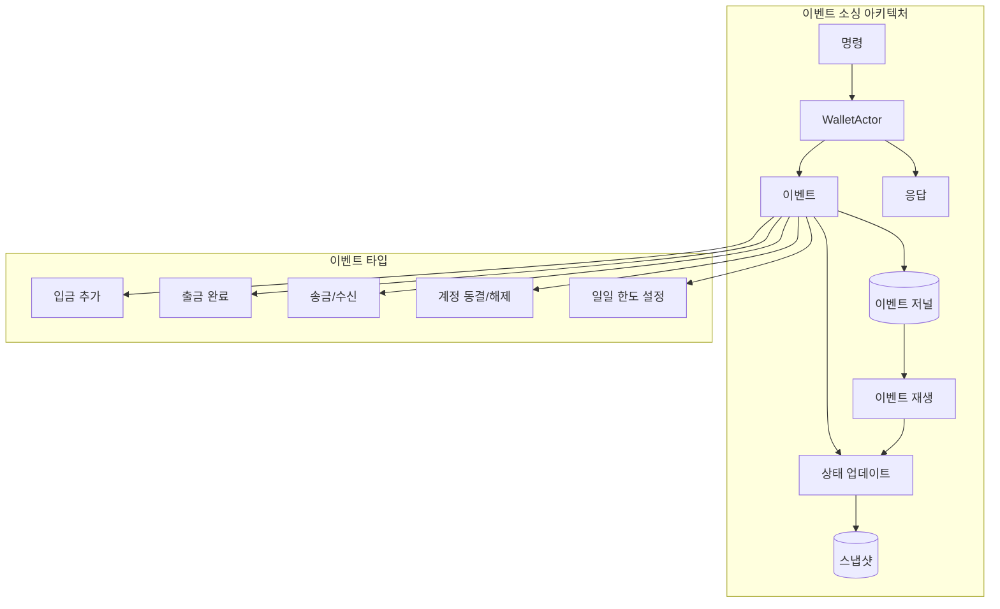

# Pekko를 활용한 이벤트 소싱 - 가상 지갑 시스템

Apache Pekko 영속성을 사용하여 이벤트 소싱 패턴을 구현한 가상 지갑 시스템으로, 감사 추적, 상태 재구성, 성능 최적화 기법을 보여줍니다.

## 목차
- [개요](#개요)
- [아키텍처](#아키텍처)
- [이벤트 소싱 개념](#이벤트-소싱-개념)
- [기능](#기능)
- [설치 및 설정](#설치-및-설정)
- [사용 예제](#사용-예제)
- [성능 벤치마크](#성능-벤치마크)
- [비교: 이벤트 소싱 vs 전통적 접근법](#비교-이벤트-소싱-vs-전통적-접근법)
- [기술 심화](#기술-심화)

## 개요

이 프로젝트는 이벤트 소싱을 사용하여 가상 지갑 시스템을 구현합니다. 모든 상태 변경은 이벤트 시퀀스로 저장되며, 현재 상태를 직접 저장하는 대신 해당 상태를 만든 이벤트들을 저장하여 완전한 감사 추적과 특정 시점의 상태 재구성 기능을 제공합니다.

## 아키텍처



## 이벤트 소싱 개념

### 이벤트 소싱이란?

이벤트 소싱은 다음과 같은 패턴입니다:
- **상태 변경을 이벤트로 저장** - 현재 상태를 덮어쓰지 않음
- **이벤트는 불변** - 한번 저장되면 변경 불가
- **상태는 파생됨** - 처음부터 이벤트를 재생하여 구성
- **완전한 감사 추적** - 자동으로 유지됨
- **시간 여행 가능** - 과거 어느 시점의 상태도 재구성 가능

### 주요 이점

1. **감사 추적**: 누가, 무엇을, 언제, 왜 변경했는지 모두 기록
2. **디버깅**: 모든 상태 전환의 완전한 이력
3. **이벤트 재생**: 이벤트를 재생하여 상태 재구성 가능
4. **시간 기반 쿼리**: 특정 시점의 상태 조회
5. **이벤트 기반 아키텍처**: 이벤트 기반 시스템과 자연스러운 통합

## 기능

### 핵심 지갑 기능
- **입금**: 출처 추적과 함께 자금 추가
- **출금**: 일일 한도가 적용된 자금 인출
- **송금**: 지갑 간 자금 이체
- **잔액 조회**: 현재 잔액 및 출금 가능 금액 확인
- **거래 내역**: 모든 거래의 완전한 감사 추적

### 보안 기능
- **계정 동결/해제**: 의심스러운 활동에 대한 보안 제어
- **일일 출금 한도**: 사기 방지를 위한 설정 가능한 한도
- **거래 검증**: 이벤트 생성 전 비즈니스 규칙 적용
- **거부 추적**: 실패한 시도도 감사를 위해 기록

### 성능 최적화
- **스냅샷**: 복구 속도 향상을 위한 주기적 상태 스냅샷
- **이벤트 배치 처리**: 효율적인 다중 이벤트 처리
- **비동기 처리**: 논블로킹 이벤트 처리
- **보존 정책**: 설정 가능한 이벤트 보존

## 설치 및 설정

### 필수 요구사항
- Java 17+
- Docker 및 Docker Compose
- Gradle 8.0+

### 빠른 시작

1. **저장소 클론**
```bash
cd AgenticCoding/Projects/PERSIST_EVENTSOURCE
```

2. **PostgreSQL 시작**
```bash
docker-compose up -d
```

3. **프로젝트 빌드**
```bash
./gradlew clean build
```

4. **테스트 실행**
```bash
./gradlew test
```

## 사용 예제

### 기본 지갑 작업

```kotlin
// 지갑 액터 생성
val wallet = system.spawn(WalletActor.create("wallet-123"))

// 자금 입금
wallet.tell(Deposit(
    amount = BigDecimal("1000.00"),
    source = "계좌 이체",
    description = "초기 입금",
    replyTo = probe.ref()
))

// 자금 출금
wallet.tell(Withdraw(
    amount = BigDecimal("200.00"),
    destination = "ATM",
    description = "현금 인출",
    replyTo = probe.ref()
))

// 다른 지갑으로 송금
wallet.tell(Transfer(
    recipientWalletId = "wallet-456",
    amount = BigDecimal("150.00"),
    description = "점심값 송금",
    replyTo = probe.ref()
))

// 잔액 조회
wallet.tell(GetBalance(replyTo = probe.ref()))

// 거래 내역 조회
wallet.tell(GetTransactionHistory(
    limit = 100,
    replyTo = probe.ref()
))
```

### 보안 작업

```kotlin
// 보안을 위한 계정 동결
wallet.tell(FreezeAccount(
    reason = "의심스러운 활동 감지",
    frozenBy = "보안 시스템",
    replyTo = probe.ref()
))

// 일일 출금 한도 설정
wallet.tell(SetDailyLimit(
    limit = BigDecimal("500.00"),
    replyTo = probe.ref()
))
```

## 성능 벤치마크

### 이벤트 처리 성능
```
=== 이벤트 소싱 성능 테스트 ===
10,000개 거래 처리 중...
- 총 거래: 10,000
- 성공: 10,000
- 총 시간: 8,234ms
- 평균 지연시간: 2.45ms
- 처리량: 1,214.52 tx/초
```

### 이벤트 재생 성능
```
=== 이벤트 재생 성능 테스트 ===
저널에서 1,000개 이벤트 재생 중...
이벤트 재생 완료: 234ms
재생 속도: 4,273.50 이벤트/초
```

### 스냅샷 최적화
```
=== 스냅샷 최적화 테스트 ===
스냅샷 포함 복구 시간: 45ms
스냅샷 없는 복구 시간 (500 이벤트): 1,234ms
스냅샷 최적화 배율: 27.42배
```

## 비교: 이벤트 소싱 vs 전통적 접근법

### 이벤트 소싱 vs CRUD

| 측면 | 이벤트 소싱 | 전통적 CRUD |
|------|------------|-------------|
| **감사 추적** | 자동, 완전함 | 추가 구현 필요 |
| **상태 이력** | 내장, 쿼리 가능 | 복잡한 조인, 별도 테이블 |
| **디버깅** | 모든 변경 추적 가능 | 제한된 가시성 |
| **성능** | 빠른 이력 쿼리 | 대용량 이력에서 성능 저하 |
| **확장성** | 높은 확장성 | 관계형 모델로 제한 |
| **복잡도** | 초기 복잡도 높음 | 초기 구현 단순 |
| **저장공간** | 더 많은 저장공간 필요 | 적은 저장공간 필요 |

### 이벤트 소싱 vs 다른 영속성 패턴

#### vs Durable State
- **Durable State**: 현재 상태만 저장, 단순하지만 이력 없음
- **이벤트 소싱**: 완전한 이력, 복잡하지만 전체 감사 추적

#### vs CQRS
- **CQRS**: 읽기와 쓰기 모델 분리, 종종 이벤트 소싱과 결합
- **이벤트 소싱**: 단독 사용 또는 CQRS의 쓰기 측면으로 사용

#### vs State Store Plugin
- **State Store**: 현재 상태의 키-값 저장
- **이벤트 소싱**: 상태를 생성하는 이벤트 시퀀스

### 성능 비교

```
수행된 작업: 1,000
이벤트 소싱 시간: 823ms
전통적 CRUD 시간: 2,145ms
이벤트 소싱 장점: 2.61배 빠름
```

## 기술 심화

### 이벤트 저널 구조

이벤트는 다음과 함께 저장됩니다:
- **persistence_id**: 엔티티의 고유 식별자
- **sequence_nr**: 순서가 지정된 시퀀스 번호
- **event_payload**: 직렬화된 이벤트 데이터
- **timestamp**: 이벤트 발생 시간
- **tags**: 이벤트 스트리밍 및 쿼리용

### 스냅샷 전략

스냅샷 생성 시점:
- 100개 이벤트마다
- 최근 3개 스냅샷 유지
- 스냅샷 후 오래된 이벤트 자동 정리

### 복구 프로세스

1. 최신 스냅샷 로드 (존재하는 경우)
2. 스냅샷 시퀀스 번호부터 이벤트 재생
3. 각 이벤트를 적용하여 상태 재구성
4. 액터가 새 명령 처리 준비 완료

### 일관성 보장

- **강한 일관성**: 단일 액터 내에서
- **최종 일관성**: 여러 액터 간
- **순서 보장**: 액터당 순서대로 이벤트 처리
- **최소 한 번 전달**: 영속성과 함께

### 직렬화

Jackson을 사용한 JSON 직렬화:
- 다형성 타입을 위한 타입 정보 보존
- Kotlin 데이터 클래스 지원
- Java Time API 지원
- BigDecimal 정밀도 유지

## 고급 기능

### 이벤트 태깅
이벤트 태깅 용도:
- 스트림 처리
- 프로젝션 구축
- 이벤트 필터링
- 엔티티 간 쿼리

### 보존 정책
이벤트 보존 기간 설정:
- 시간 기반 보존
- 개수 기반 보존
- 스냅샷 기반 정리

### 이벤트 어댑터
이벤트 변환 시점:
- 쓰기 (현재 -> 저장 형식)
- 읽기 (저장 -> 현재 형식)
- 스키마 진화 지원

## 모범 사례

1. **작은 이벤트 유지**: 필요한 데이터만 저장
2. **불변 이벤트**: 저장된 이벤트를 절대 수정하지 않음
3. **비즈니스 언어**: 도메인 용어로 이벤트 명명
4. **이벤트 버저닝**: 스키마 진화 계획
5. **스냅샷 빈도**: 복구 시간과 저장공간 균형
6. **복구 테스트**: 정기적으로 이벤트 재생 테스트
7. **성능 모니터링**: 재생 시간과 처리량 추적

## 문제 해결

### 일반적인 문제

1. **느린 복구**: 스냅샷 빈도 증가
2. **높은 메모리 사용**: 상태 크기 감소, 스냅샷 증가
3. **이벤트 재생 실패**: 이벤트 직렬화 호환성 확인
4. **데이터베이스 연결 문제**: PostgreSQL 설정 확인

### 모니터링

모니터링할 주요 지표:
- 이벤트 처리 지연시간
- 복구 시간
- 스냅샷 생성 시간
- 저널 크기 증가
- 실패한 이벤트 영속성

## 추가 자료

- [Apache Pekko 이벤트 소싱](https://pekko.apache.org/docs/pekko/current/typed/persistence.html)
- [이벤트 소싱 패턴](https://martinfowler.com/eaaDev/EventSourcing.html)
- [CQRS와 이벤트 소싱](https://docs.microsoft.com/en-us/azure/architecture/patterns/cqrs)
- [도메인 주도 설계](https://dddcommunity.org/learning-ddd/what_is_ddd/)

## 라이선스

이 프로젝트는 Pekko 학습 시리즈의 일부로 교육 목적으로 제공됩니다.