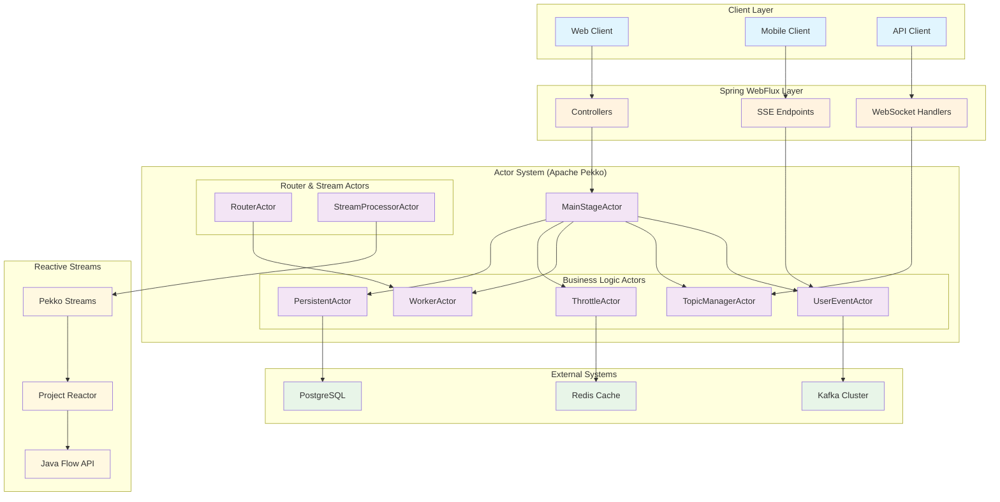

# 액터모델 + 리액티브 스트림 코드구현 by Claude Code

**리액티브 스트림(Reactive Streams)**은 비동기 데이터 처리와 흐름 제어(Backpressure)를 표준화한 자바 진영의 명세로, Netflix, Lightbend, Pivotal 등 주요 기업들이 참여해 2015년에 정식 발표되었습니다. Java 9부터는 Flow API로 포함되어 공식적인 JVM 표준이 되었으며, Spring WebFlux, Akka Streams, Project Reactor, RxJava 등 다양한 프레임워크들이 이를 기반으로 비동기 스트림 처리의 신뢰성과 일관성을 제공하고 있습니다. 특히 고속 데이터 전송, 스트리밍 분석, 웹소켓 기반 실시간 서비스에 핵심적인 기술로 자리 잡았습니다.

**액터모델(Actor Model)**은 상태를 메시지를 통해만 변경할 수 있는 독립적인 액터 단위로 분산 시스템을 구성하는 개념으로, 동시성 문제를 안전하게 해결하면서 수평 확장이 용이하다는 장점이 있습니다. Erlang/OTP, Akka(Lightbend), Microsoft Orleans 등의 구현체를 통해 WhatsApp, LinkedIn, Tesla, Microsoft 같은 글로벌 기업들이 실시간 통신, IoT, 게임, AI 에이전트 등에 성공적으로 활용하고 있으며, 이벤트 기반 구조와 궁합이 좋아 복잡한 비즈니스 로직이나 AI 파이프라인의 오케스트레이션에도 탁월한 구조를 제공합니다.

## 전체 아키텍처 개념도

## 프로젝트 목적

액터모델을 알지못해도 액터모델을 이용하는 다양한 샘플기능을 바이브로도 만들수있지만 
바이브를 통해 액터구현을 다양하게 시도할수 있음으로 학습곡선에따른 시간을 단축하는것과 동시에
액터시스템이 지원하는 클러스터 포함 상태프로그래밍/분산처리 설계능력을 로컬로 수행함으로 고오급 설계 능력을 배양하는데 목적이있습니다. 

## 이용 AI-TOOL
- Claude Code

## 프롬프트 샘플

AgenticCoding/Projects는 여기서 구성된 프롬프트에의해 생성된 프로젝트로 참고할수 있으며
프롬프트를 참고해 다양한 지침을 생성한후 다양한 액터시스템을 구현에 도전할수 있습니다.
샘플코드의 생성순서는 난이도에 따른 학습순서와 무관하게 작성되고 있으나~ CRUD가 일반적으로 잘하지 못하는 영역의 구현을 시도하고 있습니다.

### 검증된 프롬프트 목록 (학습 순서별)

현재 상위 경로에서 수행 - 난이도별 학습 경로

| 순번 | 프롬프트 | 난이도 | 핵심 학습 목표 |
|------|----------|--------|---------------|
| **00** | [SSE-PUSH 시스템](./Prompt/00_SSE-PUSH-SYSTEM.md) | ⭐⭐ | Spring WebFlux + Actor 기본 패턴 |
| **01** | [액터 동시성 처리](./Prompt/01_ACTOR_CONCURRENCY.md) | ⭐ | Tell/Ask 패턴과 동시성 모델 비교 |
| **02** | [LLM 토큰 제어](./Prompt/02_LLM_THROTTLE.md) | ⭐⭐⭐ | 백프레셔와 Pekko Streams 활용 |
| **03** | [액터 라우터](./Prompt/03_ACTOR_ROUTER.md) | ⭐⭐ | 6가지 라우팅 전략과 확장성 |
| **04** | [액터 스트림](./Prompt/04_ACTOR_STREAM.md) | ⭐⭐⭐ | 다양한 스트림 처리 기술 비교 |
| **05** | [액터 스로틀](./Prompt/05_ACTOR_THROTTLE.md) | ⭐⭐⭐ | 고급 백프레셔와 메시지 큐 관리 |
| **06** | [Kafka 커넥터](./Prompt/06_CONNECTOR_KAFKA.md) | ⭐⭐⭐⭐ | 외부 시스템 통합과 이벤트 처리 |
| **07** | [액터 영속성](./Prompt/07_PERSIST_DURABLE.md) | ⭐⭐⭐⭐ | 영속성과 상태 복원, 자원 관리 |
| **08** | [Pekko HTTP 서버](./Prompt/08_PEKKO_HTTP.md) | ⭐⭐⭐⭐ | Pekko HTTP 서버와 순수 액터 시스템 |
| **09** | [분산 영속성 클러스터](./Prompt/09_PERSIST_DURABLE_CLUSTER.md) | ⭐⭐⭐⭐⭐ | Cluster Sharding과 Durable State 통합 |
| **10** | [이벤트 소싱 영속성](./Prompt/10_PERSIST_EVENTSOURCE.md) | ⭐⭐⭐⭐⭐ | 완전한 감사 추적과 상태 재구성을 갖춘 이벤트 소싱 |

> **참고**: 액터모델은 자바(+코틀린)가 지원하는 다양한 동시성프로그래밍을 이해하며 이를 이용하기때문에, 동시성 처리 기본기는 중요합니다.

## 생성된 프로젝트

Claude Code에 의해 코딩없이 생성된 프로젝트는 [Projects 디렉토리](./Projects/)에서 확인할 수 있습니다.

### 프로젝트 목록 by AI생성 (학습 순서별)

#### 00. [SSE Push System](./Projects/SSE-PUSH-SYSTEM/) ⭐⭐
**핵심 기술**: Spring WebFlux + Apache Pekko Actor + SSE  
**학습 목표**: 실시간 푸시 시스템과 액터 모델의 기본 통합 패턴
- Server-Sent Events를 통한 실시간 이벤트 스트리밍
- TopicManagerActor와 UserEventActor를 활용한 토픽 기반 pub/sub
- 이벤트 히스토리 관리 (토픽당 100개 이벤트 저장)
- Ask/Tell 패턴을 활용한 비동기 메시지 처리
- **성과**: 실시간 통신 + 액터 모델의 기초 이해

#### 01. [Actor Concurrency](./Projects/ACTOR_CONCURRENCY/) ⭐
**핵심 기술**: Apache Pekko + 동시성 처리 패턴  
**학습 목표**: Tell/Ask 패턴과 3가지 동시성 모델 비교 학습
- HelloActor를 통한 기본 액터 패턴 학습
- Tell 패턴(fire-and-forget) vs Ask 패턴(request-response)
- CompletableFuture, WebFlux Mono, Kotlin Coroutines 동시성 비교
- TestProbe를 활용한 액터 테스트 방법론
- **성과**: 액터 모델과 JVM 동시성 프로그래밍의 융합

#### 02. [LLM Throttle](./Projects/LLM-THROTTLE/) ⭐⭐⭐
**핵심 기술**: Pekko Streams + 백프레셔 + 토큰 기반 스로틀링  
**학습 목표**: 고급 백프레셔 메커니즘과 자동 속도 조절
- 기본 버전: 수동 백프레셔와 단계별 지연 처리
- 향상된 버전: Pekko Streams 기반 자동 속도 조절
- 슬라이딩 윈도우를 통한 토큰 사용량 추적
- 실패 요청 관리와 재시도 메커니즘
- **성과**: 백프레셔와 리액티브 스트림의 실전 활용

#### 03. [Actor Router](./Projects/ACTOR_ROUTER/) ⭐⭐
**핵심 기술**: 액터 라우팅 전략 + 동적 스케일링  
**학습 목표**: 6가지 라우팅 전략과 로컬→클러스터 확장 설계
- Round Robin, Random, Least Loaded, Consistent Hash 등
- Priority Based, Broadcast 라우팅 구현
- 동적 워커 스케일링(Scale In/Out)
- 로컬 시스템에서 클러스터로의 무중단 전환 가능 구조
- **성과**: 분산 시스템 설계와 확장성 패턴 이해

#### 04. [Actor Stream](./Projects/ACTOR_STREAM/) ⭐⭐⭐
**핵심 기술**: 스트림 처리 기술 비교 + StreamProcessorActor  
**학습 목표**: 4가지 스트림 처리 기술의 특성과 성능 비교
- Pekko Streams: 액터 기반 스트림 처리
- Java Streams API: 함수형 스트림 처리
- WebFlux: 리액티브 스트림 처리
- Kotlin Coroutines: 코루틴 기반 비동기 처리
- **성과**: 스트림 처리 기술들의 장단점과 적용 시나리오 파악

#### 05. [Actor Throttle](./Projects/ACTOR_THROTTLE/) ⭐⭐⭐
**핵심 기술**: 고급 스로틀링 + ThrottleManagerActor  
**학습 목표**: 복합적인 백프레셔 전략과 메시지 큐 관리
- ThrottleActor와 ThrottleManagerActor의 계층적 구조
- 다단계 백프레셔 적용과 메시지 스태싱
- 용량 기반 동적 지연 조절
- 실시간 메트릭 수집과 모니터링
- **성과**: 복잡한 시스템에서의 부하 제어와 안정성 확보

#### 06. [Kafka Connector](./Projects/CONNECTOR_KAFKA/) ⭐⭐⭐⭐
**핵심 기술**: Kafka + Pekko Streams + Actor 통합  
**학습 목표**: 외부 시스템과의 안정적인 이벤트 처리 통합
- EventProducer: Kafka로의 고성능 이벤트 전송
- EventConsumerActor: 액터 기반 이벤트 상태 관리
- KafkaConsumerConnector: Kafka-Actor 연결 계층
- Kill Switch를 통한 우아한 종료 처리
- **성과**: 대규모 이벤트 스트리밍과 액터 모델의 실전 결합

#### 07. [Persist Durable](./Projects/PERSIST_DURABLE/) ⭐⭐⭐⭐
**핵심 기술**: Pekko Durable State + PostgreSQL + 자원 관리  
**학습 목표**: 영속성과 상태 복원, 효율적인 자원 관리
- UserStateActor: 사용자별 상태 영속화
- 30분 비활성화 시 자동 셧다운과 상태 복원
- PostgreSQL R2DBC를 통한 비동기 영속성
- mallId-userId 조합의 고유 식별자 설계
- **비교 분석**: Pekko Persist vs Kafka KTable vs Apache Flink
- **성과**: 상태 관리의 영속성과 효율성 양립

#### 08. [Pekko HTTP](./Projects/PEKKO_HTTP/) ⭐⭐⭐⭐
**핵심 기술**: Pekko HTTP + WebSocket + Swagger UI + 순수 액터 시스템  
**학습 목표**: Spring Boot 없이 경량 HTTP 서버 구축과 액터 시스템 전면 활용
- Spring Boot 의존성 없는 순수 Pekko HTTP 서버 구현
- WebSocket과 SSE를 통한 실시간 양방향 통신
- Swagger UI 통합으로 대화형 API 문서화
- HelloActor, EventStreamActor, WebSocketActor 등 다양한 액터 패턴
- 메모리 사용량 ~50MB, 시작 시간 ~1초의 경량 서버
- **비교 분석**: Pekko HTTP vs Spring Boot WebFlux 장단점
- **성과**: 경량 마이크로서비스와 고성능 스트리밍 서버 구축 능력

#### 09. [Persist Durable Cluster](./Projects/PERSIST_DURABLE_CLUSTER/) ⭐⭐⭐⭐⭐
**핵심 기술**: Pekko Cluster Sharding + Durable State + PostgreSQL  
**학습 목표**: 분산 환경에서의 상태 관리와 클러스터 샤딩 마스터
- Cluster Sharding을 통한 엔티티 자동 분산 관리
- mallId-userId 기반 해시 샤딩 전략
- R2DBC PostgreSQL을 통한 비동기 영속성
- 노드 장애 시 자동 엔티티 마이그레이션
- 30분 비활성화 시 자동 Passivation
- 100개 샤드로 균등 분산 및 자동 리밸런싱
- **비교 분석**: Pekko Cluster vs Kafka KTable vs Apache Flink
- **성과**: 엔터프라이즈급 분산 상태 관리 시스템 구축 능력

#### 10. [Persist EventSource](./Projects/PERSIST_EVENTSOURCE/) ⭐⭐⭐⭐⭐
**핵심 기술**: Pekko Event Sourcing + PostgreSQL + 스냅샷 + 감사 추적  
**학습 목표**: 이벤트 소싱 패턴, 완전한 감사 기능, CQRS 구현
- 입금(DepositAdded)과 출금(WithdrawalMade) 이벤트를 갖춘 가상 지갑
- 모든 거래에 대한 완전한 감사 추적과 추적성
- 특정 시점의 상태 재구성을 위한 이벤트 재생 기능
- 성능 향상을 위한 스냅샷 최적화
- 보안 기능: 계정 동결/해제, 일일 출금 한도
- 거래 검증 및 거부 추적
- 전통적인 CRUD 대비 장점을 보여주는 성능 벤치마크
- **비교 분석**: 이벤트 소싱 vs CRUD vs Durable State vs State Store Plugin
- **성과**: 완전한 감사 기능을 갖춘 엔터프라이즈급 이벤트 소싱 시스템 구축

## 액터 모델의 CQRS 처리 장점

전통적인 CRUD 패턴을 넘어서 CQRS(Command Query Responsibility Segregation) 패턴을 구현할 때 액터 모델이 제공하는 핵심 가치:

### 🎯 명령(Command) 처리의 우수성
- **상태 캡슐화**: 각 액터가 독립적인 상태를 관리하여 동시성 이슈 원천 차단
- **메시지 기반 처리**: 비동기 명령 처리로 높은 처리량과 응답성 확보
- **백프레셔 적용**: 시스템 부하에 따른 자동 속도 조절로 안정성 보장

### 📊 조회(Query) 처리의 효율성
- **읽기 모델 최적화**: 액터별 상태 관리로 빠른 조회 성능
- **이벤트 히스토리**: 시간별 상태 변화 추적 가능
- **분산 캐싱**: 액터 레벨에서의 인메모리 상태 관리

### 🔄 전체적인 시스템 이점
- **수평 확장**: 액터 단위로 독립적인 확장 가능
- **장애 격리**: 하나의 액터 실패가 전체 시스템에 미치는 영향 최소화
- **복잡한 워크플로우**: 상태 기반 처리로 복잡한 비즈니스 로직 단순화

## 액터모델(리액티브 스트림) 학습을 위한 다양한 프롬프트

다음과 같은 질문을 LLM에게 의뢰해~ 액터모델이 할수 있는것들을 조사한후 엑터모델을 활용한 다양한 고급기능 구현을 시도할수 있습니다.

- 자바진영의 리액티브 스트림을 영향을 준 기업과 활동들을 연도별로 정리
  - webflux 부터 시작한 자바개발자에게 인사이트를 넓혀줄수 있습니다.
- 액터모델로 시도할수 있는 유용한 샘플소개
- AKKA및 언어 상관없이 액터모델을 도입해 성공한 다양한 테크기업의 사례소개, 국내/해외를 나눠서 
  - 기업테크 조사는 할루네이션이 있을수 있음으로 실 활용사례는 검색을 한번더 하는것을 권장
- CRUD만 개발할줄 아는 개발자가 액터모델을 수련하게되면 할수 있는것들? 주로 DB/REDIS에만 의존해 상태없는 프로그래밍만 하는 케이스와 비교해 설명해죠
- 다양한 AI를 활용해야하는시대 액터모델을 도입했을때~ 효과와 실제 활용한 기업의 사례는?
- Backpresure 가 적용된것과 아닌것의 프로그래밍 난이도차이? 안정성/성능 관점에서도 비교해죠
- JAVA9에서 STREAM API가 적용되기까지 영향을 준 활동및, 영향력 있는 개발자는? 

## Docs
- https://wiki.webnori.com/display/AKKA/Vibe+Coding+Actor+Model
- https://wiki.webnori.com/display/AKKA