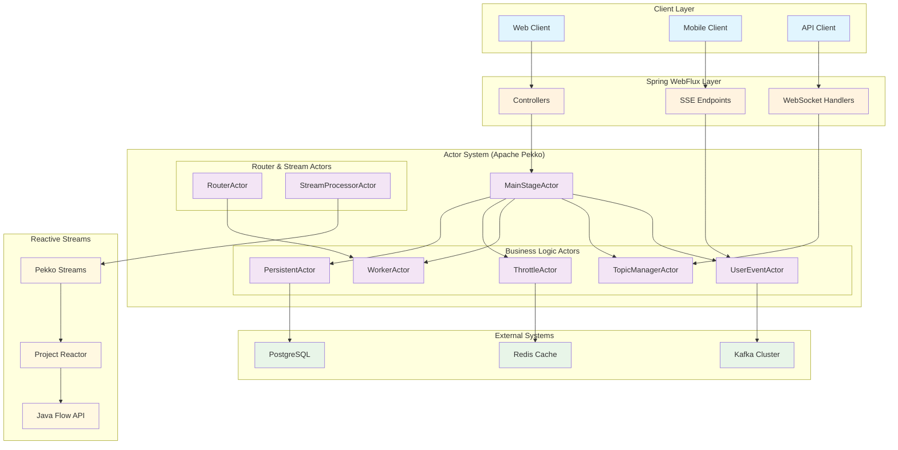

# Kotlin Pekko Actor Model + Reactive Streams Implementation by Claude Code

**Reactive Streams** is a Java ecosystem specification that standardizes asynchronous data processing and flow control (Backpressure). Major companies like Netflix, Lightbend, and Pivotal participated in its development, officially released in 2015. Since Java 9, it has been included as the Flow API, becoming an official JVM standard. Various frameworks such as Spring WebFlux, Akka Streams, Project Reactor, and RxJava provide reliability and consistency in asynchronous stream processing based on this specification. It has become a core technology particularly for high-speed data transmission, streaming analytics, and WebSocket-based real-time services.

**Actor Model** is a concept that constructs distributed systems with independent actor units whose state can only be changed through messages. It has the advantage of safely resolving concurrency issues while facilitating horizontal scaling. Through implementations like Erlang/OTP, Akka (Lightbend), and Microsoft Orleans, global companies such as WhatsApp, LinkedIn, Tesla, and Microsoft have successfully utilized it for real-time communication, IoT, gaming, and AI agents. Its compatibility with event-driven architecture also provides an excellent structure for orchestrating complex business logic and AI pipelines.

## Overall Architecture Diagram

## Project Purpose

Even without prior knowledge of the Actor Model, various sample features can be created using vibe coding. However, by attempting diverse actor implementations through vibe coding, we can reduce the learning curve time while simultaneously developing advanced design capabilities in state programming and distributed processing, including clusters supported by actor systems, by executing them locally.

## AI Tools Used
- Claude Code

## Prompt Samples

The AgenticCoding/Projects directory contains projects generated by the prompts configured here. You can reference these prompts to create various guidelines and challenge yourself with implementing diverse actor systems. While the sample code generation order is independent of the learning difficulty order, we are attempting implementations in areas where CRUD typically struggles.

### Verified Prompt List (By Learning Order)

Execute from the current parent path - Learning path by difficulty level

| Order | Prompt | Difficulty | Core Learning Objective |
|-------|--------|------------|-------------------------|
| **00** | [SSE-PUSH System](./Prompt/00_SSE-PUSH-SYSTEM.md) | ⭐⭐ | Spring WebFlux + Actor Basic Pattern |
| **01** | [Actor Concurrency](./Prompt/01_ACTOR_CONCURRENCY.md) | ⭐ | Tell/Ask Pattern and Concurrency Model Comparison |
| **02** | [LLM Token Control](./Prompt/02_LLM_THROTTLE.md) | ⭐⭐⭐ | Backpressure and Pekko Streams Utilization |
| **03** | [Actor Router](./Prompt/03_ACTOR_ROUTER.md) | ⭐⭐ | 6 Routing Strategies and Scalability |
| **04** | [Actor Stream](./Prompt/04_ACTOR_STREAM.md) | ⭐⭐⭐ | Comparison of Various Stream Processing Technologies |
| **05** | [Actor Throttle](./Prompt/05_ACTOR_THROTTLE.md) | ⭐⭐⭐ | Advanced Backpressure and Message Queue Management |
| **06** | [Kafka Connector](./Prompt/06_CONNECTOR_KAFKA.md) | ⭐⭐⭐⭐ | External System Integration and Event Processing |
| **07** | [Actor Persistence](./Prompt/07_PERSIST_DURABLE.md) | ⭐⭐⭐⭐ | Persistence, State Recovery, and Resource Management |
| **08** | [Pekko HTTP Server](./Prompt/08_PEKKO_HTTP.md) | ⭐⭐⭐⭐ | Pekko HTTP Server and Pure Actor System |
| **09** | [Distributed Persistence Cluster](./Prompt/09_PERSIST_DURABLE_CLUSTER.md) | ⭐⭐⭐⭐⭐ | Cluster Sharding and Durable State Integration |
| **10** | [Persist EventSource](./Prompt/10_PERSIST_EVENTSOURCE.md) | ⭐⭐⭐⭐⭐ | Event Sourcing with complete audit trail and state reconstruction |

> **Note**: Since the Actor Model understands and utilizes various concurrent programming features supported by Java (+Kotlin), fundamental concurrent processing skills are important.

## Generated Projects

Projects generated without coding by Claude Code can be found in the [Projects directory](./Projects/).

### Project List by AI Generation (By Learning Order)

#### 00. [SSE Push System](./Projects/SSE-PUSH-SYSTEM/) ⭐⭐
**Core Technologies**: Spring WebFlux + Apache Pekko Actor + SSE  
**Learning Objectives**: Basic integration patterns of real-time push systems and actor models
- Real-time event streaming through Server-Sent Events
- Topic-based pub/sub using TopicManagerActor and UserEventActor
- Event history management (storing 100 events per topic)
- Asynchronous message processing using Ask/Tell patterns
- **Achievement**: Understanding the basics of real-time communication + actor model

#### 01. [Actor Concurrency](./Projects/ACTOR_CONCURRENCY/) ⭐
**Core Technologies**: Apache Pekko + Concurrency Processing Patterns  
**Learning Objectives**: Learning Tell/Ask patterns and comparing 3 concurrency models
- Learning basic actor patterns through HelloActor
- Tell pattern (fire-and-forget) vs Ask pattern (request-response)
- Comparing CompletableFuture, WebFlux Mono, Kotlin Coroutines concurrency
- Actor testing methodology using TestProbe
- **Achievement**: Fusion of actor model and JVM concurrent programming

#### 02. [LLM Throttle](./Projects/LLM-THROTTLE/) ⭐⭐⭐
**Core Technologies**: Pekko Streams + Backpressure + Token-based Throttling  
**Learning Objectives**: Advanced backpressure mechanisms and automatic rate adjustment
- Basic version: Manual backpressure and step-by-step delay processing
- Enhanced version: Automatic rate adjustment based on Pekko Streams
- Token usage tracking through sliding window
- Failed request management and retry mechanisms
- **Achievement**: Practical application of backpressure and reactive streams

#### 03. [Actor Router](./Projects/ACTOR_ROUTER/) ⭐⭐
**Core Technologies**: Actor Routing Strategies + Dynamic Scaling  
**Learning Objectives**: 6 routing strategies and local→cluster scalable design
- Round Robin, Random, Least Loaded, Consistent Hash, etc.
- Priority Based, Broadcast routing implementation
- Dynamic worker scaling (Scale In/Out)
- Architecture enabling seamless transition from local system to cluster
- **Achievement**: Understanding distributed system design and scalability patterns

#### 04. [Actor Stream](./Projects/ACTOR_STREAM/) ⭐⭐⭐
**Core Technologies**: Stream Processing Technology Comparison + StreamProcessorActor  
**Learning Objectives**: Comparing characteristics and performance of 4 stream processing technologies
- Pekko Streams: Actor-based stream processing
- Java Streams API: Functional stream processing
- WebFlux: Reactive stream processing
- Kotlin Coroutines: Coroutine-based asynchronous processing
- **Achievement**: Understanding pros/cons and application scenarios of stream processing technologies

#### 05. [Actor Throttle](./Projects/ACTOR_THROTTLE/) ⭐⭐⭐
**Core Technologies**: Advanced Throttling + ThrottleManagerActor  
**Learning Objectives**: Complex backpressure strategies and message queue management
- Hierarchical structure of ThrottleActor and ThrottleManagerActor
- Multi-level backpressure application and message stashing
- Capacity-based dynamic delay adjustment
- Real-time metrics collection and monitoring
- **Achievement**: Load control and stability assurance in complex systems

#### 06. [Kafka Connector](./Projects/CONNECTOR_KAFKA/) ⭐⭐⭐⭐
**Core Technologies**: Kafka + Pekko Streams + Actor Integration  
**Learning Objectives**: Stable event processing integration with external systems
- EventProducer: High-performance event transmission to Kafka
- EventConsumerActor: Actor-based event state management
- KafkaConsumerConnector: Kafka-Actor connection layer
- Graceful shutdown processing through Kill Switch
- **Achievement**: Practical combination of large-scale event streaming and actor model

#### 07. [Persist Durable](./Projects/PERSIST_DURABLE/) ⭐⭐⭐⭐
**Core Technologies**: Pekko Durable State + PostgreSQL + Resource Management  
**Learning Objectives**: Persistence, state recovery, and efficient resource management
- UserStateActor: Per-user state persistence
- Automatic shutdown and state recovery after 30 minutes of inactivity
- Asynchronous persistence through PostgreSQL R2DBC
- Unique identifier design with mallId-userId combination
- **Comparative Analysis**: Pekko Persist vs Kafka KTable vs Apache Flink
- **Achievement**: Balancing persistence and efficiency in state management

#### 08. [Pekko HTTP](./Projects/PEKKO_HTTP/) ⭐⭐⭐⭐
**Core Technologies**: Pekko HTTP + WebSocket + Swagger UI + Pure Actor System  
**Learning Objectives**: Building lightweight HTTP server without Spring Boot and full actor system utilization
- Pure Pekko HTTP server implementation without Spring Boot dependencies
- Real-time bidirectional communication through WebSocket and SSE
- Interactive API documentation with Swagger UI integration
- Various actor patterns including HelloActor, EventStreamActor, WebSocketActor
- Lightweight server with ~50MB memory usage and ~1 second startup time
- **Comparative Analysis**: Pekko HTTP vs Spring Boot WebFlux pros and cons
- **Achievement**: Ability to build lightweight microservices and high-performance streaming servers

#### 09. [Persist Durable Cluster](./Projects/PERSIST_DURABLE_CLUSTER/) ⭐⭐⭐⭐⭐
**Core Technologies**: Pekko Cluster Sharding + Durable State + PostgreSQL  
**Learning Objectives**: Mastering state management and cluster sharding in distributed environments
- Automatic entity distribution management through Cluster Sharding
- Hash sharding strategy based on mallId-userId
- Asynchronous persistence through R2DBC PostgreSQL
- Automatic entity migration on node failure
- Automatic Passivation after 30 minutes of inactivity
- Even distribution across 100 shards and automatic rebalancing
- **Comparative Analysis**: Pekko Cluster vs Kafka KTable vs Apache Flink
- **Achievement**: Ability to build enterprise-grade distributed state management systems

#### 10. [Persist EventSource](./Projects/PERSIST_EVENTSOURCE/) ⭐⭐⭐⭐⭐
**Core Technologies**: Pekko Event Sourcing + PostgreSQL + Snapshots + Audit Trail  
**Learning Objectives**: Event sourcing pattern, complete audit capabilities, and CQRS implementation
- Virtual wallet with DepositAdded and WithdrawalMade events
- Complete audit trail and traceability for all transactions
- Event replay capability for state reconstruction at any point in time
- Snapshot optimization for performance improvement
- Security features: account freeze/unfreeze, daily withdrawal limits
- Transaction validation and rejection tracking
- Performance benchmarks demonstrating advantages over traditional CRUD
- **Comparative Analysis**: Event Sourcing vs CRUD vs Durable State vs State Store Plugin
- **Achievement**: Building enterprise-grade event-sourced systems with complete audit capabilities

## Advantages of Actor Model for CQRS Processing

Core values provided by the Actor Model when implementing CQRS (Command Query Responsibility Segregation) pattern beyond traditional CRUD patterns:

### 🎯 Excellence in Command Processing
- **State Encapsulation**: Each actor manages independent state, eliminating concurrency issues at the source
- **Message-based Processing**: High throughput and responsiveness through asynchronous command processing
- **Backpressure Application**: Stability assurance through automatic rate adjustment based on system load

### 📊 Efficiency in Query Processing
- **Read Model Optimization**: Fast query performance through per-actor state management
- **Event History**: Ability to track state changes over time
- **Distributed Caching**: In-memory state management at the actor level

### 🔄 Overall System Benefits
- **Horizontal Scaling**: Independent scaling possible at the actor unit level
- **Fault Isolation**: Minimizing the impact of single actor failure on the entire system
- **Complex Workflows**: Simplifying complex business logic through state-based processing

## Various Prompts for Learning Actor Model (Reactive Streams)

You can investigate what the Actor Model can do by asking LLM the following questions, then attempt to implement various advanced features using the Actor Model:

- Organize companies and activities that influenced Reactive Streams in the Java ecosystem by year
  - Can broaden insights for Java developers who started with WebFlux
- Introduction to useful samples that can be attempted with the Actor Model
- Introduction to various tech company cases that successfully adopted the Actor Model regardless of AKKA and language, separated by domestic/international
  - Corporate tech research may have hallucinations, so it's recommended to search once more for actual use cases
- What can developers who only know CRUD development do after training in the Actor Model? Explain comparing with cases that only do stateless programming mainly depending on DB/REDIS
- In an era requiring various AI utilization, what are the effects of adopting the Actor Model and actual corporate use cases?
- Programming difficulty difference between with and without Backpressure application? Compare from stability/performance perspectives
- Activities that influenced the adoption of STREAM API in JAVA9 and influential developers?

## Docs
- https://wiki.webnori.com/display/AKKA/Vibe+Coding+Actor+Model
- https://wiki.webnori.com/display/AKKA
