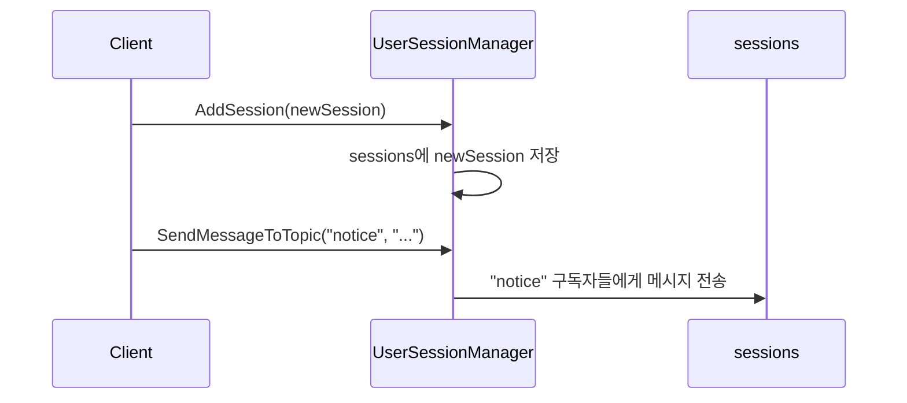

# Chapter 2: 사용자 세션 매니저 액터 (UserSessionManagerActor)

이전 장([메인 스테이지 액터 (MainStageActor)](01_메인_스테이지_액터__mainstageactor__.md))에서 액터를 중앙에서 생성·관리하는 방법을 배웠습니다. 이번 장에서는 실제로 웹소켓 세션을 다룰 때, 각 사용자를 어떻게 관리하고 메시지를 주고받을 수 있는지 살펴보겠습니다. 이 일을 하는 핵심 주체가 바로 “사용자 세션 매니저 액터(UserSessionManagerActor)”입니다.

---

## 사용자 세션 매니저 액터란?

간단히 말해, 사용자 세션 매니저 액터는 “채팅방 관리자” 역할을 합니다. 여러 사용자가 웹소켓을 통해 들어왔다 나갔다 할 때, 누가 들어왔는지(세션), 어떤 토픽을 구독하고 있는지를 기억해두고, 특정 사람에게만 메시지를 보내거나, 특정 토픽을 듣는 사람들에게 메시지를 뿌리는 일을 담당합니다.

- 사용자(세션)가 접속하면 그 정보(WebSocketSession)를 저장  
- 특정 주제(토픽)를 구독하면, 어떤 세션이 어떤 토픽을 듣는지 기록  
- 특정 세션 혹은 특정 토픽에 메시지를 전송  

이런 식으로 관리가 이루어지므로, 우리는 복잡한 연결·구독 로직을 일일이 코딩하지 않아도 됩니다.

---

## 왜 필요한가?

“사용자별로 스레드나 객체를 만들어 메시지를 주고받으면 되지 않을까?”라고 생각하실 수 있습니다. 하지만 채팅이나 실시간 이벤트 시스템에서는 다음과 같은 상황을 쉽고 일관성 있게 처리해줘야 합니다:

1. 새로 들어오는 웹소켓 세션을 등록하고 인사(MOTD, Welcome 메시지 등)를 보내기  
2. 특정 이벤트가 발생하면 특정 토픽을 구독한 사람들에게만 알림  
3. 세션이 사라지면(연결 해제) 해당 정보를 삭제하고 후속 처리를 진행(리소스 정리 등)  

사용자 세션 매니저 액터를 사용하면, 이러한 과정을 한 곳에서 집중적으로 관리할 수 있으므로 코드 구조가 깔끔해집니다.

---

## 주요 개념 정리

### 1. 세션 등록과 제거
- 사용자가 웹소켓으로 들어오면, `AddSession` 메시지를 액터에게 보내 세션을 등록합니다.  
- 연결이 끊어지면, `RemoveSession` 메시지를 통해 세션 정보를 제거합니다.

### 2. 토픽 구독
- `SubscribeToTopic`을 통해 특정 토픽에 세션을 등록해두면, 해당 토픽에 메시지를 보낼 때 자동으로 해당 세션에 전달됩니다.  
- `UnsubscribeFromTopic`으로 구독을 해제할 수도 있습니다.

### 3. 메시지 전송
- `SendMessageToSession` 메시지를 보내면 특정 세션에만 메시지를 전달합니다.  
- `SendMessageToTopic` 메시지를 보내면 현재 토픽에 등록된 세션 모두에게 메시지를 보냅니다.  
- `SendMessageToAll`은 전체 세션에 방송(Broadcast)합니다.

---

## 사용 예시

초보 입장에서 “실제로 어떻게 써야 하지?”가 궁금할 수 있습니다. 아래는 간단한 예시 흐름입니다.

1. 액터를 생성한다(예: 메인 스테이지 액터 안에서 스폰할 수도 있고, 직접 스폰할 수도 있음).  
2. 새 손님(웹소켓 세션)이 들어오면 `AddSession`을 보낸다.  
3. 특정 세션이 어떤 토픽을 듣고 싶다고 하면 `SubscribeToTopic`으로 등록한다.  
4. 메시지를 보낼 때 `SendMessageToTopic` 등을 사용해 안전하게 전달한다.  

예시 코드는 아래처럼 아주 간단하게 작성할 수 있습니다(10줄 미만):

```kotlin
val userSessionManagerActor = context.spawn(
    UserSessionManagerActor.create(),
    "userSessionManagerActor"
)

// 새 웹소켓 세션이라 가정
val newSession = /* WebSocketSession */
userSessionManagerActor.tell(AddSession(newSession))
```

위 코드 흐름에서 `UserSessionManagerActor.create()`를 통해 액터를 생성하고, `AddSession` 메시지로 접속한 세션을 등록합니다.

그다음, 특정 토픽으로 메시지를 보내고 싶다면 아래처럼 처리할 수 있습니다:

```kotlin
// 예: "notice" 토픽으로 공지사항 전송
userSessionManagerActor.tell(
    SendMessageToTopic("notice", "새로운 이벤트가 시작되었습니다!")
)
```

이렇게 하면 `notice`를 구독해둔 세션들만 바로 알림을 받게 됩니다.

---

## 내부 동작 이해하기

사용자 세션 매니저 액터는 내부적으로 세션 목록과 토픽 구독 정보를 `ConcurrentHashMap` 등의 자료구조에 저장하고 있습니다. 메시지가 들어오면 적절히 분기하여 필요한 액션을 수행합니다. 이를 간단한 시퀀스 다이어그램으로 표현해 봅시다.



- 클라이언트(또는 상위 액터)가 `AddSession` 메시지를 보내면, 사용자 세션 매니저 액터는 내부 세션 집합에 세션을 추가합니다.  
- 이후 어떤 메시지를 토픽에 보내달라는 요청이 들어오면, 해당 토픽을 구독해둔 세션을 찾아 메시지를 전송합니다.

---

## 내부 구현 살펴보기

아래는 실제 `UserSessionManagerActor` 내부 코드 일부입니다. 파일 위치는 `UserSessionManagerActor.kt`라 가정합니다. 전체는 꽤 길지만, 핵심 부분만 떼어서 살펴보겠습니다.

### 예: 세션 추가하기

사용자가 접속을 시도할 때 `AddSession` 메시지를 받으면, 단순히 `sessions` 맵에 등록하고 환영 메시지를 보낼 수 있습니다(10줄 미만):

```kotlin
private fun onAddSession(command: AddSession): Behavior<UserSessionCommand> {
    sessions[command.session.id] = command.session
    // 로그 출력
    logger.info("Connected: ${command.session.id}")
    // 간단한 환영 메시지 전송
    sendService.sendEventTextMessage(command.session, /* 환영 메시지 */)
    return this
}
```

- `sessions` 맵에 세션을 등록해두면, 이후에 이 세션에게 메시지를 보내거나 제거할 수 있습니다.  
- `sendService`는 실제 웹소켓으로 메시지를 보내는 헬퍼 클래스라고 가정합니다.

### 예: 토픽으로 메시지 보내기

토픽 구독은 대부분 `topicSubscriptions` 맵에 “토픽: [세션ID 목록]” 형태로 저장됩니다. `SendMessageToTopic` 메시지를 처리할 때는 해당 토픽에 등록된 세션ID를 꺼내서, 각각 메시지를 보냅니다.

```kotlin
private fun onSendMessageToTopic(cmd: SendMessageToTopic): Behavior<UserSessionCommand> {
    topicSubscriptions[cmd.topic]?.forEach { sessionId ->
        sessions[sessionId]?.let { sess ->
            sendService.sendEventTextMessage(sess, /* 메시지 내용 */)
        }
    }
    return this
}
```

- `topicSubscriptions[cmd.topic]`로 해당 토픽에 구독된 세션ID 목록을 얻습니다.  
- 각 세션ID로 `sessions[sessionId]`를 찾은 뒤, 실제 메시지를 전송합니다.

---

## 마무리 및 다음 장

이번 장에서는 사용자 세션 매니저 액터가 웹소켓 채팅이나 실시간 알림 시스템에서 어떻게 세션과 구독 정보를 관리하고, 특정 대상에게만 메시지를 보낼 수 있는지를 살펴보았습니다. 이를 통해 사용자(세션) 중심의 다채로운 서비스(채팅, 알림, 1:1 메시지 등)를 한곳에서 관리할 수 있음을 알게 되셨을 것입니다.

다음 장([SSE 사용자 이벤트 액터 (UserEventActor)](03_sse_사용자_이벤트_액터__usereventactor__.md))에서는 웹소켓과 유사하지만 서버에서 클라이언트로 일방향 푸시를 주로 사용하는 SSE(Server-Sent Events)를 어떻게 액터로 관리할 수 있는지 배워보겠습니다. 기대해 주세요!  

---

Generated by [AI Codebase Knowledge Builder](https://github.com/The-Pocket/Tutorial-Codebase-Knowledge)