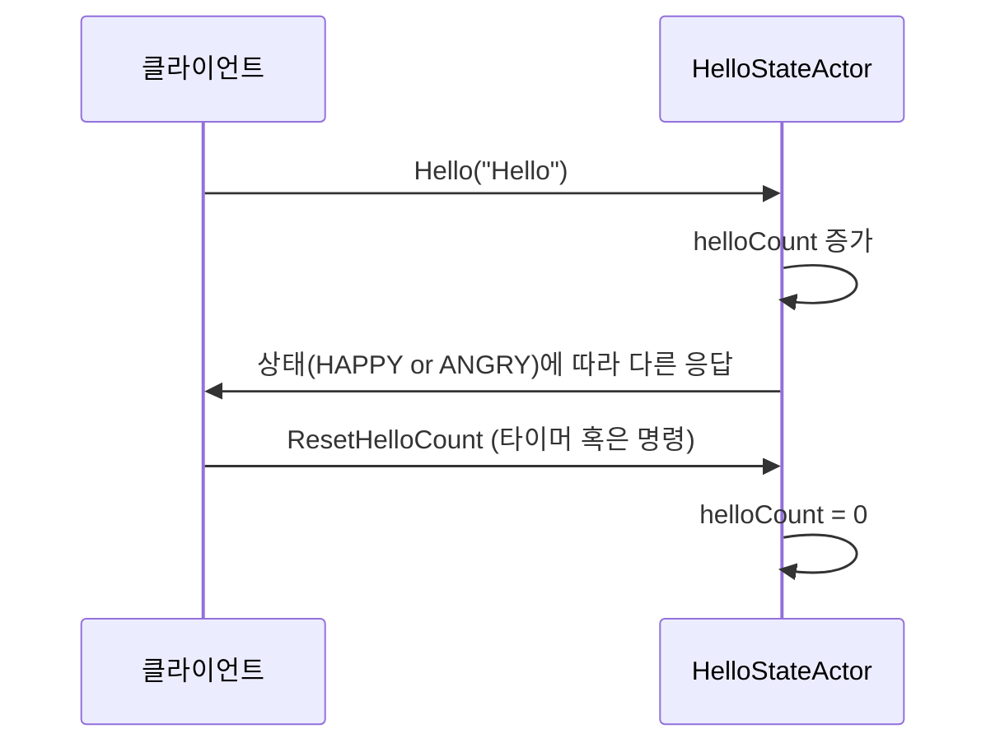

# Chapter 4: 헬로우 스테이트 액터 (HelloStateActor)

이전 장([SSE 사용자 이벤트 액터 (UserEventActor)](03_sse_사용자_이벤트_액터__usereventactor__.md))에서는 서버에서 단방향으로 이벤트를 전송하는 SSE 방식의 액터 사용법을 배워보았습니다. 이제는 액터가 내부적으로 상태를 유지하고, 주기적인 타이머나 특정 메시지를 통해 그 상태를 변경해보는 연습을 할 차례입니다. 이 장에서는 “헬로우 스테이트 액터(HelloStateActor)”가 어떤 아이디어로 만들어졌고, 실무에서 어떤 식으로 활용할 수 있는지 간단히 살펴보겠습니다.

---

## 이 액터는 무슨 문제를 해결할까?

간단히 말해, 헬로우 스테이트 액터는 “Hello”라는 인삿말을 처리하면서 누적 횟수(`helloCount`)나 전체 횟수(`helloTotalCount`) 같은 내부 상태를 유지합니다. 마치 “매번 몇 번째로 Hello가 들어왔는지 적어두는 안내원” 같은 느낌입니다. 상태(`HAPPY` 혹은 `ANGRY`)에 따라 인삿말에 대한 답변(“Kotlin!” 또는 “말 걸지 마!”)도 달라집니다.

- 내부에 카운팅 로직을 가지고, 특정 상황에서(타이머 시점) 카운트를 리셋하거나  
- 상태(`HAPPY` ↔ `ANGRY`)가 바뀌면, 들어오는 메시지에 대한 반응도 달라지는  
- 동시에 여러 “Hello”가 들어와도 액터가 단일 스레드로 처리하므로 복잡한 동시성 문제가 줄어드는  

이와 같은 상태 기반 메시지 처리는 액터 패턴을 학습하기에 아주 좋은 예시입니다.

---

## 주요 개념

헬로우 스테이트 액터가 다루는 몇 가지 핵심 개념을 정리해보겠습니다:

1. 상태(HelloState)  
   - 액터 내부에 `HAPPY`와 `ANGRY` 두 가지 상태가 있습니다.  
   - 상태에 따라 인삿말 처리 방식이 달라집니다.

2. Hello 카운트(helloCount, helloTotalCount)  
   - `helloCount`는 현재까지 누적된 “Hello” 횟수(일시적으로 리셋 가능)  
   - `helloTotalCount`는 전체적으로 몇 번이나 “Hello”를 받았는지 나타내는 값(리셋되지 않음)

3. 주기적 리셋(Reset)  
   - 10초마다(또는 개발자가 지정한 주기) `helloCount`를 0으로 초기화합니다.  
   - “잠깐, 이제까지 받은 Hello 횟수를 잊어버리자!” 하는 식으로 생각할 수 있습니다.

4. 메시지 처리 흐름  
   - `Hello(…)` 메시지가 들어오면, 상태에 따라 다른 답변을 합니다.  
   - `ChangeState` 메시지로 `HAPPY ↔ ANGRY` 전환이 가능합니다.

---

## 어떻게 사용하나?

헬로우 스테이트 액터를 직접 스폰(생성)해서 메시지를 주고받는 예시 코드를 살펴봅시다. 먼저, 아래처럼 액터를 만들 수 있습니다:

```kotlin
val helloStateActor = context.spawn(
    HelloStateActor.create(HelloState.HAPPY),
    "helloStateActor"
)

// 메시지 전송
helloStateActor.tell(Hello("Hello", replyToRef))
```

1. `HelloStateActor.create(HelloState.HAPPY)`를 통해 초기 상태를 `HAPPY`로 지정합니다.  
2. `tell(Hello("Hello", replyToRef))`로 인삿말을 보내면, 액터가 현재 상태(`HAPPY`)에 맞는 답변(“Kotlin!”)을 `replyToRef`에게 전달합니다.

만약 액터 상태를 바꾸고 싶다면:

```kotlin
helloStateActor.tell(ChangeState(HelloState.ANGRY))
```

이후 다시 `Hello("Hello", replyToRef)`를 보내면 “말 걸지 마!” 같은 반응이 가도록 동작합니다.

---

## 내부 동작 살펴보기

메시지가 어떻게 처리되는지 시퀀스 다이어그램으로 간단히 표현해보겠습니다.



- 클라이언트가 “Hello” 메시지를 전송하면, 액터 내부의 `helloCount`가 1 증가하면서 상태에 맞게 응답합니다.  
- 일정 시간이 지나거나 별도 명령을 통해 `ResetHelloCount`가 호출되면, `helloCount`를 0으로 되돌립니다(하지만 `helloTotalCount`는 유지).

---

## 코드 예시: 핵심 부분

이 액터의 실제 구현은 [Github 예시](예시 위치)나 아래 파일 `HelloStateActor.kt`에 있지만, 초심자를 위해 핵심 로직만 발췌해 간단히 보여드립니다(10줄 미만으로 분할).

아래 코드는 “Hello” 메시지를 처리하는 핵심 부분입니다:

```kotlin
private fun onHello(cmd: Hello): Behavior<HelloStateActorCommand> {
    when (helloState) {
        HelloState.HAPPY -> {
            helloCount++
            helloTotalCount++
            cmd.replyTo.tell(HelloResponse("Kotlin!"))
        }
        HelloState.ANGRY -> {
            cmd.replyTo.tell(HelloResponse("말 걸지 마!"))
        }
    }
    return this
}
```

- `HAPPY` 상태면 `helloCount`, `helloTotalCount`가 1씩 증가하고, “Kotlin!” 메시지를 응답합니다.  
- `ANGRY` 상태면 카운트는 증가시키지 않고, “말 걸지 마!”라 대응합니다.

아래는 주기적으로 `helloCount`를 리셋하는 부분의 예시입니다:

```kotlin
private fun onResetHelloCount(cmd: ResetHelloCount): Behavior<HelloStateActorCommand> {
    helloCount = 0
    return this
}
```

- 일정시간마다(10초) `ResetHelloCount` 메시지가 자동으로 들어오도록 타이머를 설정해뒀습니다.  
- 이 코드가 실행되면 `helloCount`가 0으로 초기화됩니다.

---

## 실제로 어디에 쓸 수 있을까?

1. 간단한 상태 머신 구현  
   - “인사 모드”인지 “답변 거부 모드”인지, 이렇게 작지만 명확한 상태를 가진 로직을 독립된 액터로 두면, 여러 이벤트가 들어와도 깔끔하게 처리할 수 있습니다.  
2. 주기적 카운트 클리어  
   - 특정 시간마다 횟수를 리셋해야 하는 기능이 필요할 때, 타이머 내장 기능을 사용하는 예시로 활용 가능합니다.

---

## 결론 및 다음 장 안내

이 장에서는 헬로우 스테이트 액터(HelloStateActor)가 “Hello” 메시지를 받고 내부 카운트와 상태를 어떻게 관리하는지, 그리고 타이머를 이용해 주기적으로 그것을 리셋하는 방법까지 살펴보았습니다. 상태 중심의 로직을 액터로 구현하면, 코드는 간결해지고 경쟁 상태를 자연스럽게 피할 수 있다는 장점이 있습니다.

다음 장([카운터 액터 (CounterActor)](05_카운터_액터__counteractor__.md))에서는 좀 더 단순화된 카운터 기능을 살펴보며, 액터 기반으로 숫자를 안전하게 관리하는 또 다른 예시를 다루어 보겠습니다. 기대해 주세요!

---

Generated by [AI Codebase Knowledge Builder](https://github.com/The-Pocket/Tutorial-Codebase-Knowledge)