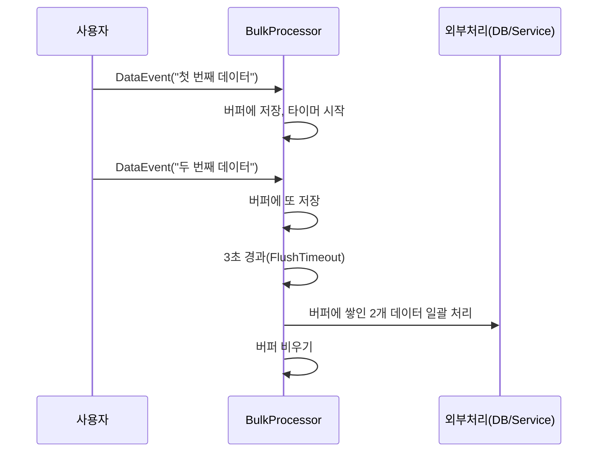

# Chapter 8: 벌크 프로세서 (BulkProcessor)

이전 장([수퍼바이저 액터 (SupervisorActor)](07_수퍼바이저_액터__supervisoractor__.md))에서 자식 액터의 장애를 복구하고, 재시작 전략을 다루는 방법을 배웠습니다. 이번 장에서는 “벌크 프로세서(BulkProcessor)” 액터를 살펴보겠습니다. 이 액터는 다수의 이벤트를 한곳에 모아두었다가, 한 번에 묶어서 처리(Flush)함으로써 성능과 효율성을 높이는 데 목적이 있습니다.

---

## 왜 벌크 프로세서가 필요할까?

간단한 예시 상황을 떠올려 봅시다. 어떤 서비스에서 새로운 “데이터 이벤트(DataEvent)”가 짧은 간격으로 자주 발생합니다. 이 이벤트를 처리할 때마다 매번 DB나 외부 API를 호출하면, 호출 비용이 크게 누적됩니다. 이를 효율적으로 해결하려면 일정 시간이나 일정 개수가 모였을 때 한꺼번에 처리(Flush)하여 오버헤드를 줄이는 전략이 좋습니다.

벌크 프로세서 액터는 다음과 같은 식으로 동작합니다:

1. 데이터가 들어올 때마다 버퍼에 쌓아둔다.  
2. 버퍼가 목표 개수에 도달하거나, 정해진 시간이 지나면 한 번에 묶어서 처리(Flush)한다.  
3. 처리 후에는 버퍼를 비우고, 다시 새 데이터를 기다린다.

---

## 핵심 개념 정리

- DataEvent: 새 데이터가 들어왔다는 메시지. 벌크 프로세서는 이를 버퍼에 차곡차곡 모읍니다.  
- Flush: 버퍼에 쌓인 데이터를 한꺼번에 처리하는 명령.  
- FlushTimeout: “3초” 같은 정해진 시간이 지나면 내부 타이머가 자동으로 Flush를 일으키는 이벤트.  
- Buffer: 실제로 데이터들을 모아두는 저장 공간(List 등).  

이 구조 덕분에 작은 데이터들이 빠르게 연속 발생해도, 벌크 프로세서 액터가 알아서 병합해 처리할 수 있습니다.

---

## 간단 사용 흐름 예시

아래처럼 벌크 프로세서 액터를 생성하고, 데이터 이벤트(DataEvent)를 보낼 수 있습니다(코드 각 10줄 미만).

```kotlin
// 액터 생성
val bulkProcessorRef = context.spawn(
    BulkProcessor.create(),
    "bulkProcessor"
)

// 예시 이벤트 전송
bulkProcessorRef.tell(
    DataEvent("첫 번째 데이터", replyActor)
)
```

1. BulkProcessor.create()로 액터를 스폰(spawn)합니다.  
2. DataEvent를 보낼 때, “첫 번째 데이터”라는 문자열을 전송해 봅니다.  
3. 액터는 내부 버퍼에 “첫 번째 데이터”를 쌓고, 3초 타이머를 시작합니다(코드상 보통 3초).  

만약 한 번 더 이벤트를 보낸다면:

```kotlin
bulkProcessorRef.tell(
    DataEvent("두 번째 데이터", replyActor)
)
```

이 시점에도 아직 3초가 지나지 않았다면, 버퍼는 “첫 번째 데이터, 두 번째 데이터”를 누적합니다. 버퍼가 목표 개수(예: 100개)에 도달하거나 3초가 경과하면 자동으로 Flush가 일어나고, “flushBuffer()” 로직이 실행됩니다.

---

## 벌크 프로세서 내부 동작 간단도

아래 시퀀스 다이어그램은 “데이터가 두 번 들어온 뒤, 시간이 지나 Flush가 실행”되는 흐름을 보여줍니다.



- DataEvent가 들어오면 버퍼에 추가하고 타이머를 건다.  
- 타이머가 만료되면(또는 버퍼가 목표 개수에 도달하면) 데이터를 한 번에 처리(Flush)한다.  

---

## 내부 구현 예시 살펴보기

프로젝트 내에서 “src/main/kotlin/org/example/kotlinbootreactivelabs/actor/bulkprocessor/BulkProcessor.kt” 파일에 구현되어 있습니다. 핵심 로직을 짧게 나누어 확인해 봅시다.

### 1) 기본 구조 (생성 메서드)

```kotlin
companion object {
    fun create(): Behavior<BulkProcessorCommand> {
        return Behaviors.setup { context ->
            BulkProcessor(context)
        }
    }
}
```

- “create()”라는 정적 메서드를 통해 액터를 간편하게 생성합니다.  
- Behaviors.setup(...){ ... } 내부에서 BulkProcessor 인스턴스를 초기화합니다.

### 2) idle 상태

처음에는 “idle” 상태로, 아무 데이터도 없는 상황입니다. 첫 번째 DataEvent가 도착하면 이 상태를 벗어나 “active”로 전환합니다.

```kotlin
private fun idle(): Receive<BulkProcessorCommand> {
    return newReceiveBuilder()
        .onMessage(DataEvent::class.java) { event ->
            // 첫 DataEvent 받은 뒤 버퍼에 저장
            buffer.add(event.data)
            startFlushTimer()
            active()
        }
        .onMessage(Flush::class.java) {
            // idle 상태에서 Flush는 할 일 없음
            Behaviors.same()
        }
        .build()
}
```

- 첫 DataEvent가 오면 버퍼에 저장하고, 3초 타이머를 시작한 뒤 “active” 상태로 바뀝니다.  

### 3) active 상태

active 상태에서는 새로운 DataEvent가 들어올 때마다 버퍼를 채웁니다. 버퍼가 100개에 달하거나, Flush 명령이 오거나, 3초 타이머가 만료되면 “flushBuffer()”를 호출하고 다시 “idle()”로 돌아갑니다.

```kotlin
private fun active(): Receive<BulkProcessorCommand> {
    return newReceiveBuilder()
        .onMessage(DataEvent::class.java) { event ->
            buffer.add(event.data)
            if (buffer.size >= 100) {
                flushBuffer()
                idle()
            } else {
                Behaviors.same()
            }
        }
        .onMessage(Flush::class.java) {
            flushBuffer()
            idle()
        }
        .onMessageEquals(FlushTimeout) {
            flushBuffer()
            idle()
        }
        .build()
}
```

- `DataEvent`가 들어올 때마다 버퍼 크기를 확인하여, 100개 이상이면 바로 Flush 실시.  
- `Flush` 명령이나 `FlushTimeout`이 발생해도 마찬가지로 Flush를 수행합니다.

### 4) flushBuffer()

```kotlin
private fun flushBuffer() {
    // 실제 외부 연동 로직을 여기서 처리
    context.log.info("Processing ${buffer.size} events.")
    buffer.clear()
    stopFlushTimer()
}
```

- 버퍼에 있는 만큼 한꺼번에 처리하고, 로그를 찍은 뒤 버퍼를 비웁니다.  
- 처리 후에는 타이머를 중단(혹은 재설정)합니다.

---

## 마무리

벌크 프로세서(BulkProcessor)는 데이터를 일정 기간 혹은 일정 개수만큼 모아 한꺼번에 처리함으로써, 잦은 DB/외부 API 호출 비용을 줄여줍니다. 소규모 이벤트들이 누적되어도 자동 타이머 또는 일정 개수를 기준으로 Flush가 일어나므로, 초심자도 쉽게 “일괄 처리” 방식을 구현할 수 있다는 장점이 있습니다.

이로써 [메인 스테이지 액터(MainStageActor)](01_메인_스테이지_액터__mainstageactor__.md)부터 시작해 다양한 액터 패턴을 살펴보았으며, 상태 관리, SSE, 수퍼바이저, 그리고 이번 벌크 프로세서까지 “Reaktive & Actor” 기반 토대를 익혔습니다. 실제 서비스에 적용해서 대량의 이벤트를 효율적으로 처리해 보시길 바랍니다!

더욱 복잡한 시스템 상황에서는, 이 벌크 프로세서를 [수퍼바이저 액터 (SupervisorActor)](07_수퍼바이저_액터__supervisoractor__.md) 아래에서 관리하거나, 클러스터 환경에서 여러 벌크 프로세서를 병렬로 운영하는 시나리오도 확장 가능함을 기억해 주세요. 좋은 개발 여정이 되길 바랍니다!  

---

Generated by [AI Codebase Knowledge Builder](https://github.com/The-Pocket/Tutorial-Codebase-Knowledge)