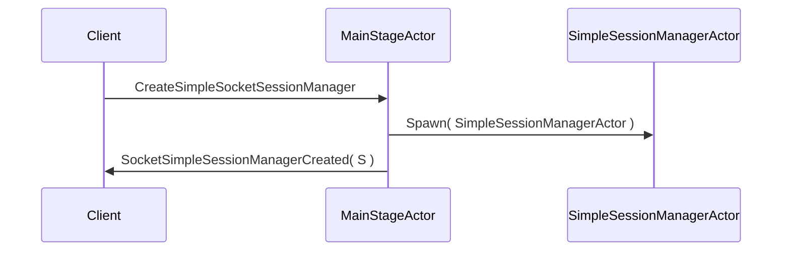

# Chapter 1: MainStageActor

Welcome! In this first chapter, we’ll explore the “MainStageActor,” the central piece of our actor system in this Kotlin Boot Reactive project. Think of it like a show’s director: it pulls the strings behind the scenes, creating and supervising all other “performers” (actors).

---

## Why a MainStageActor?

Imagine you have a theater performance with many characters: some actors manage user sessions, some handle chat interactions, others process special events. You need a single person to manage everyone—someone who figures out who shows up, when they appear, and what they do. That’s the MainStageActor’s job.

**Use Case**:  
Suppose you have a chat application where:  
1. Some users need a simple chat session.  
2. Others need a more advanced, multi-user chat room.  
3. You also have user events and notifications to distribute.

Without a MainStageActor, you’d create all these “session managers” and “event managers” separately, potentially losing track of them. With the MainStageActor, you simply request the creation of any specialized actor. It will spawn (create) and keep track of them for you.

---

## Key Concepts

- **Central Coordinator**: The MainStageActor is a single entry point. You ask it to create session managers or event actors for you.  
- **Child Actors**: Whenever you need specialized behavior—like a “SimpleSessionManager” or a “SupervisorChannelActor”—the MainStageActor spawns these child actors.  
- **Subscriptions & Topics**: It can also configure topics for users to subscribe, which is crucial to broadcast messages (like events or notifications) to multiple listeners.  
- **Message Commands**: You interact with the MainStageActor by sending it pre-defined “commands.” For instance, “CreateSimpleSocketSessionManager” or “PublishToTopic.”

---

## How to Use MainStageActor

### 1. Creating a Simple Session Manager

To request a “simple session manager,” you send a command that looks something like below:

```kotlin
// Up to 10 lines of example code
val createSimpleSessionCommand = CreateSimpleSocketSessionManager(replyTo = myReplyActorRef)
mainStageActorRef.tell(createSimpleSessionCommand)
```

- `CreateSimpleSocketSessionManager` is a message class. 
- `replyTo` is the actor that should receive the newly created session manager’s reference.  

**Result**: Your `myReplyActorRef` will eventually receive a message containing the new “SimpleSessionManagerActor.”

### 2. Publishing to a Topic

If you want to broadcast a message to everyone who cares about a certain topic (say “myTopic”), you can do:

```kotlin
val publishCommand = PublishToTopic(topic = "myTopic", message = "Hello, Topic!")
mainStageActorRef.tell(publishCommand)
```

- The MainStageActor will ensure a topic actor exists.  
- It then publishes your message so that any actor subscribed to “myTopic” gets it.

---

## Under the Hood

When a message like `CreateSimpleSocketSessionManager` arrives, the MainStageActor does these steps:

1. Spawns a new actor (e.g., SimpleSessionManagerActor) with a special name.  
2. Watches it (so if it stops or crashes, the MainStageActor knows).  
3. Sends a confirmation back to the requestor containing the new actor’s address.

### Basic Sequence Diagram

Here’s a very simple flow to illustrate:



- **Client** (C) is any actor or component that sends the initial request.  
- **MainStageActor** (M) is the director.  
- **SimpleSessionManagerActor** (S) is the newly created actor.

### Internal Implementation (Brief Peek)

The code lives in  
`src/main/kotlin/org/example/kotlinbootreactivelabs/actor/MainStageActor.kt`.  
When MainStageActor receives a `CreateSimpleSocketSessionManager` command, it might look like this:

```kotlin
// Simplified snippet (below 10 lines)
private fun onSimpleSocketSessionManager(
    command: CreateSimpleSocketSessionManager
): Behavior<MainStageActorCommand> {
    val simpleSessionManagerActor = context.spawn(
        // create a new SimpleSessionManagerActor
        Behaviors.supervise(SimpleSessionManagerActor.create())
            .onFailure(SupervisorStrategy.resume()),
        "simpleSessionManagerActor"
    )
    command.replyTo.tell(SocketSimpleSessionManagerCreated(simpleSessionManagerActor))
    return this
}
```

1. `context.spawn` creates the child actor.  
2. `supervise(...).onFailure(SupervisorStrategy.resume())` restarts or resumes on errors.  
3. A `SocketSimpleSessionManagerCreated` message is sent back with the brand-new actor reference.

---

## Conclusion and Next Steps

You now know how the MainStageActor acts like the director of the entire show. It spawns child actors for different responsibilities and coordinates them. In the next chapter, we’ll see how it partners with a powerful actor called [SupervisorActor](02_supervisoractor.md) to manage failures gracefully. 

See you there!

---

Generated by [AI Codebase Knowledge Builder](https://github.com/The-Pocket/Tutorial-Codebase-Knowledge)