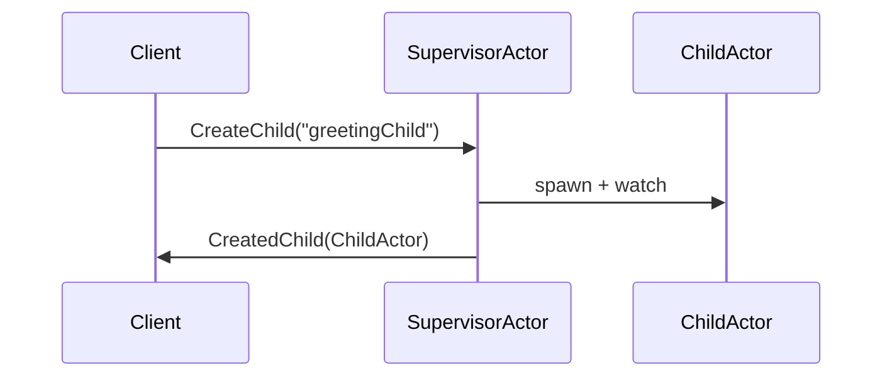

# Chapter 2: SupervisorActor

In the [previous chapter](01_mainstageactor.md), we learned about our “director,” the MainStageActor, which coordinates all actors. Now we’ll explore the SupervisorActor—a specialized “safety officer” that keeps its child actors healthy, ensuring the entire system stays stable even when some parts fail.

---

## Why SupervisorActor?

Imagine you have multiple machines in a factory. If one machine jams, you wouldn’t want the entire factory to shut down. Instead, you’d have a safety officer check if that machine can be restarted or repaired, keeping the overall operation up and running. That’s exactly what SupervisorActor does:

• It monitors child actors (machines).  
• If a child actor crashes, SupervisorActor can restart or stop that single child (without impacting others).  
• This isolates problems and keeps processes running smoothly.

---

## A Simple Use Case

As a beginner, suppose you have a “Hello” feature that occasionally stores messages in a database. You could create a dedicated “HelloStateStoreActor” for each message stream. But if one message stream encounters an error, you wouldn’t want every other stream to break. With SupervisorActor, you can manage all these child store actors safely.

---

## Key Concepts

1. **Child Management**: SupervisorActor can create child actors on demand, configuring each child to automatically restart on failure if needed.  
2. **Failure Isolation**: If a child crashes, only that child is affected. SupervisorActor decides whether to resume, restart, or stop it.  
3. **Lifecycle Monitoring**: SupervisorActor automatically “watches” each child’s lifecycle, so it knows if a child terminates (stops).  

---

## How to Use SupervisorActor

Here’s how to solve our “Hello message storage” scenario using SupervisorActor:

1. **Create**: When you want a new child actor (e.g., a “HelloStateStoreActor” handling message storage), tell SupervisorActor to create it.  
2. **Send Commands**: You instruct the child actor (through SupervisorActor) to store or retrieve data. If an error happens, SupervisorActor will apply a strategy (like restart).  
3. **Terminate**: When you don’t need a child anymore, instruct SupervisorActor to stop it.

### 1. Creating a Child Actor

Below is a minimal example of asking SupervisorActor to create a new child:

```kotlin
val command = CreateChild(
    name = "greetingChild",
    persistId = "HelloStorage",
    replyTo = myActorRef
)
supervisorActorRef.tell(command)
```

• `name` is the new child’s label (like “greetingChild”).  
• `persistId` lets the child actor track its state with a persistence ID (if needed).  
• `replyTo` is the actor that will receive confirmation once the child is created.

### 2. Restarting or Terminating a Child

You can also request a child be restarted (usually after a crash) or be explicitly terminated:

```kotlin
// Terminating a child
supervisorActorRef.tell(TerminateChild("greetingChild"))
```

• `TerminateChild("greetingChild")` means SupervisorActor will safely stop “greetingChild.”

---

## Under the Hood

When SupervisorActor receives a command like `CreateChild`, it:

1. Spawns a new actor with the name you provided.  
2. Sets up a supervision strategy (e.g., “restart on failure”).  
3. Watches it, so if the child terminates, SupervisorActor gets notified.  
4. Replies back to the sender (your “myActorRef”) with the newly created actor’s reference.

### Quick Sequence Diagram



- “Client” is whoever requests the child to be created.  
- “SupervisorActor” is our safety officer.  
- “ChildActor” is the newly created “HelloStateStoreActor” (or any other).

---

### Simplified Implementation Snippet

Here’s a bare-bones look inside `SupervisorActor` showing how a child might be created:

```kotlin
private fun onCreateChild(command: CreateChild): Behavior<SupervisorCommand> {
    val childActor = context.spawn(
        Behaviors.supervise(HelloStateStoreActor.create(command.persistId, durableRepository))
            .onFailure(SupervisorStrategy.restart()),
        command.name
    )
    context.watch(childActor)
    command.replyTo.tell(CreatedChild(childActor))
    return this
}
```

1. `spawn(...)` creates the child with a retry-on-failure rule (`restart()`).  
2. `context.watch(childActor)` ensures SupervisorActor is informed if the child stops.  
3. `replyTo.tell(...)` sends the new actor’s reference back to whoever requested it.

---

## Conclusion and Next Steps

Congratulations! You’ve learned how SupervisorActor acts like a safety officer, ensuring that one misbehaving child doesn’t affect the entire system. In the next chapter, we’ll dive into managing user sessions with [UserSessionManagerActor](03_usersessionmanageractor.md), a specialized actor for handling active user interactions. 

See you there!

---

Generated by [AI Codebase Knowledge Builder](https://github.com/The-Pocket/Tutorial-Codebase-Knowledge)