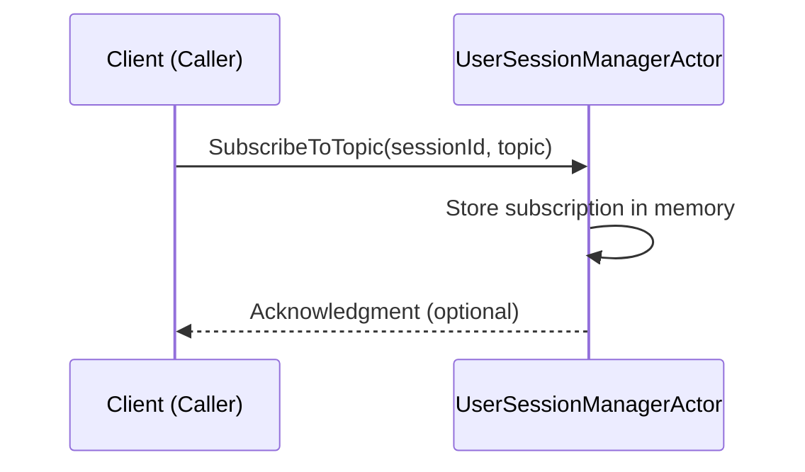

# Chapter 3: UserSessionManagerActor

In the [previous chapter](02_supervisoractor.md), we discovered the “SupervisorActor,” our project’s safety officer that restarts child actors if something goes wrong. In this chapter, we’ll shine the spotlight on another critical actor: **UserSessionManagerActor**.

Picture a busy receptionist at a hotel’s front desk. Guests arrive (i.e., new WebSocket sessions), each wanting different notifications (or “topics”). This receptionist keeps track of who is checked in (who’s connected), which topics they want, and where to send relevant messages. Let’s walk through these concepts step by step.

---

## Why UserSessionManagerActor?

Imagine building a chat or notification system. You have dozens (or thousands) of connected users, each interested in certain event streams or chat topics. The core challenges are:

• Who’s connected, and what’s their ID?  
• Which chat rooms (topics) are they subscribed to?  
• How do you efficiently broadcast messages to everyone who cares, without spamming others?

This is where the **UserSessionManagerActor** comes in. It’s your dedicated hub for handling:

1. User connections (or sessions).  
2. Subscriptions/unsubscriptions to topics.  
3. Sending messages to specific users, topics, or everyone.

---

## Key Concepts

1. **Session Tracking**: The actor keeps track of each user’s active WebSocket session (like the front-desk log that notes which guest is in which room).  
2. **Topic Subscriptions**: Users can “subscribe” or “unsubscribe” to different “topics.” A topic is just a label (e.g., “sports,” “news,” or “chat-room-123”).  
3. **Targeted Messaging**:  
   • **Send to Session**: Deliver a message to a single user.  
   • **Send to Topic**: Deliver a message to everyone who’s subscribed to that topic.  
   • **Send to All**: Deliver a message to all connected users.  
4. **Personal Rooms**: Each user can also have a private “room” (actor) that handles one-on-one or unique logic for them.

---

## How to Use UserSessionManagerActor

Let’s walk through a basic scenario:  
1. A new user connects (we add their session).  
2. The user subscribes to a topic (“myTopic”).  
3. The system sends a message to that topic, and our user receives it.  
4. The user disconnects (we remove their session).

### 1. Adding a Session
To register a new user’s WebSocket session:

```kotlin
val add = AddSession(session)
userSessionManagerRef.tell(add)
```
• `AddSession(session)` is a command telling the actor, “We have a new session.”  
• Once added, the actor tracks that user in a session map.  

### 2. Subscribing to a Topic
If our new user wants to subscribe to a topic called “myTopic”:

```kotlin
val subscribe = SubscribeToTopic(
    sessionId = session.id,
    topic = "myTopic"
)
userSessionManagerRef.tell(subscribe)
```
• This links the user’s session ID to “myTopic.”  

### 3. Sending a Message to a Topic
Now, the user will receive any “topic-wide” announcements:

```kotlin
val sendCmd = SendMessageToTopic(
    topic = "myTopic",
    message = "Hello, subscribers!"
)
userSessionManagerRef.tell(sendCmd)
```
• Everyone who’s subscribed to “myTopic” will get this message.  

### 4. Removing a Session  
When a user disconnects, do:

```kotlin
val remove = RemoveSession(session)
userSessionManagerRef.tell(remove)
```
• This removes the user from the session map and cleans up any topic subscriptions.

---

## Under the Hood

Here’s a simple flow to illustrate how a “SubscribeToTopic” command works:



1. The client (some other part of your system) sends “SubscribeToTopic(sessionId, topic).”  
2. **UserSessionManagerActor** updates its internal map so that sessionId is added to the topic’s subscriber list.  
3. It can optionally reply or just store the info silently.  

---

## A Peek at the Implementation

The source code for this actor lives in  
`src/main/kotlin/org/example/kotlinbootreactivelabs/ws/actor/chat/UserSessionManagerActor.kt`.

When UserSessionManagerActor receives a command like `SubscribeToTopic(...):`
1. It looks up (or creates) a data structure for that topic.  
2. Adds the session ID to that topic’s subscriber set.  
3. Logs or confirms internally.

Below is a simplified snippet showing how a subscription is handled:

```kotlin
private fun onSubscribeToTopic(
    cmd: SubscribeToTopic
): Behavior<UserSessionCommand> {
    topicSubscriptions
        .computeIfAbsent(cmd.topic) { mutableSetOf() }
        .add(cmd.sessionId)
    // Logging or additional steps go here
    return this
}
```
1. `computeIfAbsent` ensures the topic has an entry in `topicSubscriptions`.  
2. `.add(cmd.sessionId)` appends this user to that topic’s set.  
3. Finally, it returns the current behavior (`this`).

---

### Sending a Message to a Topic

When we want to broadcast a message to a topic, we do something like:

```kotlin
private fun onSendMessageToTopic(
    cmd: SendMessageToTopic
): Behavior<UserSessionCommand> {
    topicSubscriptions[cmd.topic]?.forEach { sessionId ->
        val session = sessions[sessionId]
        // send message to session
    }
    return this
}
```

1. We look up all session IDs subscribed to `cmd.topic`.  
2. For each session ID, we fetch the user’s session and send them the message.  

---

## Conclusion and Next Steps

Congratulations! You now have a clear picture of how UserSessionManagerActor routes WebSocket users, manages their subscriptions, and helps keep your communication organized. This knowledge is invaluable for building chat features, live notifications, or any system requiring real-time user updates.

In the next chapter, we’ll introduce the [CounselorManagerActor](04_counselormanageractor.md) and learn how it helps manage more specialized “counselor-like” tasks. See you there!

---

Generated by [AI Codebase Knowledge Builder](https://github.com/The-Pocket/Tutorial-Codebase-Knowledge)