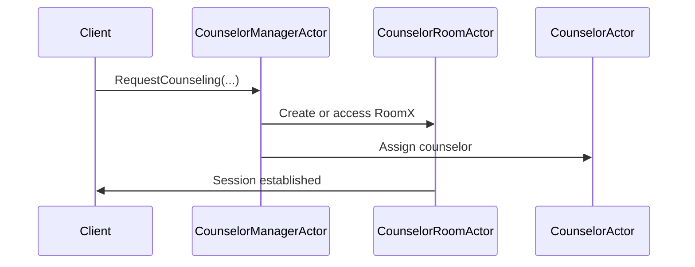

# Chapter 4: CounselorManagerActor

In the [previous chapter](03_usersessionmanageractor.md), we learned how to manage user sessions—like a helpful receptionist tracking individual users. Now let’s meet the “CounselorManagerActor,” which acts as a front-office manager for our virtual counseling system. It organizes counselors, chat rooms, and any special routing rules to match the right counselor with the right client.

---

## Why CounselorManagerActor?

Imagine a real counseling clinic where a front-office manager:  
• Schedules appointments for various counselors.  
• Decides which counselor goes to which room.  
• Handles observers (like interns) joining some sessions.  

That’s exactly what our CounselorManagerActor does. It keeps everything flexible and scalable when you have multiple clients and counselors across many “rooms.”

---

## Key Concepts

1. **Counselor**: A specialized actor that handles conversation with a client.  
2. **Counselor Room**: A virtual “room” (actor) where one or more counselors and clients can interact.  
3. **Routing Rules**: Decide which counselor is assigned to which room based on the client’s needs or skill matching.  
4. **Observer**: An additional counselor who can observe an ongoing session (useful for training or specialized reviews).  

---

## Basic Use Case

Let’s walk through how a new counselor joins the system, a room is created, and a client’s counseling request is assigned:

1) We ask CounselorManagerActor to create a new counselor.  
2) We ask CounselorManagerActor to create a new counselor room.  
3) We send a counseling request that references the room and the client’s personal actor.  
4) CounselorManagerActor applies any routing rules, assigns the appropriate counselor, and connects everyone.

---

## How to Use CounselorManagerActor

Below are some example messages you’d send to CounselorManagerActor. Each snippet is kept shorter than 10 lines for clarity.

### 1) Create a New Counselor

```kotlin
val createCounselorCmd = CreateCounselor(
    name = "CounselorAlice",
    replyTo = myReplyActor
)
counselorManagerRef.tell(createCounselorCmd)
```

• We give the counselor a name (“CounselorAlice”).  
• `replyTo` is who will receive the response (e.g., “CounselorCreated”).  

### 2) Create a Counseling Room

```kotlin
val createRoomCmd = CreateRoom(
    roomName = "RoomX",
    replyTo = myReplyActor
)
counselorManagerRef.tell(createRoomCmd)
```

• This spawns a new “CounselorRoom” actor named “RoomX.”  
• Once created, you can link counselors and clients to it.

### 3) Request Counseling (Assigning a Counselor)

```kotlin
val counselingReq = RequestCounseling(
    roomName = "RoomX",
    skillInfo = mySkillInfo,
    personalRoomActor = myClientActor,
    replyTo = myReplyActor
)
counselorManagerRef.tell(counselingReq)
```

• `skillInfo` might say “needs Spanish-speaking counselor” or “financial support.”  
• `personalRoomActor` is the client’s personal actor.  
• CounselorManagerActor finds the right counselor and connects them to “RoomX.”

### 4) Add an Observer

```kotlin
val addObserverCmd = AddObserverCounselor(
    roomName = "RoomX",
    observerName = "CounselorBob",
    replyTo = myReplyActor
)
counselorManagerRef.tell(addObserverCmd)
```

• This instructs “RoomX” to let “CounselorBob” observe.  

---

## Under the Hood

When CounselorManagerActor receives “RequestCounseling,” it:  
1. Checks your defined routing rule (like “pick any counselor with skill X”).  
2. Creates (or finds) the requested room actor if it doesn’t exist.  
3. Sets up the client’s personal actor and the assigned counselor in that room so they can chat.  
4. Logs any events (e.g., “CounselorAlice joined RoomX”).

### Simple Sequence Diagram



- CounselorManagerActor (CM) is the “front office manager.”  
- CounselorRoomActor (CR) is the room where the session happens.  
- CounselorActor (CO) is the assigned counselor.  

---

## Implementation Peek

The code for CounselorManagerActor typically lives in:  
“src/main/kotlin/org/example/kotlinbootreactivelabs/ws/actor/chat/CounselorManagerActor.kt”  

When it receives `RequestCounseling`, a simplified version might do this:

```kotlin
// Simplified logic for counseling request
context.spawn(CounselorRoomActor.create(roomName), roomName)
val chosenCounselor = pickCounselor(skillInfo)
chosenCounselor.tell(AssignRoom(roomName, personalRoomActor))
personalRoomActor.tell(SendTextMessage("Connected to counselor."))
```

1. Spawn a room actor if it doesn’t already exist.  
2. Pick the right counselor based on routing rules.  
3. Pass references around so they can communicate with each other.  

---

## Conclusion & Next Steps

With CounselorManagerActor, you can build a flexible counseling system that dynamically assigns counselors to clients and manages multiple rooms at once. You can also add observers for supervision or training without disrupting ongoing sessions.

In the next chapter, we’ll look at an even simpler example: [HelloActor](05_helloactor.md). It just greets users, but you’ll see the same actor model in action—so stay tuned!

---

Generated by [AI Codebase Knowledge Builder](https://github.com/The-Pocket/Tutorial-Codebase-Knowledge)