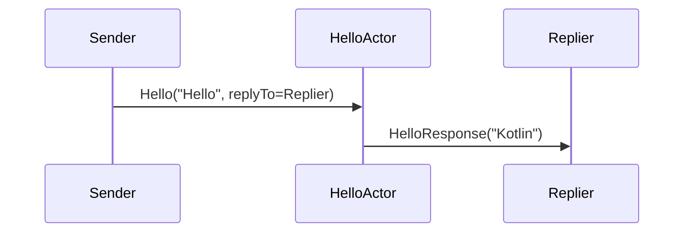

# Chapter 5: HelloActor

In the [previous chapter](04_counselormanageractor.md), we learned how the CounselorManagerActor organizes and assigns counselors to different sessions. Now, let’s look at something far simpler: our “HelloActor.” Imagine a friendly doorman who, whenever you say “Hello,” replies cheerily with “Kotlin.” This chapter walks you through that minimal example of actor communication—perfect for beginners seeing Pekko Typed Actors for the first time.

---

## Why a HelloActor?

Think of “HelloActor” as the most basic greeter. Its only real job is to wait for a particular message—“Hello”—and then answer with a single word: “Kotlin.” This might seem too simple, but it perfectly illustrates:

• How typed messages flow between actors.  
• How to handle a specific command and produce a response.  
• The basic skeleton of an actor’s lifecycle (start and stop).

This is a gentle introduction to typed actor systems without the complexity of user sessions or counselor routing.

---

## Key Concepts

Here are the core ideas behind HelloActor:

1. Messages (Commands):  
   - “Hello”: Sent by anyone who wants a greeting.  
   - “HelloResponse”: The actor’s reply, containing “Kotlin.”  

2. Actor Behavior:  
   - Wait for incoming “Hello.”  
   - If it recognizes “Hello,” respond with “HelloResponse.”  
   - Ignore or handle unexpected messages differently (e.g., do nothing).

3. Typed Handling: Pekko typed actors define strict command types so that only valid messages reach the actor.

---

## How to Use HelloActor

Picture this scenario:
• We create a HelloActor.  
• Another actor/user says “Hello” by sending a “Hello” command.  
• The HelloActor responds with a “HelloResponse” containing “Kotlin.”

### Example: Sending a Greeting

Below is how you might send “Hello” to HelloActor:

```kotlin
val helloCommand = Hello("Hello", myReplyActorRef)
helloActorRef.tell(helloCommand)
```
1. “Hello(…)” includes the text “Hello” and a “replyTo” actor reference.
2. Once HelloActor sees that text is “Hello,” it sends back “HelloResponse(“Kotlin”).”

### Receiving the Reply

The “myReplyActorRef” you provided is where HelloActor’s response will go:

```kotlin
.override fun onMessage(msg: HelloCommand): Behavior<HelloCommand> {
    if (msg is HelloResponse) {
        println("I got a greeting: ${msg.message}")
    }
    return this
}
```
1. If your actor receives “HelloResponse,” it can handle it.  
2. This “HelloResponse” simply contains “Kotlin.”  

---

## A Simple Sequence Diagram

Here’s a mini illustration of the greeting flow:



• Sender: The actor or component that wants a greeting.  
• HelloActor: Waits for “Hello,” sends back “Kotlin.”  
• Replier: The recipient of “HelloResponse.”

---

## Under the Hood

The HelloActor code (located in “src/main/kotlin/org/example/kotlinbootreactivelabs/actor/core/HelloActor.kt”) uses Pekko’s typed actor APIs. Let’s break down the important parts.

### 1) Defining the Commands

```kotlin
sealed class HelloCommand
data class Hello(
    val message: String,
    val replyTo: ActorRef<HelloCommand>
) : HelloCommand()

data class HelloResponse(val message: String) : HelloCommand()
```
1. “HelloCommand” is a sealed class that groups all possible messages.  
2. “Hello” has a String (the user’s text) and a replyTo reference.  
3. “HelloResponse” simply wraps the response text.

### 2) Actor Creation

```kotlin
companion object {
    fun create(): Behavior<HelloCommand> {
        return Behaviors.setup { context -> HelloActor(context) }
    }
}
```
1. “create()” is a convenient function to start the actor.  
2. “Behaviors.setup” initializes the HelloActor, giving access to the Pekko “context.”

### 3) Handling the “Hello” Command

```kotlin
private fun onHello(cmd: Hello): Behavior<HelloCommand> {
    if (cmd.message == "Hello") {
        cmd.replyTo.tell(HelloResponse("Kotlin"))
    }
    return this
}
```
1. Checks if the incoming message is literally “Hello.”  
2. If yes, sends back “Kotlin.”  
3. Returns the same behavior (i.e., the actor remains ready for more messages).

---

## Conclusion and Next Steps

You now understand how a minimal actor can receive a typed command (“Hello”) and respond with a typed message (“Kotlin”). This might seem trivial, but it lays the foundation for more advanced patterns—like storing state or persisting data.

Ready to explore an actor that actually remembers things? Let’s go to the next chapter: [HelloStateActor](06_hellostateactor.md).

---

Generated by [AI Codebase Knowledge Builder](https://github.com/The-Pocket/Tutorial-Codebase-Knowledge)