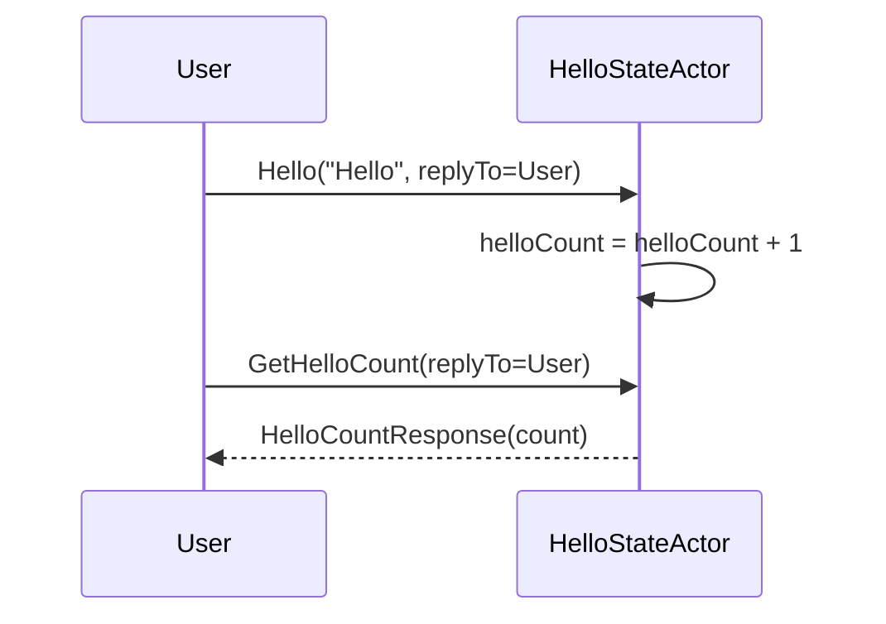

# Chapter 6: HelloStateActor

In the [previous chapter](05_helloactor.md), we saw how our simple “HelloActor” responds with “Kotlin” whenever someone greets it. Now it’s time to introduce a slightly more advanced character: **HelloStateActor**. Think of HelloStateActor as a greeter who not only says “Hello” but also keeps track of how many times it’s greeted people—like someone tallying marks on a whiteboard.

## Why HelloStateActor?

Sometimes, you want to remember a small piece of information while your app is running without permanently saving it to a database. For example:
• Counting how many times the user has said “Hello.”  
• Tracking a short-lived state that resets if no one is around or after a time limit.  

HelloStateActor does exactly that, acting as an “in-memory” notebook. Once the actor stops or restarts, the “notebook” is gone. This makes HelloStateActor handy for quick, temporary logging or counting.

---

## Basic Use Case

Imagine you build an application that greets users and shows them how many greetings have happened so far. You don’t need to save these counts forever—just while the app runs. HelloStateActor can:

1. Receive a “Hello” command from someone.  
2. Increment a counter each time a new “Hello” arrives.  
3. Return the current “HelloCount” when asked.  
4. Optionally reset the count automatically after some time (like every 10 seconds).

---

## Key Concepts

1. **State**: A simple integer counter (“helloCount”) that increments whenever the actor is greeted. The actor forgets this counter if it restarts.  
2. **Commands**:  
   - "Hello": User greets, the actor increments the counter.  
   - "GetHelloCount": User asks how many hellos have been counted so far.  
   - "ResetHelloCount": Wipes the counter to zero. (HelloStateActor can do this on a timer, too.)  
3. **Ephemeral**: The data is not written to any database. Once the actor shuts down, the count disappears.

---

## How to Use HelloStateActor

Below is a very simplified version of how you might interact with HelloStateActor:

```kotlin
// 1) You greet the actor
helloStateActorRef.tell(Hello("Hello", replyTo))

// 2) You request the current count
helloStateActorRef.tell(GetHelloCount(replyTo))
```

Explanation:  
• “Hello” increments the actor’s internal counter.  
• “GetHelloCount” returns the number of times “Hello” has been called.  

### Receiving the Replies

Whichever actor sent “GetHelloCount(replyTo)” will eventually receive something like this:

```kotlin
// A response from the HelloStateActor
class MyReplier : AbstractBehavior<HelloStateActorResponse>(context) {
    override fun onMessage(msg: HelloStateActorResponse): Behavior<HelloStateActorResponse> {
        if (msg is HelloCountResponse) {
            println("Current Hello Count: ${msg.count}")
        }
        return this
    }
}
```

Explanation:  
• This snippet shows a simplistic “reply” actor printing “Current Hello Count: X”.  
• You can do whatever you like with that count, such as display it in a UI or log it.

---

## Under the Hood

When HelloStateActor starts, it initializes a `helloCount` to 0. Every time it receives a “Hello” command:
1. It checks if the incoming message says “Hello.”  
2. It increments `helloCount`.  
3. It may send back a greeting response.  

If it receives “GetHelloCount,” it replies with how many times it has said hello so far. Periodically, if auto-reset is configured, it will reset that count to 0 without any extra commands (like clearing a whiteboard every so often).

### Simple Sequence Diagram



---

## Peek at the Implementation

The complete code lives in  
“src/main/kotlin/org/example/kotlinbootreactivelabs/actor/state/HelloStateActor.kt.”

Below are a few important highlights:

1) Storing a count in a variable:

```kotlin
private var helloCount: Int = 0
```

• This integer goes up each time we get “Hello.”  
• Resets if instructed or when the actor restarts.

2) Handling the “Hello” command:

```kotlin
private fun onHello(command: Hello): Behavior<HelloStateActorCommand> {
    if (command.message == "Hello") {
        helloCount++
        command.replyTo.tell(HelloResponse("Kotlin"))
    }
    return this
}
```

• Increments the counter and replies with “Kotlin.”  
• Stays in the same state to handle more commands.

3) Returning the current count:

```kotlin
private fun onGetHelloCount(command: GetHelloCount): Behavior<HelloStateActorCommand> {
    command.replyTo.tell(HelloCountResponse(helloCount))
    return this
}
```

• Sends back the total “helloCount.”  

4) Resetting automatically:

```kotlin
private fun onResetHelloCount(command: ResetHelloCount): Behavior<HelloStateActorCommand> {
    helloCount = 0
    return this
}
```

• Clears the counter. This can happen whenever a timer triggers or you explicitly request it.

---

## Conclusion and Next Steps

Congratulations! You now have a friendly actor that not only greets users but also keeps a small memory of how many greetings have happened so far—without touching any database.

But what if you want this count to stay around even if your actor stops or your application restarts? Stay tuned for the next chapter: [HelloPersistentDurableStateActor](07_hellopersistentdurablestateactor.md), where we’ll add persistence to our greetings!

See you there!

---

Generated by [AI Codebase Knowledge Builder](https://github.com/The-Pocket/Tutorial-Codebase-Knowledge)