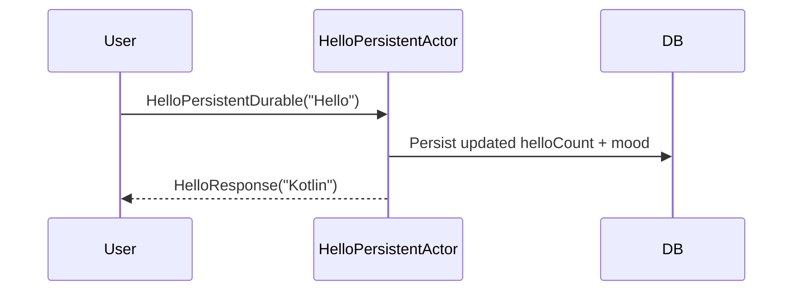

# Chapter 7: HelloPersistentDurableStateActor

In the [previous chapter](06_hellostateactor.md), you met the “HelloStateActor,” an actor that could keep a simple count of how many times it got a “Hello” message. However, its memory was purely in-memory: if the actor restarted, it forgot everything. Now, let’s introduce the “HelloPersistentDurableStateActor,” which hangs on to its data even after restarts—like a sturdy safe that protects your valuables, no matter what.

---

## Why HelloPersistentDurableStateActor?

Imagine you have an important counter of “Hello” greetings and a mood indicator (HAPPY or ANGRY). You want this information to stay around even if your application restarts or if something crashes. The HelloPersistentDurableStateActor:

• Stores its “hello count” in durable storage.  
• Keeps track of its mood (HAPPY or ANGRY) across restarts.  
• Ensures that if something goes wrong, the next time it boots up, it starts from the last known state (similar to turning on a computer that remembers your data from the hard drive).

This is extra helpful in real-world systems where you can’t afford to lose data when an actor is shut down or restarted.

---

## Basic Use Case

Let’s say you want to build a “greeting kiosk” that tracks:  
1) How many times someone pressed a “Hello” button.  
2) Whether the kiosk is feeling HAPPY or ANGRY (maybe it gets “ANGRY” if too many “Hello” presses happen in a short time).  
3) Over a month, you also want to see the total number of “Hello” presses in its entire history.  

With HelloPersistentDurableStateActor, you can do just that—storing the current count, total count, and mood in a durable place. If the kiosk restarts, it picks up right where it left off.

---

## Key Concepts

1. Durable State: The actor’s data is stored in something like a database, not just memory. It’s automatically reloaded if the actor restarts.  

2. Commands:  
   • HelloPersistentDurable: Increments the hello counters if “message” == “Hello.”  
   • GetHelloCountPersistentDurable: Returns the current “in-session” hello count.  
   • GetHelloTotalCountPersitentDurable: Returns the overall total hello count (across all time).  
   • ChangeState: Switches the actor’s mood between HAPPY and ANGRY.  
   • ResetHelloCount: Sets the current “in-session” hello count to zero.  

3. Recovery: If the actor or app crashes, on startup, the actor recovers the last known data. No manual replay required on your part.

---

## How to Use HelloPersistentDurableStateActor

Below is a simplified example of creating and interacting with this persistent actor. Assume we already have a reference to the actor called “helloPersistentActorRef.”

### 1) Sending a “Hello” Command

```kotlin
val cmd = HelloPersistentDurable(
    message = "Hello",
    replyTo = myReplyActorRef
)
helloPersistentActorRef.tell(cmd)
```
Explanation:  
• If “message” is “Hello,” the actor increments the counts and replies with “HelloResponse(“Kotlin”).”  
• The data is safely stored so it won’t be lost if restarted.

### 2) Asking for the Current “Hello” Count

```kotlin
val countCmd = GetHelloCountPersistentDurable(myReplyActorRef)
helloPersistentActorRef.tell(countCmd)
```
Explanation:  
• The actor sends back the current count (e.g., how many times it’s been greeted since it was last reset).

### 3) Changing the Mood

```kotlin
helloPersistentActorRef.tell(ChangeState(State.ANGRY))
```
Explanation:  
• This sets the actor’s mood to ANGRY, which is also stored in durable state.  
• If you send a Hello after this, the actor might reply with a grumpy message.  

### 4) Resetting the “Hello” Count

```kotlin
helloPersistentActorRef.tell(ResetHelloCount)
```
Explanation:  
• The in-session count resets to 0, but the total count remains unaffected (still stored in the same database).

---

## Behind the Scenes

When a command like “HelloPersistentDurable” arrives, here’s a simple flow:



1. The “HelloPersistentActor” processes the “Hello” command.  
2. It updates its in-session count and total count in the database (DB).  
3. It replies to the user with “Kotlin.”  

If the actor restarts, it loads its last known state from the DB before handling new commands.

---

## Minimal Internal Implementation

The code lives in:  
“src/main/kotlin/org/example/kotlinbootreactivelabs/actor/persistent/durable/HelloPersistentDurableStateActor.kt”

Here’s a quick look at key parts:

1) Defining the State and Mood:

```kotlin
data class HelloState(
    val state: State,
    val helloCount: Int,
    val helloTotalCount: Int
)
```
• “helloCount” is resettable; “helloTotalCount” accumulates over time.  
• “state” can be HAPPY or ANGRY.

2) Handling the “Hello” command:

```kotlin
private fun onHello(
    state: HelloState,
    command: HelloPersistentDurable
): Effect<HelloState> {
    if (command.message == "Hello" && state.state == State.HAPPY) {
        val newState = state.copy(
            helloCount = state.helloCount + 1,
            helloTotalCount = state.helloTotalCount + 1
        )
        return Effect().persist(newState).thenRun {
            command.replyTo.tell(HelloResponse("Kotlin"))
        }
    }
    // ...
}
```
Explanation:  
• If mood is HAPPY and message is “Hello,” it increments counters and persists.  
• Persists newState in durable storage.  
• Then it replies to the sender with “HelloResponse(“Kotlin”).”

3) Command to Change Mood:

```kotlin
private fun onChangeState(
    state: HelloState,
    command: ChangeState
): Effect<HelloState> {
    val newState = state.copy(state = command.state)
    return Effect().persist(newState)
}
```
Explanation:  
• Sets the mood to either HAPPY or ANGRY.  
• Stores it so it’s remembered across restarts.

---

## Conclusion and Next Steps

Congratulations! You’ve learned how to make an actor that can reliably keep track of data even through restarts, just like a tough safe that never forgets. You can now keep a persistent count, mood, or any other crucial information across your application’s uptime.

Next, we’ll look at something different: the [BulkProcessor](08_bulkprocessor.md) actor, which can handle large batches of data in a more efficient way. See you in the next chapter!

---

Generated by [AI Codebase Knowledge Builder](https://github.com/The-Pocket/Tutorial-Codebase-Knowledge)