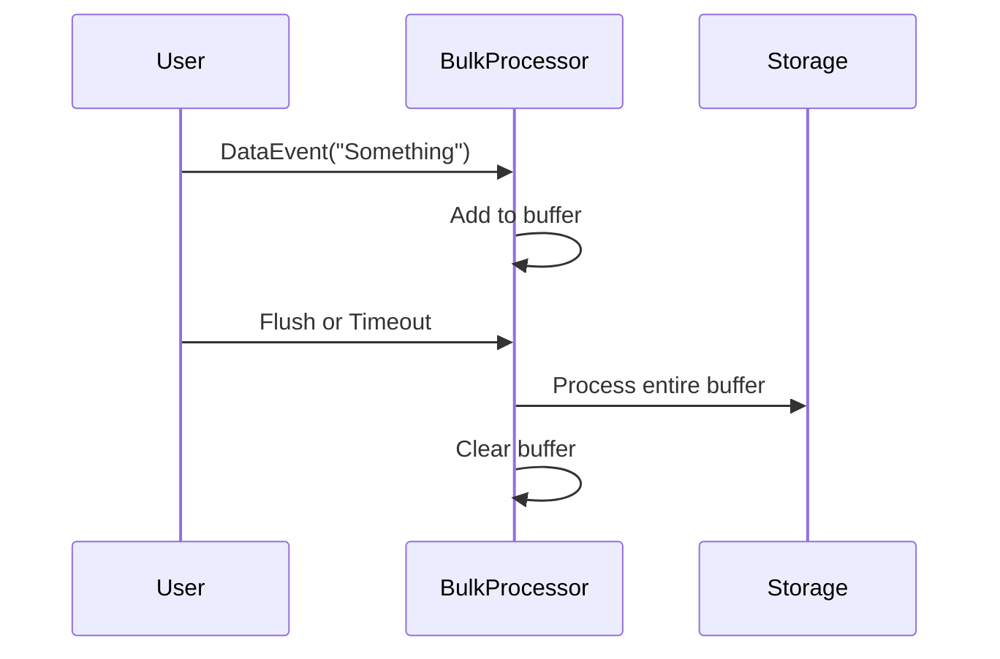

# Chapter 8: BulkProcessor

Welcome to the final chapter of our Kotlin Boot Reactive Labs tutorial! In the [previous chapter](07_hellopersistentdurablestateactor.md), we learned how “HelloPersistentDurableStateActor” can store data reliably across restarts. Now, we’ll explore the “BulkProcessor,” which processes data in batches rather than handling each item individually. Think of it like a warehouse worker who fills a box with items until the box reaches its capacity or a certain time limit has passed—then seals it (flushes the buffer) and processes everything at once. This approach helps reduce overhead and can be a huge performance booster when dealing with large or bursty data streams.

---

## Why BulkProcessor?

Imagine you’re building a logging system that receives messages every second. You could write each message to disk as soon as it arrives, but that might be inefficient if there’s a flurry of messages. With a BulkProcessor, you can:

1. Collect incoming messages in a buffer.  
2. Either wait until the buffer is full (e.g., 100 messages) or until a few seconds pass.  
3. Write them all at once, saving time and resources.

It’s a simple but powerful strategy to handle high-volume or bursty workloads efficiently.

---

## Key Concepts

1. **Buffer**: A temporary store where incoming data events are held.  
2. **Flush**: Like sealing the box, it sends the entire buffer for processing, then clears it.  
3. **Capacity Limit**: If the buffer hits a certain size (e.g., 100 items), we force a flush.  
4. **Time-based Flush**: Even if the buffer isn’t full, we automatically flush after a certain delay, ensuring data won’t stay unhandled forever.  

---

## Basic Use Case

Let’s walk through a practical scenario:

• You have incoming “DataEvent” messages that arrive in bursts.  
• Each “DataEvent” goes into the BulkProcessor’s buffer.  
• When the buffer has 100 items—or after 3 seconds—BulkProcessor flushes them all.  
• It processes or forwards them in batches, significantly reducing the overhead of handling items one by one.

---

## How to Use BulkProcessor

Below is a simplified example showing how you might interact with the BulkProcessor actor.

### 1. Sending Data Events

You send “DataEvent” commands to the BulkProcessor:

```kotlin
val dataCmd = DataEvent(data = "Something", replyTo = replyActorRef)
bulkProcessorRef.tell(dataCmd)
```

• “data” can be any information you’re batching (like log entries).  
• “replyTo” is normally who gets a confirmation (if you choose to send one later).

### 2. Flushing On Demand

Sometimes, you want to flush manually—maybe the system is about to shut down, and you want to make sure everything’s processed:

```kotlin
bulkProcessorRef.tell(Flush)
```

• This forces the BulkProcessor to handle everything in the buffer immediately.  
• Afterwards, the buffer is cleared and ready for new data.

### 3. Getting a Completion Confirmation

If you’re sending a special message that indicates the end (like “testend” in our sample code), the BulkProcessor will respond:

```kotlin
// example code snippet (below 10 lines)
val endEvent = DataEvent(data = "testend", replyTo = replyActorRef)
bulkProcessorRef.tell(endEvent)
// The BulkProcessor will respond with BulkTaskCompleted(...) to replyActorRef
```

---

## Under the Hood

Internally, the BulkProcessor stays in one of two “modes”:

• **Idle**: Empty buffer. When it receives the first “DataEvent,” it moves to “active.”  
• **Active**: Busy collecting more data. If capacity (e.g., 100 items) is reached or time passes, it flushes the buffer.

When a flush occurs, the processor “seals the box,” processes everything at once, and then clears the buffer. Here’s a simple visual:



1. User sends “DataEvent.”  
2. BulkProcessor puts it in the buffer.  
3. If a flush event happens (either due to a timer or capacity limit), BulkProcessor processes the entire buffer.  
4. BulkProcessor clears the buffer ready for new data.

---

## A Quick Look at the Actual Code

You can find the main logic in:  
“src/main/kotlin/org/example/kotlinbootreactivelabs/actor/bulkprocessor/BulkProcessor.kt”

Here are some highlights in simplified form:

1) Command Types:
```kotlin
sealed class BulkProcessorCommand
data class DataEvent(val data: Any, val replyTo: ActorRef<Any>) : BulkProcessorCommand()
object Flush : BulkProcessorCommand()
```
• “DataEvent” holds the data plus a reference to reply back if needed.  
• “Flush” is a command to process the current buffer immediately.

2) Buffer & Modes:
```kotlin
private val buffer: MutableList<Any> = mutableListOf()

override fun createReceive(): Receive<BulkProcessorCommand> {
    return idle()
}
```
• We have a mutable “buffer” inside the actor.  
• “idle()” or “active()” states define how we handle commands.

3) Transition to Active & Timer:
```kotlin
private fun idle(): Receive<BulkProcessorCommand> {
    return newReceiveBuilder()
        .onMessage(DataEvent::class.java) { event ->
            buffer.add(event.data)
            startFlushTimer() // starts a timer for time-based flush
            active()
        }
        .build()
}
```
• Upon receiving the first data, we add it to the buffer, start a flush timer, and switch to the “active” behavior.

4) Flushing the Buffer:
```kotlin
private fun flushBuffer() {
    // Actual batch processing here
    context.log.info("Processing ${buffer.size} events.")
    buffer.clear()
    stopFlushTimer()
}
```
• All items are processed, then we clear the buffer.  
• The flush timer is stopped to avoid double-flush if it triggers again.

---

## Conclusion

You’ve reached the end of our journey through Kotlin Boot Reactive Labs! The BulkProcessor is a powerful tool to handle bursts of data more efficiently by batching operations. It works just like a warehouse worker who packs items until it’s time to ship. Whether you’re logging, persisting records, or sending notifications, batching can save lots of resources and boost performance.

We hope you enjoyed this tour of actors—from simple greeters to persistent state keepers and bulk processors. Thank you for following along, and happy coding!

---

Generated by [AI Codebase Knowledge Builder](https://github.com/The-Pocket/Tutorial-Codebase-Knowledge)