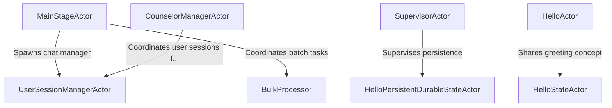

# Tutorial: KotlinBootReactiveLabs

This project showcases a **reactive system** built with *Apache Pekko Typed* actors in **Kotlin**.
The **MainStageActor** acts like a conductor, starting up key actors for web sessions and user events.
**SupervisorActor** ensures child actors remain stable by restarting them if they fail.
**HelloActor** is a simple *greeter* that responds with “Kotlin.”
**BulkProcessor** gathers items in batches before flushing them all at once.
*HelloPersistentDurableStateActor* remembers its state across restarts, unlike the *HelloStateActor* which only keeps in-memory data.
Meanwhile, **UserSessionManagerActor** manages WebSocket connections, and **CounselorManagerActor** organizes virtual counseling rooms and participants.

**Source Repository:** [kopring-reactive-labs](https://github.com/psmon/kopring-reactive-labs)

## Chapters

1. [MainStageActor](01_mainstageactor.md)
2. [SupervisorActor](02_supervisoractor.md)
3. [UserSessionManagerActor](03_usersessionmanageractor.md)
4. [CounselorManagerActor](04_counselormanageractor.md)
5. [HelloActor](05_helloactor.md)
6. [HelloStateActor](06_hellostateactor.md)
7. [HelloPersistentDurableStateActor](07_hellopersistentdurablestateactor.md)
8. [BulkProcessor](08_bulkprocessor.md)

---

Generated by [AI Codebase Knowledge Builder](https://github.com/The-Pocket/Tutorial-Codebase-Knowledge)