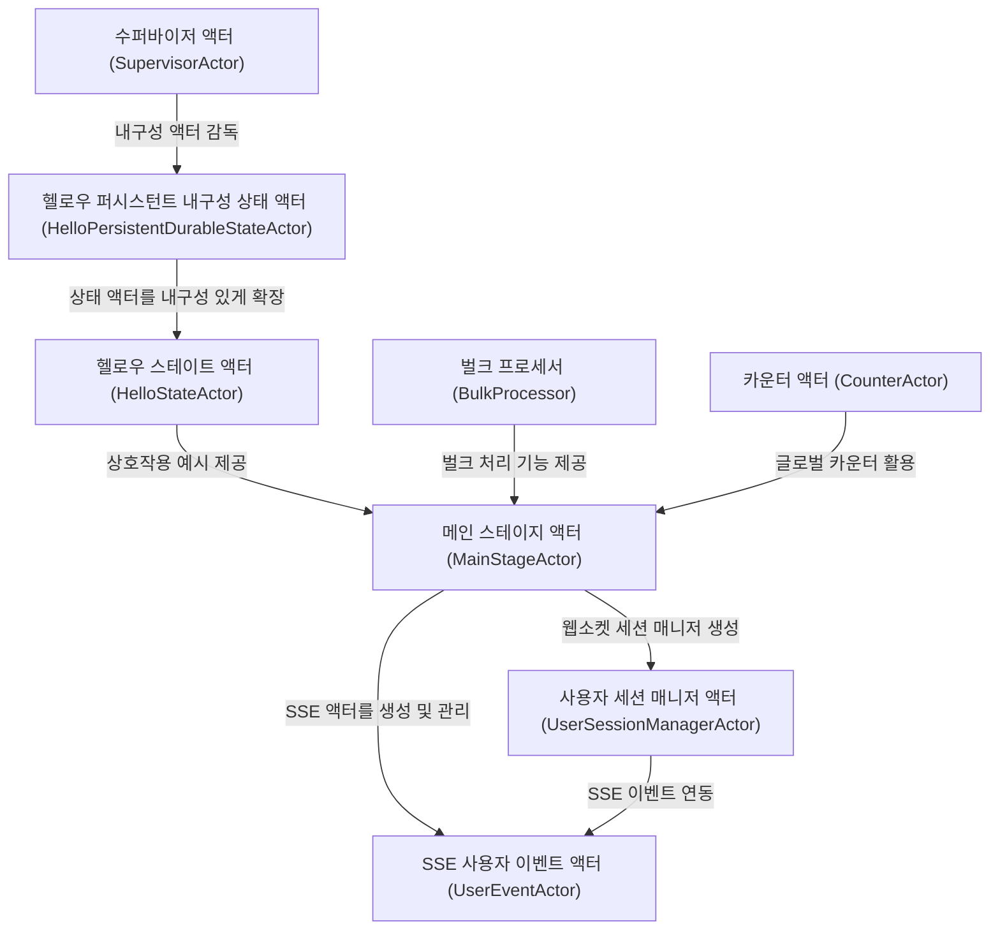

# Tutorial: KotlinBootReactiveLabs

이 프로젝트는 **Apache Pekko(구 Akka)** 환경에서 *액터 모델*을 활용해
웹소켓 세션, **SSE 스트리밍**, 그리고 내구성 있는 상태 관리 등을
손쉽게 체험하고 학습할 수 있도록 구성되었습니다.
메인 스테이지 액터가 **중심 조정자**로서 다양한 액터를 생성 및 감독하고,
수퍼바이저 액터는 하위 액터들을 재시작·관리하여 *안정성*을 보장합니다.
HelloStateActor, HelloPersistentDurableStateActor, CounterActor 등은
각각의 *상태*를 다루는 예시로서, 분산 시스템에서 액터 모델을
학습하고 확장하는 기반을 제공합니다.

**Source Repository:** [None](None)

## Chapters

1. [메인 스테이지 액터 (MainStageActor)
](01_메인_스테이지_액터__mainstageactor__.md)
2. [사용자 세션 매니저 액터 (UserSessionManagerActor)
](02_사용자_세션_매니저_액터__usersessionmanageractor__.md)
3. [SSE 사용자 이벤트 액터 (UserEventActor)
](03_sse_사용자_이벤트_액터__usereventactor__.md)
4. [헬로우 스테이트 액터 (HelloStateActor)
](04_헬로우_스테이트_액터__hellostateactor__.md)
5. [카운터 액터 (CounterActor)
](05_카운터_액터__counteractor__.md)
6. [헬로우 퍼시스턴트 내구성 상태 액터 (HelloPersistentDurableStateActor)
](06_헬로우_퍼시스턴트_내구성_상태_액터__hellopersistentdurablestateactor__.md)
7. [수퍼바이저 액터 (SupervisorActor)
](07_수퍼바이저_액터__supervisoractor__.md)
8. [벌크 프로세서 (BulkProcessor)
](08_벌크_프로세서__bulkprocessor__.md)

---

Generated by [AI Codebase Knowledge Builder](https://github.com/The-Pocket/Tutorial-Codebase-Knowledge)