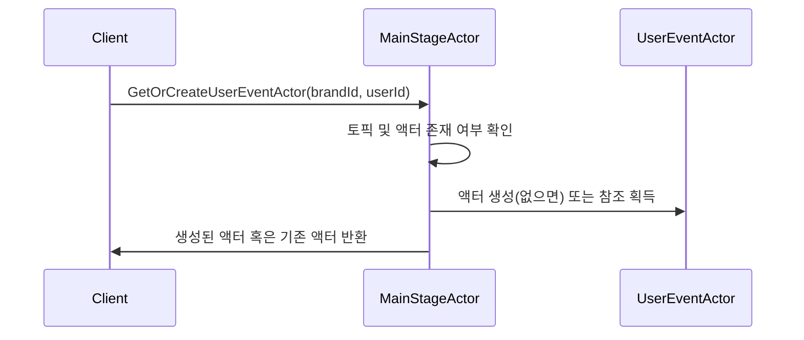

# Chapter 1: 메인 스테이지 액터 (MainStageActor)

메인 스테이지 액터(MainStageActor)는 전체 애플리케이션에서 다양한 액터를 만들어내거나 이미 생성된 액터를 관리하는 중심 역할을 담당합니다. 공연장에서 무대와 배우들을 조정하는 “무대 감독”처럼, 누군가에게 새로운 액터가 필요하다는 요청이 오면 적절한 액터를 생성하고 필요한 곳에 배치합니다. 이 장에서는 메인 스테이지 액터가 어떤 문제를 해결해주고, 이를 어떻게 간단히 사용할 수 있는지 차근차근 살펴보겠습니다.

---

## 왜 메인 스테이지 액터가 필요할까?

초보라면 “왜 굳이 중앙에서 액터를 관리해야 하지?”라고 궁금하실 수 있습니다. 간단한 예시를 들어보겠습니다:

- 사용자마다 특별히 관리해야 할 이벤트 액터가 필요하다.  
- 채팅을 위한 웹소켓 매니저 액터가 필요하다.  
- 어떤 상황에는 SSE(Server-Sent Events)를 다루는 액터가 필요하다.

이렇게 여러 종류의 액터를 한 곳에서 만들고, 다시 찾아 쓰고, 필요 없으면 정리하는 일은 생각보다 번거롭습니다. 메인 스테이지 액터가 있으면 이런 액터 생성·관리 로직을 한 곳에 모아 깔끔하고 일관성 있게 관리할 수 있습니다.

---

## 핵심 개념 정리

### 1. 액터 생성 요청 처리
메인 스테이지 액터는 “새로운 웹소켓 매니저 액터를 만들어 주세요!” 혹은 “새로운 SSE 이벤트 액터가 필요합니다!” 등의 요청을 받으면, 직접 생성하거나 이미 만들어둔 액터를 찾아서 돌려줍니다.

### 2. 브랜드ID와 사용자ID 기반 SSE 액터 관리
브랜드ID와 사용자ID가 복합적으로 주어지면, 해당 키를 사용해 연결된 SSE 액터를 생성·등록해둡니다. 이후에도 같은 브랜드ID와 사용자ID로 요청이 오면, 이미 만들어진 액터를 다시 가져다 쓸 수 있습니다.

### 3. 주제(Topic) 퍼블리시
메시지를 특정 “토픽(Topic)”에 발행해서 여러 액터가 이를 구독할 수 있습니다. 메인 스테이지 액터는 토픽을 싱글턴(Singleton) 형태로 생성·유지하고, 특정 메시지가 오면 해당 토픽을 통해 메시지를 전달합니다.

---

## 사용 방법 개요

메인 스테이지 액터를 간단히 사용하기 위해서는 아래와 같은 흐름을 기억하시면 됩니다:

1. 메인 스테이지 액터에 `CreateSocketSessionManager` 같은 메시지를 보내 새로운 액터(예: 웹소켓 매니저)를 생성하라고 지시합니다.  
2. 메인 스테이지 액터는 해당 액터를 생성하고, 필요하다면 `replyTo`를 통해 생성된 액터 참조를 되돌려줍니다.  
3. 생성된 액터 참조를 응용 로직에서 사용해, 메시지를 주고받거나 이벤트를 처리합니다.  
4. 그 외에 필요한 다른 액터들도 비슷한 요청 메시지 구조로 생성할 수 있습니다.

다음은 예시 코드 조각입니다. 10줄 미만으로 간단하게 구성하여 보여드립니다.

```kotlin
// 메인 스테이지 액터에게 소켓 매니저 생성을 요청하는 예시
val replyToRef = ...
mainStageActorRef.tell(
    CreateSocketSessionManager(replyToRef)
)
```

위 코드에서 `mainStageActorRef`는 메인 스테이지 액터의 참조입니다. `CreateSocketSessionManager` 메시지에는 `replyTo`가 담겨 있어, 생성이 완료되면 해당 액터에게 결과를 알려줍니다.

예시 흐름을 조금 더 풀어서 설명하면, 메인 스테이지 액터는 내부적으로 다음과 같은 과정을 수행합니다:

1. `CreateSocketSessionManager` 메시지 수신  
2. 새로운 `UserSessionManagerActor` 생성 후 참조 반환  
3. `replyToRef`에 `SocketSessionManagerCreated` 메시지 발송  

결과적으로 우리는 웹소켓 채팅 관련 기능을 다룰 액터 참조를 얻어오게 됩니다.

---

## 내부 동작 이해하기

메인 스테이지 액터에 대한 호출이 어떻게 처리되는지 단계별로 간단히 살펴봅시다. 여기서는 유저 이벤트 액터를 “얻거나 생성”하는 과정을 예로 들어보겠습니다.



- “Client”가 메인 스테이지 액터에 호출을 보냅니다.  
- 메인 스테이지 액터는 이미 존재하는지 확인 후, 없으면 새로 만듭니다.  
- 만든 액터 참조를 다시 “Client”에게 알려줍니다.

이렇게 호출하는 쪽(Client)은 액터 생성 세부 로직을 몰라도 되고, 메인 스테이지 액터는 중앙에서 모든 액터를 효율적으로 관리할 수 있습니다.

---

## 좀 더 구체적인 구현 살펴보기

메인 스테이지 액터의 내부 구현 코드는 아래와 같이 생겼습니다. 파일 위치는 `src/main/kotlin/org/example/kotlinbootreactivelabs/actor/MainStageActor.kt`입니다. 전체 코드는 길지만, 핵심 부분만 잘라서 차근차근 설명하겠습니다.

### 예: SSE 액터를 얻거나 생성하기

아래 코드는 `onGetOrCreateUserEventActor` 메서드 일부를 발췌했습니다. 이 메서드는 `GetOrCreateUserEventActor` 메시지를 수신하면, 내부 맵에서 액터가 이미 있는지 확인하고, 없으면 만들어서(싱글턴으로) 등록한 뒤, 해당 액터를 반환합니다.

```kotlin
private fun onGetOrCreateUserEventActor(
    command: GetOrCreateUserEventActor
): Behavior<MainStageActorCommand> {
    // brandId와 userId 기반 key 생성
    val actorKey = "${command.brandId}-${command.userId}"

    val userEventActor = userEventActors.computeIfAbsent(actorKey) {
        // 새 액터를 싱글턴으로 초기화
        val proxyActor = sigleton.init(
            SingletonActor.of(
                UserEventActor.create(command.brandId, command.userId),
                actorKey
            )
        )
        proxyActor
    }

    // ...
    
    command.replyTo.tell(userEventActor)
    return this
}
```

위 코드에서는:
1. `actorKey`를 만들어 userEventActors 맵에서 기존 액터를 찾아봅니다.  
2. 없다면 `UserEventActor`를 싱글턴으로 생성해 맵에 저장합니다.  
3. `replyTo`에 `userEventActor` 참조를 넘겨주어 호출자(Client)에 알립니다.

---

## 마무리와 다음 장 안내

이번 장에서는 메인 스테이지 액터(MainStageActor)가 전체 시스템에서 액터를 생성하고 관리하는 역할을 어떻게 담당하는지 간단한 예시와 함께 살펴보았습니다. 초심자 입장에서는 “모든 액터를 하나하나 직접 생성하기는 번거롭구나”를 깨닫게 되고, 메인 스테이지 액터가 그런 처리를 일관성 있게 대신해준다는 점이 핵심입니다.

다음 장에서는 [사용자 세션 매니저 액터 (UserSessionManagerActor)](02_사용자_세션_매니저_액터__usersessionmanageractor__.md)를 살펴보며, 실제로 웹소켓 채팅 등을 다룰 때 세션을 어떻게 관리할 수 있는지 배우겠습니다. 기대해 주세요!  

---

Generated by [AI Codebase Knowledge Builder](https://github.com/The-Pocket/Tutorial-Codebase-Knowledge)