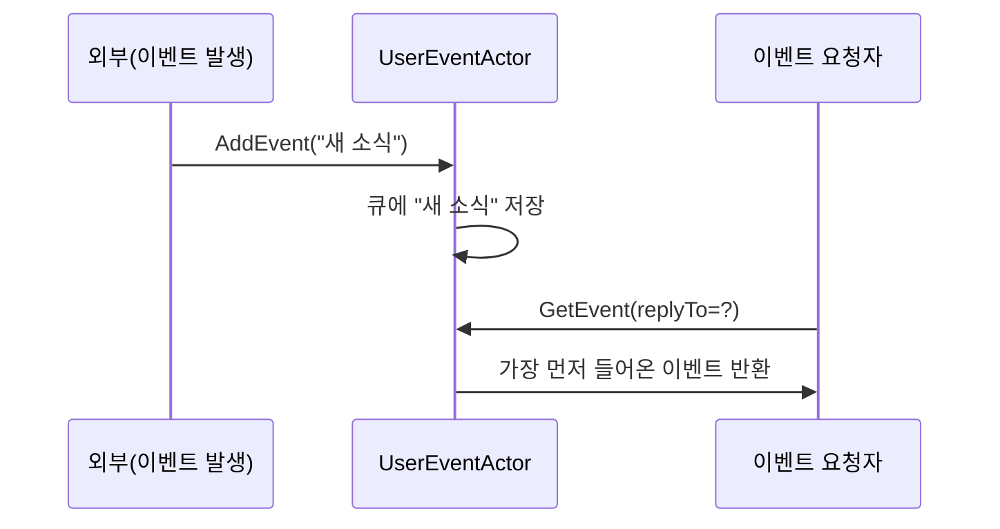

# Chapter 3: SSE 사용자 이벤트 액터 (UserEventActor)

이전 장([사용자 세션 매니저 액터 (UserSessionManagerActor)](02_사용자_세션_매니저_액터__usersessionmanageractor__.md))에서는 웹소켓 세션을 효율적으로 관리하는 방법을 살펴보았습니다. 이번에는 웹소켓과 유사하지만, 서버에서 클라이언트로 일방향 스트리밍을 제공하는 SSE(Server-Sent Events)를 위해 설계된 “SSE 사용자 이벤트 액터(UserEventActor)”를 배워보겠습니다.

---

## 왜 SSE 사용자 이벤트 액터가 필요한가?

웹소켓은 양방향 통신을 지원하지만, 어떤 경우에는 클라이언트가 굳이 서버로 메시지를 보내지 않아도 되고, 서버에서 지속적으로 보내는 알림만 수신하면 충분한 상황이 있습니다. 예를 들어, 특정 사용자의 알림 목록을 서버에서 계속해서 뿌려주고, 클라이언트는 이를 받아 화면에 표시하는 간단한 “실시간 알림” 기능을 생각해봅시다.

- 웹소켓처럼 복잡한 양방향 연결 관리가 필요할까요?  
- 클라이언트가 언제나 메시지를 보낼 필요가 없다면, 조금 더 가벼운 프로토콜을 써도 되지 않을까요?

이때 SSE는 단방향 스트리밍에 최적화된 프로토콜이어서 구현이 단순해집니다. SSE 사용자 이벤트 액터(UserEventActor)는 이러한 SSE 방식으로 사용자별·브랜드별 이벤트를 관리하고, 요청 시 메시지를 “꺼내주는” 역할을 수행합니다.

---

## 핵심 개념 살펴보기

SSE 사용자 이벤트 액터는 이벤트 큐(queue)를 가지고, “누가 가져갈 때”마다 맨 앞의 이벤트부터 순서대로 제공해줍니다. 아래 개념을 정리해보겠습니다:

1. 이벤트 저장(AddEvent)  
   - 클라이언트 등 외부에서 “새 이벤트가 도착했다”는 메시지를 액터에게 보내면, 액터는 그 이벤트를 내부 큐에 쌓아둡니다.  
2. 이벤트 취득(GetEvent)  
   - 누군가 “이벤트 하나 내놔”라고 요청하면, 큐에서 가장 먼저 들어온(먼저 쌓인) 이벤트를 꺼내 반환합니다.  
3. Queue 기반 단일 스레드 처리  
   - 액터는 기본적으로 단일 스레드 모델을 따르므로, 큐에 동시에 접근하는 복잡성을 크게 줄여줍니다.

---

## 어떻게 사용하는가?

실제로 SSE 사용자 이벤트 액터를 사용해서 이벤트를 주고받는 초간단 흐름을 살펴봅시다. 예를 들어, 어떤 사용자가 “새 알림”을 SSE로 받고자 할 때:

1. 액터에 `AddEvent` 메시지를 보내 새 이벤트를 등록합니다.  
2. 클라이언트가 서버에 “이벤트 하나 주세요”라고 하면, 액터가 `GetEvent` 메시지를 통해 큐에서 가장 앞에 있는 이벤트를 꺼내줍니다.  
3. 만약 큐가 비어있다면 “아직 이벤트가 없다”고 알려줄 수도 있습니다.

아래는 예시 코드입니다(10줄 미만):

```kotlin
// SSE 사용자 이벤트 액터를 이미 얻었다고 가정
val userEventActorRef = /* ... */

// 새 이벤트 추가
userEventActorRef.tell(
    AddEvent("사용자에게 보여줄 새로운 알림입니다.")
)

// 이벤트 가져오기
userEventActorRef.tell(
    GetEvent(replyTo = someReplyActorRef)
)
```

- `AddEvent`로 이벤트를 쌓고,  
- `GetEvent`를 통해 하나씩 꺼내 보냅니다.

어떤 상황에서 유용할까요? 이벤트가 자주 발생하지만, 클라이언트가 “폴링(주기적 확인)” 또는 SSE로 실시간 스트리밍을 받아가려 할 때 간단히 연락책(큐) 역할을 수행할 수 있습니다.

---

## 동작 흐름 살펴보기

이 액터 내부적으로는 큐(Queue)를 사용해 이벤트를 FIFO(First In First Out) 순으로 저장하고 꺼내줍니다. 아래 시퀀스 다이어그램에서 흐름을 간단히 보겠습니다:



- 누군가 이벤트를 추가(AddEvent)하면 큐에 저장됩니다.  
- 이후 요청(GetEvent)이 들어오면, 큐의 맨 앞 이벤트를 꺼내 요청자에게 전달합니다.

---

## 내부 구현 알아보기

SSE 사용자 이벤트 액터는 단순하면서도, 필요한 기능(이벤트 저장/조회)을 안정적으로 제공합니다. 실제 코드는 다음처럼 구성되어 있습니다. 전체 코드는 길기 때문에, 핵심 부분을 나누어 살펴볼게요.

### 1) 액터 정의와 기본 구조

아래는 파일 위치 `src/main/kotlin/org/example/kotlinbootreactivelabs/actor/sse/UserEventActor.kt`에 정의된 액터의 시작 부분입니다 (10줄 미만으로 축약).

```kotlin
class UserEventActor(
    context: ActorContext<UserEventCommand>,
    private val brandId: String,
    private val userId: String
) : AbstractBehavior<UserEventCommand>(context) {

    private val eventQueue: Queue<String> = LinkedList()
    
    // ...
}
```

- 클래스 생성자에서 `brandId`, `userId`를 받아, “어떤 브랜드, 어떤 사용자용 이벤트인지” 식별합니다.  
- `eventQueue`는 `LinkedList`를 이용해 FIFO 구조를 간단히 구성합니다.

### 2) 메시지 처리: AddEvent

이 액터가 처리할 핵심 메시지인 `AddEvent`는 아래처럼 구현합니다:

```kotlin
private fun onAddEvent(command: AddEvent): Behavior<UserEventCommand> {
    eventQueue.add(command.message)
    // 필요한 경우 로깅
    return this
}
```

- `eventQueue.add(...)`를 통해 이벤트 문자열을 큐에 추가합니다.  
- 처리 후에는 그대로 현재 Behavior를 유지합니다(`return this`).

### 3) 메시지 처리: GetEvent

이제 누군가 이벤트를 “가져가길” 요청하면(`GetEvent` 수신), 아래처럼 큐에서 하나를 꺼내 반환합니다. (10줄 미만 예시)

```kotlin
private fun onGetEvent(command: GetEvent): Behavior<UserEventCommand> {
    val event = eventQueue.poll()
    if(event != null) {
        command.replyTo.tell(event)
    } else {
        command.replyTo.tell("No events available")
    }
    return this
}
```

- `poll()`로 큐 맨 앞 요소를 꺼냅니다.  
- 이벤트가 있으면 `replyTo`에 이벤트를 전달하고, 없으면 “이벤트가 없다”는 메시지를 보내줍니다.

---

## 실제 활용 시나리오

1. 사용자별 알림창  
   - 특정 사용자ID로 액터를 생성해두고, 새로운 알림이 생길 때마다 `AddEvent`로 큐에 쌓습니다.  
   - 웹 페이지나 앱에서 SSE를 통해 “새 이벤트 없나?”를 요청하면, `GetEvent`로 바로 하나씩 받아볼 수 있습니다.  

2. 브랜드 공지 관리  
   - 브랜드ID 단위로 하나의 액터를 두고, “새 프로모션” 등의 알림을 쌓아둡니다.  
   - 여러 클라이언트가 해당 브랜드에 대한 SSE 구독을 맺으면, 필요할 때 `GetEvent`로 알림을 다운로드 받아 화면에 표시할 수 있습니다.

---

## 마무리

이 장에서는 SSE 사용자 이벤트 액터(UserEventActor)가 어떻게 Queue를 활용하여 “이벤트를 차곡차곡 쌓아두고, 요청이 오면 하나씩 꺼내주는” 구조로 동작하는지 살펴보았습니다. 이를 통해 단방향 이벤트 스트리밍이 필요한 상황에서 간단하지만 유용한 솔루션을 구현할 수 있습니다.

다음 장([헬로우 스테이트 액터 (HelloStateActor)](04_헬로우_스테이트_액터__hellostateactor__.md))에서는 좀 더 상태 중심의 예시를 다룹니다. 액터가 내부적으로 어떤 상태를 유지하고, 메시지에 따라 그 상태를 어떻게 바꿀 수 있는지 체험해볼 예정이니 기대해 주세요!  

---

Generated by [AI Codebase Knowledge Builder](https://github.com/The-Pocket/Tutorial-Codebase-Knowledge)