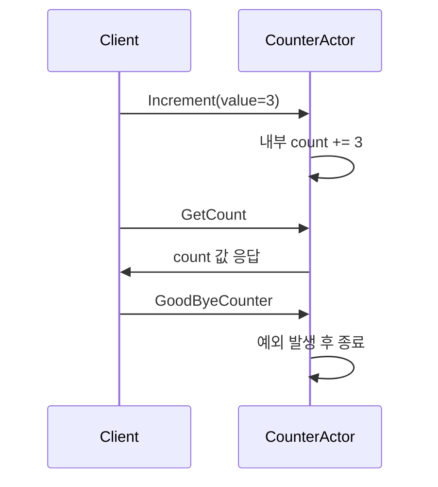

# Chapter 5: 카운터 액터 (CounterActor)

이전 장([헬로우 스테이트 액터 (HelloStateActor)](04_헬로우_스테이트_액터__hellostateactor__.md))에서는 액터 내부 상태를 어떻게 관리하고, 메시지나 타이머에 따라 상태를 업데이트하는 방법을 배웠습니다. 이번 장에서는 훨씬 간단하지만 꽤 자주 쓰이는 “카운터 액터(CounterActor)”에 대해 살펴보겠습니다.

“카운터 액터”는 말 그대로 숫자 값을 하나 들고 있다가, 누군가가 “증가(Increment)” 요청을 보내면 그 숫자를 올리고, “현재 값(GetCount)을 알려달라”는 요청이 오면 현재 값을 돌려주는 간단한 예시입니다. 이 아이디어를 확장하면:

- 여러 키(Key)별로 각각 독립된 카운터를 운영할 수 있고,  
- 이를 클러스터 셰어딩(Cluster Sharding)으로 분산해서 수많은 노드가 동시에 업데이트하더라도 안전하게 합산할 수 있으며,  
- 싱글톤(Singleton)으로도 두어 전역적으로 하나의 카운터만 공유할 수도 있습니다.  

즉, 여러 노드에서 동시에 “카운터 +1 해줘!”라는 요청이 오면 중앙에 있는(또는 셰어딩된) 액터가 자신이 들고 있던 숫자를 하나씩 올려주고, 필요 시 합산 결과를 반환해주는 구조입니다.

---

## 왜 카운터 액터가 유용할까?

“숫자 세는 거야 전역 변수 하나 둬서 원자적(Atomic)으로 처리하면 되지 않을까?”라고 생각할 수도 있습니다. 그러나 분산 환경이나 멀티 노드 환경에서 ‘안전하게 하나의 숫자를 관리’하는 일은 의외로 까다롭습니다. 액터를 이용하면:

- 단일 스레드 메시지 처리이므로 동시성 문제가 줄어듭니다.  
- 클러스터 셰어딩으로 쉽게 확장 가능(키별로 카운터를 샤딩).  
- 싱글톤 방식을 통해 전체 시스템이 공유하는 카운터도 쉽게 구현.  

이런 특징들은 간단한 “숫자 세기” 이상의 복잡한 집계나 통계 기능을 구현할 때 상당히 큰 이점을 줍니다.

---

## 핵심 개념 정리

1. Increment 메시지  
   - “카운터 값을 n만큼 올려주세요”라는 의미입니다.  
   - 액터가 이 메시지를 받으면 내부의 `count` 값을 `n`만큼 증가시킵니다.

2. GetCount 메시지  
   - “지금 카운터 값이 얼마인가요?”를 묻는 메시지입니다.  
   - 액터는 “현재 값”을 응답(`replyTo`)으로 돌려줍니다.

3. GoodByeCounter 메시지  
   - 예제에서는 “이제 카운터를 종료해 줘!” 같은 의미로, 일부러 예외를 발생시켜 액터를 중단시키는 예시입니다.  
   - 실무에서는 “특정 시점에 카운터를 정리하거나 교체해야 한다” 같은 시나리오를 가정해볼 수 있습니다.

4. Persistence(옵션)  
   - 예제 코드에서는 `count = 5`로 초기화만 해두었고, “TODO: 복구 로직” 주석이 달려 있습니다.  
   - 실제로는 `count`의 최종값을 디스크 등에 기록해 두면, 액터가 재시작되더라도 다시 회복(Recovery)할 수 있습니다.

---

## 간단한 사용 예시

아래 코드는 카운터 액터를 생성하고, 값을 증감시키거나 조회하는 흐름을 보여줍니다(각 코드 블록은 10줄 미만).

```kotlin
// 카운터 액터 생성
val counterRef = context.spawn(
    CounterActor.create("my-counter"),
    "counterActor"
)

// 카운터 값을 3만큼 증가
counterRef.tell(Increment(3))
```

위에서 `my-counter`라는 식별자(entityId)를 사용해 카운터 액터를 만들었습니다. 그다음 `Increment(3)` 메시지를 보내 내부 `count`가 3 증가합니다.

```kotlin
// 현재 카운터 값 요청
counterRef.tell(
    GetCount(replyTo = myReplyActorRef)
)
```

`GetCount` 메시지를 보내면, 카운터 액터는 `myReplyActorRef`에게 “현재 count 값”을 담은 `CounterState(count)`를 응답합니다. 예를 들어, 로그에 찍거나, 응답 액터에서 화면에 보여줄 수 있습니다.

```kotlin
// 액터 종료(실제로는 예외를 던짐)
counterRef.tell(GoodByeCounter)
```

마지막으로 `GoodByeCounter` 메시지를 보내면 예제상 `IllegalStateException`을 발생시켜 액터가 중단됩니다. 실무에서는 리소스 정리 등을 위해 이 같은 종료 메시지를 별도로 정의하기도 합니다.

---

## 동작 흐름은 어떻게 될까?

메시지 순서를 간단히 나타내면 다음과 같습니다:



- `Increment` 메시지는 카운터 값을 올리고,  
- `GetCount` 메시지가 오면 현재 값을 응답합니다.  
- `GoodByeCounter`로 액터를 명시적으로 종료시키는 단순 흐름입니다.

---

## 내부 구현 살펴보기

예제 코드의 핵심 로직은 대략 다음과 같습니다. 먼저 메시지 정의 부분(각 10줄 미만으로 분할):

```kotlin
// 명령 계층
sealed class CounterCommand : PersitenceSerializable

data class Increment(val value: Int) : CounterCommand()

data class GetCount(
    val replyTo: ActorRef<CounterState>
) : CounterCommand()

object GoodByeCounter : CounterCommand()
```

- `Increment`는 `value` 만큼 카운트를 더하겠다는 명령,  
- `GetCount`는 현재 값을 알려달라는 명령,  
- `GoodByeCounter`는 카운터를 종료하는 명령입니다.

그리고 실제 액터 클래스(중요 부분만 확인):

```kotlin
class CounterActor(
    context: ActorContext<CounterCommand>,
    val entityId: String
) : AbstractBehavior<CounterCommand>(context) {

    private var count = 0

    init {
        // 예: 초기값 5, 나중에 복구 로직 가능
        count = 5
    }

    override fun createReceive(): Receive<CounterCommand> {
        return newReceiveBuilder()
            .onMessage(Increment::class.java) { msg ->
                count += msg.value
                this
            }
            .onMessage(GetCount::class.java) { msg ->
                msg.replyTo.tell(CounterState(count))
                this
            }
            .onMessage(GoodByeCounter::class.java) { 
                throw IllegalStateException("crash..")
            }
            .build()
    }
}
```

- `onMessage(Increment::class.java)` 블록에서 `count`를 올려줍니다.  
- `onMessage(GetCount::class.java)` 블록에서 `replyTo`로 현재 상태(`CounterState(count)`)를 날려줍니다.  
- `GoodByeCounter` 메시지 시, `IllegalStateException`을 발생시켜 액터가 종료됩니다.  

이 로직만으로도 기본 카운터 기능은 문제없이 동작합니다.

---

## 클러스터 셰어딩(옵션)

만약 수많은 카운터를 키(Key)별로 운영해야 한다면, 클러스터 셰어딩을 통해 각 키에 해당하는 `CounterActor`를 자동으로 분산 배치할 수 있습니다. 덕분에 하나의 노드에 부하가 몰리지 않고, 여러 노드에서 균형 있게 카운터 액터가 관리되죠. 이 방식은 다음과 같은 장점을 추가로 가집니다.

- 노드가 다운되어도 다른 노드에서 액터를 재생성(복구)  
- 요청이 많은 키는 여러 노드에서 메시지 처리를 병행  

이처럼 “간단한 예제”로 보이는 카운터 액터가, 실제로는 분산 시스템에서 핵심이 되는 예시를 제공할 수 있습니다.

---

## 결론 및 다음 장 안내

이번 장에서는 카운터 액터(CounterActor)가 어떤 문제를 해결하는지, 그리고 메시지를 통해 숫자를 안전하게 증감하고 조회하는 흐름을 간단히 살펴보았습니다. 싱글톤 모드로 하나만 두고 쓰거나, 키 단위로 여러 개를 만들어 쓰거나, 클러스터 셰어딩을 활용해 무수히 많은 카운터를 분산시키는 등 다양한 활용이 가능함을 알았습니다.

다음 장([헬로우 퍼시스턴트 내구성 상태 액터 (HelloPersistentDurableStateActor)](06_헬로우_퍼시스턴트_내구성_상태_액터__hellopersistentdurablestateactor__.md))에서는 “내구성(Persistence)”을 좀 더 본격적으로 다룰 예정입니다. 액터가 종료되거나 재시작돼도 상태를 보전하려면 어떻게 해야 하는지 알아볼 테니, 계속해서 함께 공부해 봅시다!

---

Generated by [AI Codebase Knowledge Builder](https://github.com/The-Pocket/Tutorial-Codebase-Knowledge)