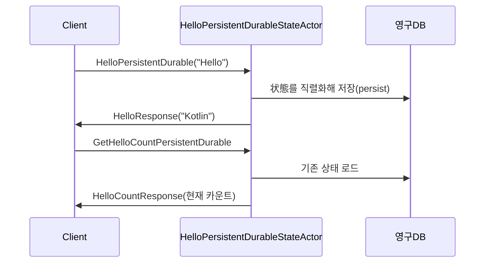

# Chapter 6: 헬로우 퍼시스턴트 내구성 상태 액터 (HelloPersistentDurableStateActor)

이전 장([카운터 액터 (CounterActor)](05_카운터_액터__counteractor__.md))에서 우리는 액터를 이용해 숫자를 안전하고 간단하게 관리하는 방법을 살펴보았습니다. 이제는 액터가 “어떤 상태를 영구적으로(DB 등)에 저장”하여, 애플리케이션이 재시작되어도 상태를 그대로 복원하는 방법을 알아볼 차례입니다. 여기서 주인공은 바로 “헬로우 퍼시스턴트 내구성 상태 액터(HelloPersistentDurableStateActor)”입니다.

“헬로우 퍼시스턴트 내구성 상태 액터”는 간단한 인삿말(“Hello”)을 받을 때마다 상태를 DB에 영구 보관하여, 액터가 재부팅되더라도(또는 노드가 다운되더라도) 이전 상태를 잊지 않습니다. 예를 들어, “지금까지 Hello가 몇 번이나 왔는지”를 기록하거나, 현재 기분(해피/앵그리 상태)을 저장해두고, 서비스를 다시 시작해도 이어서 동작할 수 있습니다.

---

## 1. 어떤 문제를 해결할까?

기본적인 액터는 메모리에 상태를 저장하기 때문에, 애플리케이션이 종료되면 그 상태가 사라집니다. 하지만 실제 운영 환경에서는 다음과 같은 상황이 자주 일어납니다:

- 서버가 재시작되었을 때도, 직전에 어디까지 처리했는지 기억해야 한다.  
- 클러스터 노드 하나가 장애로 내려가도, 다른 노드에서 동일한 상태를 복원하여 연속 서비스를 제공해야 한다.

헬로우 퍼시스턴트 내구성 상태 액터는 “Durable State(내구성 상태)” 방식을 사용하여 DB나 R2DBC 같은 영구 저장소에 상태를 직렬화해두고, 다시 올라올 때 저장된 상태를 복구합니다. 즉, 매번 새로 처음부터 시작할 필요 없이, 마지막 시점의 상태에서 이어가는 것이 가능해집니다.

---

## 2. 핵심 개념

### 2.1 Durable State (내구성 상태)
“Durable State”는 액터마다 가지고 있는 상태를 DB 등에 JSON 형식으로 보관해 두는 방식입니다. 이를 통해 시스템이 재가동되어도 이전 상태를 그대로 가져와, 끊김 없이 동작을 재개합니다.

### 2.2 PersistenceId
액터마다 고유하게 부여하는 ID로, 이 ID를 통해 DB에 저장된 데이터를 구분합니다. 예: “HelloPersistent-123”.

### 2.3 State 구조
헬로우 퍼시스턴트 액터는 “해피(HAPPY)”와 “앵그리(ANGRY)” 같은 기분 상태, 그리고 “Hello”가 몇 번 들어왔는지(helloCount), 총 누적 횟수(helloTotalCount)를 함께 저장합니다.

### 2.4 명령(Command) 처리
- “Hello” 메시지를 받으면 상태를 변경(카운트 증가)하고 DB에 persist.  
- “ChangeState”로 기분을 바꿀 수도 있고, “ResetHelloCount”로 helloCount를 0으로 만들 수도 있습니다.

---

## 3. 간단 사용 방법

실무에서는 아래처럼 액터를 생성해두고, 메시지를 통해 상태를 영구 보존할 수 있습니다(각 코드 조각 최대 10줄 미만).

예를 들어, 액터 생성(스폰)은 다음과 같이 할 수 있습니다:

```kotlin
val persistenceId = PersistenceId.ofUniqueId("HelloPersistent-001")
val helloActor = context.spawn(
    HelloPersistentDurableStateActor.create(persistenceId),
    "helloPersistentActor"
)
```

위 코드는 “HelloPersistent-001”이라는 `PersistenceId`를 지정해 DB에 저장할 키를 정합니다. 이제 메시지를 보낼 수 있습니다:

```kotlin
helloActor.tell(
    HelloPersistentDurable(
        message = "Hello",
        replyTo = replyActorRef
    )
)
```

- 이 메시지가 처리되면, 내부 상태(`helloCount` 등)가 +1 증가하고, DB에 해당 정보가 영구 저장됩니다.  
- 응답(`HelloResponse("Kotlin")` 등)은 `replyActorRef`로 전달됩니다.

또 다른 예시로, 상태(해피/앵그리)를 바꾸려면:

```kotlin
helloActor.tell(
    ChangeState(State.ANGRY)
)
```

- 그러면 DB에 `state = ANGRY`가 저장되고, 다음에 “Hello”가 들어오면 “Don't talk to me!” 응답이 갈 수 있습니다.

---

## 4. 내부 동작 살펴보기

아래는 이 액터가 어떻게 동작하는지 간단한 시퀀스 다이어그램으로 보여줍니다:



1. Client가 “Hello” 메시지를 액터에게 보냄  
2. 액터는 helloCount를 증가하고, DB에 업데이트 persist  
3. 액터는 Client에게 응답(“Kotlin” 등)을 전송  
4. 누군가 “지금 Hello 몇 번이나 받았어?”를 물어보면, DB에 저장된 최신 상태를 참조해 응답  

결과적으로 서버가 재시작되어도, DB에 남아 있는 상태를 재빨리 불러와 동일한 카운트를 이어갈 수 있습니다.

---

## 5. 내부 구현 코드 예시

프로젝트에서는 다음 위치에 코드를 배치할 수 있습니다. 예:  
“src/main/kotlin/org/example/kotlinbootreactivelabs/actor/persistent/durable/HelloPersistentDurableStateActor.kt”

이 액터 코드는 대략 아래와 같은 구조입니다(중요 부분만 10줄 미만으로 나누어 설명).

### 5.1 상태 정의

```kotlin
data class HelloState(
    val state: State,
    val helloCount: Int,
    val helloTotalCount: Int
)
```

- 현재 기분(`State`), Hello 개수, 누적 횟수를 세 필드로 보관합니다.

### 5.2 액터 클래스(요약)

```kotlin
class HelloPersistentDurableStateActor(
    context: ActorContext<HelloPersistentStateActorCommand>,
    persistenceId: PersistenceId
) : DurableStateBehavior<HelloPersistentStateActorCommand, HelloState>(persistenceId) {

    override fun emptyState(): HelloState = HelloState(State.HAPPY, 0, 0)

    // commandHandler 정의 등...
}
```

- `DurableStateBehavior`를 상속하여, 상태를 DB에 내구성 있게 저장합니다.  
- `emptyState()`에서 초기 상태를 정합니다.

### 5.3 메시지 처리: Hello

```kotlin
private fun onHello(
    state: HelloState,
    cmd: HelloPersistentDurable
): Effect<HelloState> {
    return when (state.state) {
        State.HAPPY -> {
            val newState = state.copy(
                helloCount = state.helloCount + 1,
                helloTotalCount = state.helloTotalCount + 1
            )
            Effect().persist(newState)
                .thenRun {
                    cmd.replyTo.tell(HelloResponse("Kotlin"))
                }
        }
        State.ANGRY -> {
            cmd.replyTo.tell(HelloResponse("Don't talk to me!"))
            Effect().none()
        }
    }
}
```

- `HAPPY` 상태일 때 “Hello”를 받으면 내부 카운터를 증가시키고, DB에 `newState`를 persist합니다.  
- 응답으로 “Kotlin”을 보내줍니다.  
- `ANGRY` 상태라면 “무시”하고 상태를 변경하지 않습니다.

### 5.4 메시지 처리: ResetHelloCount

```kotlin
private fun onResetHelloCount(state: HelloState): Effect<HelloState> {
    val newState = state.copy(helloCount = 0)
    return Effect().persist(newState)
}
```

- helloCount만 0으로 만들고 persist합니다.  
- 다음 번에 액터가 재시작돼도, reset된 값이 DB에 반영된 상태로 복원됩니다.

---

## 6. 활용 시나리오

- 사용자 인삿말이나 이벤트 횟수를 로깅해서, 재부팅 중에도 잃지 않고 유지해야 할 때  
- “Hello” 말고도, 주문 정보나 사용자 상태(ON/OFF)를 DB에 영구적으로 저장해야 할 때  
- 액터가 중단되더라도, 마지막으로 기록된 지점에서 곧바로 이어가야 하는 시스템(예: “파일럿 블랙박스” 역할)

헬로우 퍼시스턴트 내구성 상태 액터의 개념을 확장하면, DB와 연계해 다양한 상태를 안전하게 주고받는 고가용성 시스템을 구축할 수 있습니다.

---

## 마무리 및 다음 장 안내

이번 장에서는 헬로우 퍼시스턴트 내구성 상태 액터가 어떻게 영구 저장소(R2DBC/DB)에 상태를 기록하고, 재시작 시 다시 복원하는지 알아보았습니다. 덕분에 “상태를 잃지 않는 액터”가 될 수 있는 것이지요. 이 구조를 통해 장애 복구, 서버 재부팅 시에도 안정적으로 서비스를 이어갈 수 있습니다.

다음 장([수퍼바이저 액터 (SupervisorActor)](07_수퍼바이저_액터__supervisoractor__.md))에서는 에러나 예외 상황이 발생했을 때, 액터들을 어떻게 관리·복구할 수 있는지 살펴봅니다. 액터 시스템에서 “실수나 예외가 생겨도 중단되지 않고 회복할 수 있는 비결”을 배우게 될 거예요. 기대해 주세요!  

---

Generated by [AI Codebase Knowledge Builder](https://github.com/The-Pocket/Tutorial-Codebase-Knowledge)