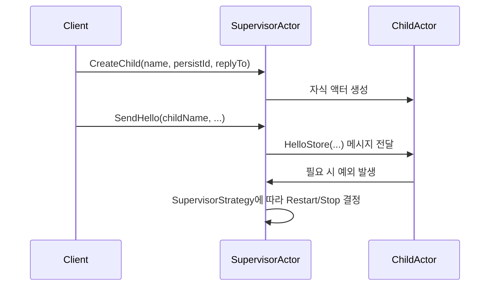

# Chapter 7: 수퍼바이저 액터 (SupervisorActor)

이전 장([헬로우 퍼시스턴트 내구성 상태 액터 (HelloPersistentDurableStateActor)](06_헬로우_퍼시스턴트_내구성_상태_액터__hellopersistentdurablestateactor__.md))에서는 액터의 상태를 영구 저장소(DB)에 보존하고 재시작 시에도 이어갈 수 있는 방법을 배웠습니다. 그렇다면 자식 액터가 실행 도중 오류를 일으키거나, 예외로 사라졌을 때는 어떻게 관리할까요? 바로 “수퍼바이저 액터(SupervisorActor)”가 등장합니다.

---

## 1. 왜 수퍼바이저 액터가 필요한가?

일상 속 “매니저”나 “팀장”을 떠올려 보면 이해하기 쉽습니다. 여러 부하 직원(자식 액터)들이 일을 하다가 실수하거나 문제가 생기면, 팀장은 다음과 같은 조치를 취합니다:

- 문제를 일으킨 직원만 재교육(재시작)  
- 아예 새 직원을 채용(새 자식 액터 생성)  
- 상황에 따라 해당 직원을 해고(종료)  

액터 시스템에서도 마찬가지입니다. 수퍼바이저 액터는 내부 정책에 따라 자식 액터들을 “Resume(계속)”, “Restart(재시작)”, “Stop(종료)”와 같은 전략으로 제어합니다. 이로써 오류가 발생해도 전체 시스템이 멈추지 않고 부분적으로만 복구할 수 있습니다.

---

## 2. 핵심 개념 정리

1. 자식 액터 관리  
   - 수퍼바이저 액터는 여러 자식 액터들을 `children` 맵 등에 등록해두고 생성·종료를 책임집니다.

2. SupervisorStrategy  
   - 자식 액터에서 예외가 발생할 경우, 어떠한 전략으로 대처할지 결정하는 설정입니다.  
   - 예: `SupervisorStrategy.restart()`는 예외가 생기면 해당 자식 액터를 자동으로 재시작합니다.

3. Termination 감시  
   - 자식 액터가 정상 종료되거나, 예외로 인해 종료되면 수퍼바이저가 이를 인지해 `onChildTerminated` 같은 메서드에서 후속 처리를 합니다.

---

## 3. 간단 사용 예시

예를 들어, “HelloStateStoreActor”라는 영구 저장 액터를 여러 개 만들어 각각 사용자에게 인삿말을 저장하고 싶다고 해봅시다. 다음처럼 수퍼바이저 액터에게 “자식 생성” 메시지를 보내면, 자식 액터를 스폰하여 관리하게 됩니다.

아래 코드는 10줄 미만의 간단 예시입니다:

```kotlin
// 수퍼바이저 액터 참조
val supervisorRef = ...

// 자식 액터 생성 요청
supervisorRef.tell(
    CreateChild("childA", "persist-id-A", replyToRef)
)
```

위에서 `CreateChild("childA", "persist-id-A", ...)` 메시지를 보내면, 수퍼바이저 액터는 “childA”라는 이름과 “persist-id-A”라는 PersistenceId를 가진 자식 액터를 생성합니다. 생성 결과(자식 액터 참조)는 `replyToRef`로 전달됩니다.

---

## 4. 메시지 흐름 이해하기

자식 액터를 생성·재시작·종료하는 과정이 어떻게 흘러가는지, 간단한 시퀀스 다이어그램으로 살펴보겠습니다.



- Client에서 “CreateChild” 메시지를 통해 자식 액터를 생성하도록 지시합니다.  
- 수퍼바이저 액터는 ChildActor를 만들고, 이후 Client에서 오는 메시지는 수퍼바이저를 거쳐 ChildActor로 전달됩니다.  
- 만약 ChildActor에서 예외가 발생하면, 수퍼바이저는 등록된 SupervisorStrategy에 따라 재시작 혹은 종료 등의 정책을 실행합니다.

---

## 5. 내부 구현 살펴보기

여기서는 예시 코드를 조금씩 쪼개어 설명합니다. 실제 파일 위치는  
“src/main/kotlin/org/example/kotlinbootreactivelabs/actor/supervisor/SupervisorActor.kt”라고 가정합니다.

### 5.1 기본 구조

아래는 “SupervisorActor”의 핵심 골격입니다(10줄 미만).

```kotlin
class SupervisorActor private constructor(
    context: ActorContext<SupervisorCommand>,
    private val durableRepository: DurableRepository
) : AbstractBehavior<SupervisorCommand>(context) {

    private val children = mutableMapOf<String, ActorRef<HelloStateStoreActorCommand>>()

    // ...
}
```

- `durableRepository`는 자식 액터에게 넘길 DB나 영구 저장소 관련 의존성을 주입받는다고 가정합니다.  
- `children` 맵에서 자식 액터 이름으로 액터 참조를 관리합니다.

### 5.2 자식 액터 생성 로직

“CreateChild” 메시지가 들어왔을 때, 자식 액터를 어떤 전략으로 생성할지 결정합니다(10줄 미만 예시).

```kotlin
private fun onCreateChild(command: CreateChild): Behavior<SupervisorCommand> {
    val childActor = context.spawn(
        Behaviors.supervise(
            HelloStateStoreActor.create(command.persistId, durableRepository)
        ).onFailure(SupervisorStrategy.restart()),
        command.name
    )
    children[command.name] = childActor
    command.replyTo.tell(CreatedChild(childActor))
    return this
}
```

- `Behaviors.supervise(...).onFailure(SupervisorStrategy.restart())` 구문을 통해, 자식 액터에서 예외가 나면 재시작을 적용합니다.  
- 자식 액터 참조를 `children` 맵에 저장하고, 생성 사실을 요청자(`replyTo`)에게 알려줍니다.

### 5.3 자식 액터로 메시지 보내기

예컨대 “SendHello” 메시지가 들어오면, 아래처럼 자식 액터를 찾아 메시지를 전달합니다(10줄 미만).

```kotlin
private fun onSendHello(command: SendHello): Behavior<SupervisorCommand> {
    val child = children[command.childName]
    if (child != null) {
        child.tell(HelloStore(command.message, command.replyTo))
    }
    return this
}
```

- “childName”을 키로 맵에서 자식 액터를 찾은 뒤, `HelloStore` 메시지를 보냅니다.  
- 자식 액터가 정상이라면 메시지를 잘 처리하고, 만약 예외가 터지면 `SupervisorStrategy.restart()`가 발동할 것입니다.

### 5.4 자식 액터 종료 처리

만약 특정 자식 액터를 종료하고 싶다면 “TerminateChild” 메시지를 통해 수행할 수 있습니다(10줄 미만).

```kotlin
private fun onTerminateChild(command: TerminateChild): Behavior<SupervisorCommand> {
    val child = children[command.name]
    if (child != null) {
        context.stop(child)
        children.remove(command.name)
    }
    return this
}
```

- `context.stop(child)`로 액터를 정상 종료하고, 맵에서 삭제합니다.

---

## 6. 실제 사용 시나리오

1. 영구 저장 액터 관리  
   - 여러 “HelloStateStoreActor”를 가동해 브랜드나 사용자별 인삿말을 저장할 때, 수퍼바이저를 통해 디비 연동 정책과 에러 복구를 통합 관리할 수 있습니다.

2. 대규모 서비스 확장  
   - 많은 자식 액터가 생성·종료되는 분산 환경에서, 예외가 발생하더라도 전체 서비스가 멈추지 않고 개별 자식만 재시작하도록 설계할 수 있습니다.

3. 장애 복구  
   - 자식 액터에서 예측 불가한 오류가 터지더라도, 수퍼바이저가 자동으로 재시작 정책을 적용해 서비스 중단을 최소화합니다.

---

## 마무리 및 다음 장 안내

이번 장에서는 수퍼바이저 액터(SupervisorActor)가 여러 자식 액터를 생성·재시작·종료하는 과정을 정책적으로 제어하여, 시스템을 안정적으로 운영하는 방법을 살펴보았습니다. 액터로 이루어진 대규모 시스템에서 오류가 발생하더라도 일부 액터만 재시작하는 방식으로 전체 장애를 예방할 수 있음을 이해하셨을 겁니다.

다음 장([벌크 프로세서 (BulkProcessor)](08_벌크_프로세서__bulkprocessor__.md))에서는 대용량 처리를 효율적으로 실행하는 “벌크 프로세서(BulkProcessor)” 액터를 배워보겠습니다. 데이터나 메시지를 한꺼번에 모아 더 빠르고 효율적으로 처리하는 아이디어에 대해 알아보도록 합시다!  

---

Generated by [AI Codebase Knowledge Builder](https://github.com/The-Pocket/Tutorial-Codebase-Knowledge)