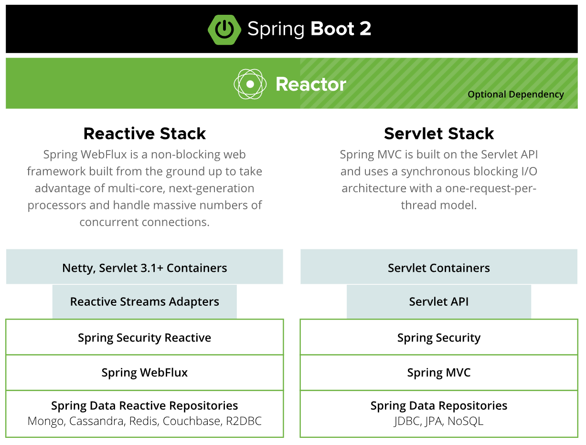

# KotlinBootReactiveLabs

This repository is for learning Reactive Stream using Spring Boot WebFlux.

## Reactive

- https://spring.io/reactive

## Reactive WebSocket

Testing WebSocket using Reactive

- http://localhost:8080/api-doc
- http://localhost:8080/ws-rx-test.html
- https://wiki.webnori.com/display/AKKA/Reactive+WebSocket+With+Kotlin

## ActorModel by Pekko

To handle concurrency and distributed processing, we use ReactiveStream based on WebFlux and partially adopt the actor model. Pekko (open-source Akka) actors can be used to solve complex problems.

- https://pekko.apache.org/docs/pekko/current/index.html
- https://www.baeldung.com/akka-with-spring
- https://wiki.webnori.com/display/AKKA/AKKA.Kotlin
